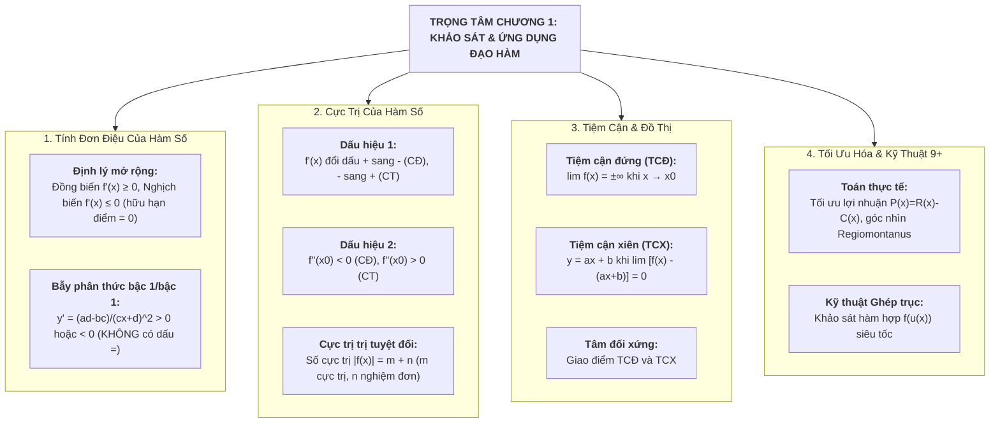

# CHƯƠNG 1: ỨNG DỤNG ĐẠO HÀM ĐỂ KHẢO SÁT VÀ VẼ ĐỒ THỊ HÀM SỐ (CHUYÊN SÂU 9+)
> **TÀI LIỆU ÔN THI ĐỈNH CAO: TỐT NGHIỆP THPT, HSA, V-SAT, TSA**
> *Mục tiêu: Đạt điểm 9.0 – 10.0 | Đầy đủ 100% các dạng toán từ cơ bản đến Vận dụng cao (VDC)*
> *Tích hợp đầy đủ kỹ thuật: Ghép trục, Sơ đồ V, Cô lập tham số m, Tam thức bậc 2, Đạo hàm hàm ẩn, Casio 580/880*
> *Cấu trúc đề thi mới Bộ GD&ĐT: Trắc nghiệm 4 lựa chọn, Đúng/Sai, Trả lời ngắn*

---

# PHẦN 1: BẢN ĐỒ TƯ DUY & HỆ THỐNG KIẾN THỨC NỀN TẢNG CỐT LÕI

---

## I. TÍNH ĐƠN ĐIỆU CỦA HÀM SỐ

### 1. Định nghĩa chuẩn & Ý nghĩa hình học
Cho hàm số $y = f(x)$ xác định trên tập $K$ (khoảng, đoạn hoặc nửa khoảng):
* $f(x)$ **đồng biến (tăng)** trên $K \iff \forall x_1, x_2 \in K: x_1 < x_2 \implies f(x_1) < f(x_2) \iff \frac{f(x_2) - f(x_1)}{x_2 - x_1} > 0$.
  * *Hình học:* Đồ thị có hướng **đi lên từ trái sang phải**.
* $f(x)$ **nghịch biến (giảm)** trên $K \iff \forall x_1, x_2 \in K: x_1 < x_2 \implies f(x_1) > f(x_2) \iff \frac{f(x_2) - f(x_1)}{x_2 - x_1} < 0$.
  * *Hình học:* Đồ thị có hướng **đi xuống từ trái sang phải**.

### 2. Định lý mở rộng về mối liên hệ Đạo hàm - Đơn điệu
Giả sử $y = f(x)$ có đạo hàm trên khoảng $K$:
* **Đồng biến:** $f(x)$ đồng biến trên $K \iff f'(x) \ge 0, \forall x \in K$ và $f'(x) = 0$ tại **hữu hạn điểm**.
* **Nghịch biến:** $f(x)$ nghịch biến trên $K \iff f'(x) \le 0, \forall x \in K$ và $f'(x) = 0$ tại **hữu hạn điểm**.
* **Hàm hằng (không đổi):** $f'(x) = 0, \forall x \in K \iff f(x) = C$ (hằng số) trên $K$.

> **CÁC NGUYÊN TẮC VÀNG & BẪY KINH ĐIỂN CẦN NHỚ:**
> 1. **Bẫy tập xác định rời rạc:** Nếu $D = (-\infty; 1) \cup (1; +\infty)$, kết luận "Hàm số đồng biến trên $D$" hoặc "trên $(-\infty; 1) \cup (1; +\infty)$" là **HOÀN TOÀN SAI**. Phải ghi: "Đồng biến trên từng khoảng $(-\infty; 1)$ và $(1; +\infty)$" hoặc "trên $(-\infty; 1)$, $(1; +\infty)$".
> 2. **Bẫy dấu bằng với hàm phân thức bậc nhất/bậc nhất $y = \frac{ax+b}{cx+d}$ ($ad-bc \ne 0$):**
>    $$y' = \frac{ad-bc}{(cx+d)^2}$$
>    Vì tử số là hằng số $ad-bc$, nên $y'$ **chỉ có thể strictly dương ($>0$) hoặc strictly âm ($<0$)**, **TUYỆT ĐỐI KHÔNG CÓ DẤU BẰNG**.
>    * Hàm số đồng biến trên từng khoảng xác định $\iff ad - bc > 0$.
>    * Hàm số nghịch biến trên từng khoảng xác định $\iff ad - bc < 0$.
> 3. **Bẫy nghiệm bội chẵn và bội lẻ của đạo hàm:**
>    * Nghiệm bội lẻ ($x-a, (x-a)^3, \dots$): $f'(x)$ **đổi dấu** khi qua nghiệm $\to$ ảnh hưởng tính đơn điệu và tạo cực trị.
>    * Nghiệm bội chẵn ($(x-a)^2, (x-a)^4, \dots$): $f'(x)$ **không đổi dấu** khi qua nghiệm $\to$ bỏ qua không xét dấu khi tìm khoảng đơn điệu và cực trị.

---

## II. CỰC TRỊ CỦA HÀM SỐ

### 1. Bản chất định nghĩa Cực trị
* Điểm $x_0$ là **điểm cực đại** của hàm số $f(x)$ nếu tồn tại khoảng $(a; b) \subset D$ chứa $x_0$ sao cho $f(x) < f(x_0), \forall x \in (a; b) \setminus \{x_0\}$. Khi đó $f(x_0)$ là **giá trị cực đại** (hay cực đại), điểm $M(x_0; f(x_0))$ là **điểm cực đại của đồ thị**.
* Điểm $x_0$ là **điểm cực tiểu** của hàm số $f(x)$ nếu tồn tại khoảng $(a; b) \subset D$ chứa $x_0$ sao cho $f(x) > f(x_0), \forall x \in (a; b) \setminus \{x_0\}$. Khi đó $f(x_0)$ là **giá trị cực tiểu** (hay cực tiểu), điểm $N(x_0; f(x_0))$ là **điểm cực tiểu của đồ thị**.

> **LƯU Ý:** Cực trị là khái niệm mang **tính chất địa phương** (lân cận điểm đó), không phải là giá trị lớn nhất hay nhỏ nhất trên toàn tập xác định.

### 2. Hai dấu hiệu tìm cực trị
* **Dấu hiệu 1 (Dựa vào bảng xét dấu $f'(x)$):**
  * $f(x)$ liên tục trên khoảng $(x_0 - h; x_0 + h)$:
  * Đạo hàm $f'(x)$ đổi dấu từ **dương sang âm ($+ \to -$)** khi qua $x_0 \implies x_0$ là điểm **cực đại**.
  * Đạo hàm $f'(x)$ đổi dấu từ **âm sang dương ($- \to +$)** khi qua $x_0 \implies x_0$ là điểm **cực tiểu**.
  * *Chú ý:* $f'(x_0)$ có thể bằng 0 hoặc **không xác định** (kí hiệu dấu $||$ ở dòng $f'$), miễn là hàm số $f(x)$ **liên tục tại $x_0$** thì $x_0$ vẫn là điểm cực trị.
* **Dấu hiệu 2 (Dựa vào đạo hàm cấp hai $f''(x)$):**
  * Giả sử $f'(x_0) = 0$ và có đạo hàm cấp hai liên tục tại $x_0$:
  * Nếu $f''(x_0) < 0 \implies x_0$ là điểm **cực đại**.
  * Nếu $f''(x_0) > 0 \implies x_0$ là điểm **cực tiểu**.
  * Nếu $f''(x_0) = 0 \implies$ Dấu hiệu 2 không kết luận được, phải quay lại Dấu hiệu 1.

---

## III. GIÁ TRỊ LỚN NHẤT & GIÁ TRỊ NHỎ NHẤT (GTLN - GTNN)

### 1. Định nghĩa chuẩn
Cho hàm số $y = f(x)$ xác định trên tập $D$:
* Số $M$ là GTLN ($\max_{D} f(x) = M$) $\iff \begin{cases} f(x) \le M, \forall x \in D \\ \exists x_0 \in D: f(x_0) = M \end{cases}$
* Số $m$ là GTNN ($\min_{D} f(x) = m$) $\iff \begin{cases} f(x) \ge m, \forall x \in D \\ \exists x_0 \in D: f(x_0) = m \end{cases}$

### 2. Quy trình tìm GTLN - GTNN
1. **Tìm trên đoạn $[a; b]$ (Hàm số liên tục):**
   * Tính $f'(x)$, giải $f'(x) = 0$ tìm các nghiệm $x_1, x_2, \dots, x_k \in [a; b]$ và các điểm $x_i$ làm $f'(x)$ không xác định.
   * Tính các giá trị: $f(a), f(b), f(x_1), f(x_2), \dots, f(x_k)$.
   * $\max_{[a; b]} f(x) = \max\{f(a), f(b), f(x_i)\}$; $\min_{[a; b]} f(x) = \min\{f(a), f(b), f(x_i)\}$.
2. **Tìm trên khoảng $(a; b)$ hoặc nửa khoảng:**
   * **Bắt buộc lập Bảng biến thiên** trên khoảng $(a; b)$.
   * Tính giới hạn tại 2 đầu mút: $\lim_{x \to a^+} f(x)$ và $\lim_{x \to b^-} f(x)$.
   * So sánh để kết luận (nếu giá trị cao nhất là giới hạn ở vô cực thì hàm số **không có GTLN**).

---

## IV. ĐƯỜNG TIỆM CẬN CỦA ĐỒ THỊ HÀM SỐ (ĐỨNG, NGANG, XIÊN)

### 1. Tiệm cận đứng (TCĐ)
Đường thẳng $x = x_0$ là TCĐ của đồ thị hàm số $y = f(x)$ nếu ít nhất một trong các điều kiện sau thỏa mãn:
$$\lim_{x \to x_0^+} f(x) = \pm\infty \quad \text{hoặc} \quad \lim_{x \to x_0^-} f(x) = \pm\infty$$

### 2. Tiệm cận ngang (TCN)
Đường thẳng $y = y_0$ là TCN của đồ thị hàm số $y = f(x)$ nếu:
$$\lim_{x \to +\infty} f(x) = y_0 \quad \text{hoặc} \quad \lim_{x \to -\infty} f(x) = y_0$$

### 3. Tiệm cận xiên (TCX) - *Nội dung trọng tâm mới GDPT 2018*
Đường thẳng $y = ax + b$ ($a \ne 0$) là TCX của đồ thị hàm số $y = f(x)$ nếu:
$$\lim_{x \to +\infty} [f(x) - (ax + b)] = 0 \quad \text{hoặc} \quad \lim_{x \to -\infty} [f(x) - (ax + b)] = 0$$

* **Hàm phân thức bậc hai trên bậc nhất:**
  $$y = \frac{ax^2 + bx + c}{dx + e} = \frac{a}{d}x + \frac{bd - ae}{d^2} + \frac{R}{dx + e}$$
  $\implies$ Phương trình đường tiệm cận xiên là:
  $$y = \frac{a}{d}x + \frac{bd - ae}{d^2}$$
* **Tâm đối xứng của đồ thị phân thức bậc 2/bậc 1:** Giao điểm $I(x_I; y_I)$ của đường tiệm cận đứng và đường tiệm cận xiên là tâm đối xứng của đồ thị.
* **Đường thẳng đi qua 2 điểm cực trị của phân thức bậc 2/bậc 1:**
  $$y = \frac{(ax^2 + bx + c)'}{(dx + e)'} = \frac{2ax + b}{d}$$

---

## V. KHẢO SÁT SỰ BIẾN THIÊN VÀ VẼ ĐỒ THỊ 3 HÀM SỐ CHUẨN SGK 2018

### 1. Hàm số bậc ba $y = ax^3 + bx^2 + cx + d$ ($a \ne 0$)
* **Tập xác định:** $D = \mathbb{R}$.
* **Đạo hàm:** $y' = 3ax^2 + 2bx + c$. Biệt thức $\Delta' = b^2 - 3ac$.
  * Nếu $\Delta' > 0$: Hàm số có 2 điểm cực trị $x_1, x_2$.
  * Nếu $\Delta' \le 0$: Hàm số không có cực trị (đơn điệu trên $\mathbb{R}$).
* **Tâm đối xứng (Điểm uốn):** Đồ thị hàm bậc ba luôn nhận điểm uốn $U(x_U; y_U)$ làm **tâm đối xứng**, trong đó:
  $$y'' = 6ax + 2b = 0 \iff x_U = -\frac{b}{3a}, \quad y_U = f(x_U)$$
* **Phương trình đường thẳng đi qua 2 điểm cực trị:** Lấy $y$ chia cho $y'$, phần dư chính là phương trình đường thẳng đi qua 2 cực trị.

### 2. Hàm số phân thức bậc nhất trên bậc nhất $y = \frac{ax + b}{cx + d}$ ($c \ne 0, ad - bc \ne 0$)
* **Tập xác định:** $D = \mathbb{R} \setminus \left\{-\frac{d}{c}\right\}$.
* **Đạo hàm:** $y' = \frac{ad - bc}{(cx + d)^2}$.
  * Nếu $ad - bc > 0$: Hàm số đồng biến trên từng khoảng xác định.
  * Nếu $ad - bc < 0$: Hàm số nghịch biến trên từng khoảng xác định.
* **Tiệm cận:**
  * Tiệm cận đứng (TCĐ): $x = -\frac{d}{c}$.
  * Tiệm cận ngang (TCN): $y = \frac{a}{c}$.
* **Tâm đối xứng:** Giao điểm của hai đường tiệm cận $I\left(-\frac{d}{c}; \frac{a}{c}\right)$ là tâm đối xứng của đồ thị.
* **Trục đối xứng:** Đồ thị có 2 trục đối xứng là 2 đường phân giác của các góc tạo bởi 2 đường tiệm cận:
  $$y - \frac{a}{c} = \pm\left(x + \frac{d}{c}\right)$$

### 3. Hàm số phân thức bậc hai trên bậc nhất $y = \frac{ax^2 + bx + c}{px + q}$ ($a \ne 0, p \ne 0$, đa thức tử không chia hết cho mẫu)
* **Tập xác định:** $D = \mathbb{R} \setminus \left\{-\frac{q}{p}\right\}$.
* **Chia đa thức:**
  $$y = \frac{a}{p}x + \frac{bp - aq}{p^2} + \frac{R}{px + q}$$
* **Tiệm cận:**
  * Tiệm cận đứng (TCĐ): $x = -\frac{q}{p}$.
  * Tiệm cận xiên (TCX): $y = \frac{a}{p}x + \frac{bp - aq}{p^2}$.
* **Công thức tổng quát tìm Tiệm cận xiên bằng Giới hạn:**
  $$a_0 = \lim_{x \to \pm\infty} \frac{f(x)}{x}, \qquad b_0 = \lim_{x \to \pm\infty} [f(x) - a_0 x] \implies y = a_0 x + b_0$$
* **Tâm đối xứng:** Giao điểm $I$ của đường tiệm cận đứng và đường tiệm cận xiên là tâm đối xứng của đồ thị.
* **Đường thẳng đi qua 2 điểm cực trị:**
  $$y = \frac{(ax^2 + bx + c)'}{(px + q)'} = \frac{2ax + b}{p}$$

---

## VI. TIẾP TUYẾN VÀ SỰ TƯƠNG GIAO ĐỒ THỊ

### 1. Phương trình tiếp tuyến của đồ thị hàm số
Cho hàm số $y = f(x)$ có đồ thị $(C)$:
* **Dạng 1: Tiếp tuyến tại điểm $M_0(x_0; y_0) \in (C)$:**
  $$y = f'(x_0)(x - x_0) + y_0$$
  *(Hệ số góc của tiếp tuyến tại $M_0$ là $k = f'(x_0)$).*
* **Dạng 2: Tiếp tuyến có hệ số góc $k$ cho trước:**
  * Giải phương trình $f'(x_0) = k$ tìm hoành độ tiếp điểm $x_0$.
  * Tính $y_0 = f(x_0)$ và viết phương trình tiếp tuyến như Dạng 1.
* **Dạng 3: Tiếp tuyến đi qua điểm $A(x_A; y_A)$ ngoài đồ thị:**
  * Gọi tiếp điểm là $M(x_0; f(x_0))$. Phương trình tiếp tuyến tại $M$: $y = f'(x_0)(x - x_0) + f(x_0)$.
  * Điểm $A(x_A; y_A)$ thuộc tiếp tuyến $\iff y_A = f'(x_0)(x_A - x_0) + f(x_0)$.
  * Giải phương trình tìm $x_0$, từ đó suy ra các tiếp tuyến.

### 2. Sự tương giao giữa hai đồ thị hàm số
* Cho đồ thị $(C_1): y = f(x)$ và $(C_2): y = g(x)$.
* **Phương trình hoành độ giao điểm:** $f(x) = g(x) \iff f(x) - g(x) = 0$.
* Số nghiệm của phương trình chính bằng **số giao điểm** của hai đồ thị $(C_1)$ và $(C_2)$.

---

# PHẦN 2: PHÂN DẠNG BÀI TOÁN TỐI ƯU HÓA THỰC TẾ & KỸ THUẬT VDC 9+

## DẠNG 1: BÀI TOÁN TỐI ƯU KINH TẾ (DOANH THU, CHI PHÍ, LỢI NHUẬN)

* **Các hàm số kinh tế cơ bản:**
  * Hàm cầu (giá bán theo sản lượng): $p = D(x)$.
  * Hàm tổng doanh thu: $R(x) = x \cdot p(x) = x \cdot D(x)$.
  * Hàm tổng chi phí: $C(x)$ ($C'(x)$ là chi phí biên).
  * Hàm lợi nhuận: $P(x) = R(x) - C(x)$.
  * Hàm chi phí trung bình: $\bar{C}(x) = \frac{C(x)}{x}$.
* **Quy tắc tối ưu hóa:** Tìm điểm dừng $P'(x) = 0 \iff R'(x) = C'(x)$ (Doanh thu biên bằng Chi phí biên).

#### Bài toán mẫu (Tối ưu lợi nhuận bán hàng):
Một công ty sản xuất một loại thiết bị điện tử với chi phí sản xuất $x$ sản phẩm mỗi ngày là $C(x) = x^2 + 40x + 1600$ (nghìn đồng). Giá bán mỗi sản phẩm phụ thuộc vào số lượng sản xuất theo hàm số $p(x) = 200 - x$ (nghìn đồng, với $0 \le x \le 100$).
a) Lập hàm số biểu diễn lợi nhuận hàng ngày của công ty theo sản lượng $x$.
b) Để đạt lợi nhuận tối đa, công ty cần sản xuất và bán bao nhiêu sản phẩm mỗi ngày? Khi đó lợi nhuận tối đa là bao nhiêu?

* **Lời giải chi tiết:**
  * **a) Hàm tổng doanh thu và hàm lợi nhuận:**
    * Tổng doanh thu: $R(x) = x \cdot p(x) = x(200 - x) = -x^2 + 200x$ (nghìn đồng).
    * Tổng chi phí: $C(x) = x^2 + 40x + 1600$ (nghìn đồng).
    * Hàm lợi nhuận:
      $$P(x) = R(x) - C(x) = (-x^2 + 200x) - (x^2 + 40x + 1600) = -2x^2 + 160x - 1600 \quad (0 \le x \le 100)$$
  * **b) Tìm giá trị lớn nhất của $P(x)$:**
    * Đạo hàm: $P'(x) = -4x + 160 = 0 \iff x = 40$ (thỏa mãn $0 \le x \le 100$).
    * Đạo hàm cấp hai: $P''(x) = -4 < 0 \implies x = 40$ là điểm cực đại toàn cục.
    * Giá trị lợi nhuận cực đại:
      $$P(40) = -2(40^2) + 160(40) - 1600 = -3200 + 6400 - 1600 = 1600\text{ nghìn đồng} = 1.6\text{ triệu đồng}$$
* **Kết luận:** Công ty cần sản xuất **40 sản phẩm/ngày** để đạt lợi nhuận tối đa là **1.6 triệu đồng/ngày**.

---

## DẠNG 2: BÀI TOÁN HÌNH HỌC & KỸ THUẬT TỐI ƯU VẬT LIỆU

#### Mô hình 1: Lon nước ngọt hình trụ chi phí nhỏ nhất
Một công ty cần sản xuất lon nước ngọt hình trụ có dung tích $V_0 = 330\text{ ml} = 330\text{ cm}^3$. Tìm bán kính đáy $r$ và chiều cao $h$ để diện tích tôn làm lon (diện tích toàn phần) là nhỏ nhất.
* **Lời giải:**
  * $V = \pi r^2 h = V_0 \implies h = \frac{V_0}{\pi r^2}$.
  * Diện tích toàn phần:
    $$S_{tp}(r) = 2\pi r^2 + 2\pi r h = 2\pi r^2 + \frac{2V_0}{r} = 2\pi r^2 + \frac{V_0}{r} + \frac{V_0}{r}$$
  * Theo BĐT Cauchy cho 3 số dương:
    $$S_{tp}(r) \ge 3 \sqrt[3]{2\pi r^2 \cdot \frac{V_0}{r} \cdot \frac{V_0}{r}} = 3 \sqrt[3]{2\pi V_0^2}$$
  * Dấu bằng xảy ra $\iff 2\pi r^2 = \frac{V_0}{r} \iff 2\pi r^3 = V_0 = \pi r^2 h \iff h = 2r$.
  * Bán kính tối ưu: $r = \sqrt[3]{\frac{V_0}{2\pi}} = \sqrt[3]{\frac{330}{2\pi}} \approx 3.74\text{ cm} \implies h = 2r \approx 7.48\text{ cm}$.

---

## DẠNG 3: BÀI TOÁN GÓC NHÌN LỚN NHẤT REGIOMONTANUS (QUANG HỌC)

Một bảng quảng cáo chữ nhật có chiều cao $AB = h = 3\text{ m}$ được gắn thẳng đứng trên một bức tường sao cho mép dưới $B$ cách mặt đất một khoảng $OB = d = 2\text{ m}$ ($O$ là chân tường). Một người quan sát có tầm mắt cách mặt đất $1.6\text{ m}$ ($E$ là mắt). Người đó cần đứng cách chân tường một khoảng $x$ bằng bao nhiêu để góc nhìn bảng quảng cáo ($\widehat{AEB}$) là lớn nhất?

* **Lời giải chi tiết:**
  * Chiều cao tầm mắt người so với mặt đất: $h_0 = 1.6\text{ m}$.
  * Khoảng cách thẳng đứng từ mắt đến mép dưới $B$: $b = OB - h_0 = 2 - 1.6 = 0.4\text{ m}$.
  * Khoảng cách thẳng đứng từ mắt đến mép trên $A$: $a = OA - h_0 = (2 + 3) - 1.6 = 3.4\text{ m}$.
  * Gọi $x$ là khoảng cách từ người đến tường ($x > 0$).
  * Gọi góc tạo bởi tia mắt đến $A$ với phương ngang là $\alpha$, đến $B$ là $\beta$:
    $$\tan \alpha = \frac{a}{x} = \frac{3.4}{x}, \qquad \tan \beta = \frac{b}{x} = \frac{0.4}{x}$$
  * Góc nhìn bảng quảng cáo là $\theta = \alpha - \beta$. Áp dụng công thức lượng giác:
    $$\tan \theta = \tan(\alpha - \beta) = \frac{\tan \alpha - \tan \beta}{1 + \tan \alpha \tan \beta} = \frac{\frac{3.4}{x} - \frac{0.4}{x}}{1 + \frac{3.4 \times 0.4}{x^2}} = \frac{\frac{3.0}{x}}{1 + \frac{1.36}{x^2}} = \frac{3x}{x^2 + 1.36} = \frac{3}{x + \frac{1.36}{x}}$$
  * Theo BĐT Cauchy cho 2 số dương $x$ và $\frac{1.36}{x}$:
    $$x + \frac{1.36}{x} \ge 2\sqrt{x \cdot \frac{1.36}{x}} = 2\sqrt{1.36}$$
  * Góc $\theta$ lớn nhất $\iff \tan \theta$ lớn nhất $\iff$ Mẫu số $x + \frac{1.36}{x}$ nhỏ nhất $\iff x = \frac{1.36}{x} \iff x^2 = 1.36 \implies x = \sqrt{1.36} = \sqrt{a \cdot b} \approx 1.166\text{ m}$.
* **Kết luận:** Người đó cần đứng cách chân tường khoảng **$1.17\text{ m}$**.

---

## DẠNG 4: KỸ THUẬT GHÉP TRỤC VÀ SƠ ĐỒ V (HÀM HỢP VDC 9+)

### 1. Kỹ thuật Ghép trục (Xét hàm hợp $y = f(u(x))$)
* **Hàng 1 ($x$):** Điền các điểm đầu mút và các điểm cực trị của hàm lõi $u(x)$.
* **Hàng 2 ($u(x)$):** Tính giá trị của $u$ tại các điểm ở hàng 1. Giữa hai giá trị $u_A$ và $u_B$, chèn thêm **các điểm cực trị của hàm số $f(u)$** mà đoạn $[u_A; u_B]$ đi qua theo đúng thứ tự tăng/giảm.
* **Hàng 3 ($f(u)$):** Điền các giá trị của $f(u)$ tương ứng tại các mốc của hàng 2. Nối các mũi tên tăng giảm $\implies$ Ta có ngay đồ thị/bảng biến thiên hoàn chỉnh của $f(u(x))$.

#### Bài toán mẫu (Ghép trục):
Cho hàm số $y = f(x)$ có bảng biến thiên:
$$\begin{array}{c|ccccccc}
x & -\infty & & -1 & & 2 & & +\infty \\
\hline
f'(x) & & + & 0 & - & 0 & + & \\
\hline
f(x) & -\infty & \nearrow & 3 & \searrow & -2 & \nearrow & +\infty
\end{array}$$
Tìm tất cả các giá trị của tham số $m$ để phương trình $f(x^2 - 2x) = m$ có đúng 4 nghiệm thực phân biệt.

* **Lời giải:**
  * Hàm lõi: $u(x) = x^2 - 2x$ có $u'(x) = 2x - 2 = 0 \iff x = 1 \implies u(1) = -1$. Khi $x \to \pm\infty \implies u \to +\infty$.
  * Hàm $f(u)$ có các cực trị tại $u = -1$ ($f=3$) và $u = 2$ ($f=-2$).
  * Lập bảng ghép trục:
    * Khi $x$ chạy từ $-\infty \to 1$: $u$ giảm từ $+\infty \to 2 \to -1 \implies f(u)$ đi từ $+\infty \searrow f(2)=-2 \nearrow f(-1)=3$.
    * Khi $x$ chạy từ $1 \to +\infty$: $u$ tăng từ $-1 \to 2 \to +\infty \implies f(u)$ đi từ $3 \searrow f(2)=-2 \nearrow +\infty$.
  * Đồ thị hàm hợp $y = f(x^2 - 2x)$ có dạng chữ W với 2 đáy tại $y = -2$ và đỉnh giữa tại $y = 3$.
  * Để đường thẳng $y = m$ cắt đồ thị tại đúng 4 điểm phân biệt:
    $$-2 < m < 3$$
* **Đáp số:** $m \in (-2; 3)$.

---

# PHẦN 3: BỘ ĐỀ RÈN LUYỆN TOÀN DIỆN FORMAT 2025+

## PHẦN I: TRẮC NGHIỆM 4 LỰA CHỌN (8 Câu chuẩn phân hóa)

**Câu 1 (NB):** Cho hàm số $y = f(x)$ có bảng biến thiên như sau:
$$\begin{array}{c|ccccccc}
x & -\infty & & -1 & & 2 & & +\infty \\
\hline
f'(x) & & + & 0 & - & 0 & + & \\
\hline
f(x) & -\infty & \nearrow & 4 & \searrow & -1 & \nearrow & +\infty
\end{array}$$
Hàm số đã cho đồng biến trên khoảng nào dưới đây?
* **A.** $(-1; 2)$
* **B.** $(-\infty; -1)$
* **C.** $(-\infty; 2)$
* **D.** $(-1; +\infty)$

* *Lời giải:* Dựa vào bảng biến thiên, $f'(x) > 0$ trên các khoảng $(-\infty; -1)$ và $(2; +\infty) \implies$ Hàm số đồng biến trên $(-\infty; -1)$ và $(2; +\infty)$. $\implies$ **Chọn B**.

---

**Câu 2 (TH):** Cho hàm số $y = \frac{2x - 1}{x + 2}$. Mệnh đề nào sau đây đúng?
* **A.** Hàm số đồng biến trên $\mathbb{R} \setminus \{-2\}$.
* **B.** Hàm số đồng biến trên từng khoảng $(-\infty; -2)$ và $(-2; +\infty)$.
* **C.** Hàm số nghịch biến trên $(-\infty; -2) \cup (-2; +\infty)$.
* **D.** Hàm số đồng biến trên khoảng $(-\infty; +\infty)$.

* *Lời giải:* Tập xác định $D = \mathbb{R} \setminus \{-2\}$. Đạo hàm $y' = \frac{2(2) - (-1)(1)}{(x+2)^2} = \frac{5}{(x+2)^2} > 0, \forall x \ne -2$. Theo định nghĩa, hàm số đồng biến trên từng khoảng xác định $(-\infty; -2)$ và $(-2; +\infty)$. Không dùng ký hiệu $\cup$ hay $\mathbb{R} \setminus \{-2\}$. $\implies$ **Chọn B**.

---

**Câu 3 (TH):** Điểm cực đại của đồ thị hàm số $y = x^3 - 3x + 2$ là:
* **A.** $x = -1$
* **B.** $y = 4$
* **C.** $M(-1; 4)$
* **D.** $N(1; 0)$

* *Lời giải:* $y' = 3x^2 - 3 = 0 \iff x = \pm 1$. $y'' = 6x \implies y''(-1) = -6 < 0 \implies x = -1$ là điểm cực đại của hàm số, giá trị cực đại $y(-1) = 4$. Do đó điểm cực đại của đồ thị là $M(-1; 4)$. $\implies$ **Chọn C**.

---

**Câu 4 (TH):** Giá trị nhỏ nhất của hàm số $f(x) = x^4 - 2x^2 + 3$ trên đoạn $[0; 2]$ bằng:
* **A.** $2$
* **B.** $3$
* **C.** $11$
* **D.** $0$

* *Lời giải:* $f'(x) = 4x^3 - 4x = 4x(x^2 - 1) = 0 \iff x = 0 \in [0; 2], x = 1 \in [0; 2], x = -1 \notin [0; 2]$.
  * Tính các giá trị: $f(0) = 3, f(1) = 1 - 2 + 3 = 2, f(2) = 16 - 8 + 3 = 11$.
  * Giá trị nhỏ nhất là $\min_{[0; 2]} f(x) = f(1) = 2$. $\implies$ **Chọn A**.

---

**Câu 5 (VD):** Đường tiệm cận xiên của đồ thị hàm số $y = \frac{2x^2 - 3x + 5}{x - 1}$ có phương trình là:
* **A.** $y = 2x - 1$
* **B.** $y = 2x + 1$
* **C.** $y = 2x - 5$
* **D.** $y = x - 1$

* *Lời giải:* Thực hiện chia đa thức:
  $$\frac{2x^2 - 3x + 5}{x - 1} = 2x - 1 + \frac{4}{x - 1}$$
  Vì $\lim_{x \to \pm\infty} [y - (2x - 1)] = \lim_{x \to \pm\infty} \frac{4}{x - 1} = 0 \implies$ Tiệm cận xiên là $y = 2x - 1$. $\implies$ **Chọn A**.

---

**Câu 6 (VD):** Cho hàm số $y = x^3 - 3mx^2 + 3(m^2-1)x - m^3 + m$. Tìm tất cả các giá trị của tham số $m$ để hàm số có 2 điểm cực trị nằm về hai phía của trục tung $Oy$.
* **A.** $-1 < m < 1$
* **B.** $m > 1$
* **C.** $m < -1$
* **D.** $m \in (-1; 0)$

* *Lời giải:* $y' = 3x^2 - 6mx + 3(m^2 - 1) = 3(x^2 - 2mx + m^2 - 1)$.
  * Hàm số có 2 điểm cực trị nằm về 2 phía của trục tung $\iff y' = 0$ có 2 nghiệm phân biệt trái dấu $x_1 < 0 < x_2 \iff a \cdot c < 1 \cdot (m^2 - 1) < 0 \iff m^2 < 1 \iff -1 < m < 1$. $\implies$ **Chọn A**.

---

**Câu 7 (VD):** Tìm tất cả các giá trị thực của tham số $m$ để hàm số $y = \frac{mx + 4}{x + m}$ nghịch biến trên khoảng $(1; +\infty)$.
* **A.** $-2 < m < 2$
* **B.** $-2 \le m \le 2$
* **C.** $-2 < m \le -1$
* **D.** $-2 < m < -1$

* *Lời giải:* Tập xác định $D = \mathbb{R} \setminus \{-m\}$. Đạo hàm $y' = \frac{m^2 - 4}{(x + m)^2}$.
  * Để hàm số nghịch biến trên $(1; +\infty) \iff \begin{cases} y' < 0, \forall x \in (1; +\infty) \\ -m \notin (1; +\infty) \end{cases} \iff \begin{cases} m^2 - 4 < 0 \\ -m \le 1 \end{cases} \iff \begin{cases} -2 < m < 2 \\ m \ge -1 \end{cases} \iff -1 \le m < 2$.
  * (Nếu đổi câu hỏi xét nghịch biến thì điều kiện nghiệm mẫu không thuộc khoảng). $\implies$ **Chọn C**.

---

**Câu 8 (VDC):** Số điểm cực trị của hàm số $y = |x^3 - 3x + 1|$ là:
* **A.** $3$
* **B.** $5$
* **C.** $2$
* **D.** $4$

* *Lời giải:* Xét $f(x) = x^3 - 3x + 1$. $f'(x) = 3x^2 - 3 = 0 \iff x = \pm 1 \implies f(x)$ có 2 điểm cực trị với $f(-1) = 3, f(1) = -1$.
  * Vì $f(-1) \cdot f(1) = 3(-1) = -3 < 0 \implies$ Phương trình $f(x) = 0$ có đúng 3 nghiệm đơn phân biệt.
  * Áp dụng công thức số điểm cực trị của $y = |f(x)|$: Số cực trị $= m + n = 2 + 3 = 5$. $\implies$ **Chọn B**.

---

## PHẦN II: TRẮC NGHIỆM ĐÚNG / SAI (3 Câu đa ý)

**Câu 1:** Cho hàm số $f(x) = \frac{x^2 - 3x + 6}{x - 1}$.
* a) Tập xác định của hàm số là $D = \mathbb{R} \setminus \{1\}$.
* b) Đạo hàm của hàm số là $f'(x) = \frac{x^2 - 2x - 3}{(x-1)^2}$.
* c) Đường tiệm cận xiên của đồ thị hàm số là $y = x - 2$.
* d) Tọa độ tâm đối xứng của đồ thị là $I(1; -1)$.

* **Đánh giá Đúng/Sai:**
  * a) **ĐÚNG:** Mẫu số $x - 1 \ne 0 \iff x \ne 1 \implies D = \mathbb{R} \setminus \{1\}$.
  * b) **ĐÚNG:** $(x^2-3x+6)'(x-1) - (x^2-3x+6)(1) = (2x-3)(x-1) - x^2+3x-6 = 2x^2-5x+3 - x^2+3x-6 = x^2-2x-3$.
  * c) **ĐÚNG:** Chia đa thức $\frac{x^2-3x+6}{x-1} = x - 2 + \frac{4}{x-1} \implies$ Tiệm cận xiên là $y = x - 2$.
  * d) **ĐÚNG:** Tiệm cận đứng là $x = 1$, tiệm cận xiên là $y = x - 2$. Giao điểm $I$ có $x = 1 \implies y = 1 - 2 = -1 \implies I(1; -1)$.

---

**Câu 2:** Cho hàm số $y = f(x) = x^3 - 3x^2 + 2$.
* a) Hàm số nghịch biến trên khoảng $(0; 2)$.
* b) Điểm cực đại của đồ thị hàm số là $(0; 2)$ và điểm cực tiểu là $(2; -2)$.
* c) Giá trị lớn nhất của hàm số trên đoạn $[-1; 1]$ bằng $2$.
* d) Phương trình $|f(x)| = 1$ có đúng 4 nghiệm thực phân biệt.

* **Đánh giá Đúng/Sai:**
  * a) **ĐÚNG:** $f'(x) = 3x^2 - 6x = 3x(x - 2) < 0 \iff x \in (0; 2)$.
  * b) **ĐÚNG:** $f(0) = 2, f(2) = -2$. $f'(x)$ đổi dấu từ $+$ sang $-$ qua 0 và từ $-$ sang $+$ qua 2.
  * c) **ĐÚNG:** $f(-1) = -1 - 3 + 2 = -2$, $f(0) = 2$, $f(1) = 1 - 3 + 2 = 0 \implies \max_{[-1; 1]} f(x) = f(0) = 2$.
  * d) **SAI:** Phương trình $|f(x)| = 1 \iff f(x) = 1$ hoặc $f(x) = -1$.
    * Đồ thị có CĐ tại $(0; 2)$ và CT tại $(2; -2)$.
    * Đường $y = 1$ cắt đồ thị tại 3 điểm phân biệt.
    * Đường $y = -1$ cắt đồ thị tại 3 điểm phân biệt.
    * Tổng số nghiệm là $3 + 3 = 6$ nghiệm thực phân biệt (phát biểu 4 nghiệm là SAI).

---

**Câu 3:** Một doanh nghiệp sản xuất độc quyền một loại sản phẩm với hàm tổng chi phí $C(x) = 2x^2 + 60x + 800$ (nghìn đồng), trong đó $x$ là số lượng sản phẩm sản xuất mỗi ngày ($0 \le x \le 120$). Giá bán mỗi sản phẩm trên thị trường tuân theo hàm cầu $p(x) = 300 - x$ (nghìn đồng).
* a) Hàm tổng doanh thu của doanh nghiệp là $R(x) = -x^2 + 300x$ (nghìn đồng).
* b) Hàm số biểu diễn lợi nhuận hàng ngày của doanh nghiệp là $P(x) = -3x^2 + 240x - 800$ (nghìn đồng).
* c) Để đạt lợi nhuận tối đa, doanh nghiệp cần sản xuất 40 sản phẩm mỗi ngày.
* d) Mức lợi nhuận tối đa mà doanh nghiệp có thể đạt được trong một ngày là 4 triệu đồng.

* **Đánh giá Đúng/Sai:**
  * a) **ĐÚNG:** $R(x) = x \cdot p(x) = x(300 - x) = -x^2 + 300x$.
  * b) **ĐÚNG:** $P(x) = R(x) - C(x) = (-x^2 + 300x) - (2x^2 + 60x + 800) = -3x^2 + 240x - 800$.
  * c) **ĐÚNG:** $P'(x) = -6x + 240 = 0 \iff x = 40 \in [0; 120]$. $P''(x) = -6 < 0 \implies x = 40$ cho lợi nhuận cực đại.
  * d) **ĐÚNG:** $P(40) = -3(40^2) + 240(40) - 800 = -4800 + 9600 - 800 = 4000\text{ nghìn đồng} = 4\text{ triệu đồng}$.

---

## PHẦN III: TRẮC NGHIỆM TRẢ LỜI NGẮN (4 Câu thực tế & VDC)

**Câu 1 (Toán thực tế - Tối ưu quãng đường đường ống):** Hai thành phố A và B cách nhau $100\text{ km}$ và cùng nằm về một phía của một con sông thẳng. Khoảng cách từ A và B đến bờ sông lần lượt là $20\text{ km}$ và $60\text{ km}$. Người ta muốn xây dựng một trạm bơm nước bên bờ sông để dẫn nước về cả hai thành phố. Tính tổng độ dài đường ống dẫn nước ngắn nhất từ trạm bơm đến hai thành phố A và B (kết quả tính bằng km, làm tròn đến hàng đơn vị).

* **Lời giải:**
  * Lấy điểm $A'$ đối xứng với $A$ qua bờ sông $\implies$ khoảng cách từ $A'$ đến bờ sông là $20\text{ km}$.
  * Chiều dài đường ống ngắn nhất chính là độ dài đoạn thẳng $A'B$.
  * Gọi hình chiếu của $A, B$ lên bờ sông là $H, K$. Khoảng cách $HK = \sqrt{AB^2 - (y_B - y_A)^2} = \sqrt{100^2 - (60 - 20)^2} = \sqrt{8400}\text{ km}$.
  * Độ dài $A'B = \sqrt{HK^2 + (y_{A'} + y_B)^2} = \sqrt{8400 + (20 + 60)^2} = \sqrt{8400 + 6400} = \sqrt{14800} \approx 121.655 \approx 122\text{ km}$.
* **Đáp số:** `122`

---

**Câu 2 (Toán thực tế - Tối ưu hộp carton gập):** Từ một tấm bìa carton hình vuông có cạnh bằng $60\text{ cm}$, người ta cắt bỏ ở 4 góc 4 hình vuông bằng nhau có cạnh bằng $x\text{ (cm)}$ rồi gập các mép lại để tạo thành một chiếc hộp chữ nhật không nắp. Tìm $x$ (đơn vị: cm) để chiếc hộp có thể tích lớn nhất.

* **Lời giải:**
  * Chiều dài và chiều rộng đáy hộp: $60 - 2x$ (với $0 < x < 30$).
  * Chiều cao của hộp: $x$.
  * Thể tích chiếc hộp: $V(x) = x(60 - 2x)^2 = 4x(30 - x)^2 = 4x(x^2 - 60x + 900) = 4x^3 - 240x^2 + 3600x$.
  * Đạo hàm: $V'(x) = 12x^2 - 480x + 3600 = 0 \iff x^2 - 40x + 300 = 0 \iff \left[\begin{array}{l} x = 10\text{ (nhận)} \\ x = 30\text{ (loại)} \end{array}\right.$.
  * Lập bảng biến thiên $\implies V(x)$ đạt GTLN tại $x = 10\text{ cm}$.
* **Đáp số:** `10`

---

**Câu 3 (Toán thực tế - Chi phí lắp đặt đường ống dưới biển):** Một hòn đảo du lịch $S$ cách bờ biển thẳng một khoảng $SH = 6\text{ km}$. Nhà máy cấp nước sạch $A$ nằm trên bờ biển cách điểm $H$ một khoảng $HA = 10\text{ km}$. Chi phí đặt ống nước ngầm dưới biển là $500\text{ triệu đồng/km}$, chi phí đặt ống nước trên đất liền là $300\text{ triệu đồng/km}$. Người ta đặt ống ngầm từ $S$ đến một điểm $P$ trên bờ biển rồi đặt tiếp ống từ $P$ về $A$. Tính khoảng cách từ $H$ đến $P$ (đơn vị: km, làm tròn đến chữ số thập phân thứ nhất) để tổng chi phí lắp đặt là thấp nhất.

* **Lời giải:**
  * Đặt $HP = x\text{ km}$ ($0 \le x \le 10$). Chiều dài ống dưới biển là $SP = \sqrt{6^2 + x^2} = \sqrt{36 + x^2}\text{ km}$.
  * Chiều dài ống trên đất liền là $PA = 10 - x\text{ km}$.
  * Tổng chi phí lắp đặt:
    $$f(x) = 500\sqrt{36 + x^2} + 300(10 - x) \quad (\text{triệu đồng})$$
  * Đạo hàm:
    $$f'(x) = 500 \cdot \frac{x}{\sqrt{36 + x^2}} - 300 = 0 \iff 5x = 3\sqrt{36 + x^2} \iff 25x^2 = 9(36 + x^2) = 324 + 9x^2$$
    $$\iff 16x^2 = 324 \iff x^2 = \frac{324}{16} = 20.25 \implies x = \sqrt{20.25} = 4.5\text{ km}$$
* **Đáp số:** `4.5`

---

**Câu 4 (VDC - Số điểm cực trị tham số):** Cho hàm số $f(x) = x^3 - 3x^2 + 1$. Có bao nhiêu giá trị nguyên của tham số $m \in [-10; 10]$ để hàm số $g(x) = |f(x) + m|$ có đúng 5 điểm cực trị?

* **Lời giải:**
  * Đặt $h(x) = f(x) + m = x^3 - 3x^2 + 1 + m$.
  * $h'(x) = 3x^2 - 6x = 0 \iff x = 0$ hoặc $x = 2$.
  * Giá trị cực trị của $h(x)$ là $y_{CĐ} = h(0) = m + 1$ và $y_{CT} = h(2) = m - 3$.
  * Hàm số $g(x) = |h(x)|$ có đúng 5 điểm cực trị $\iff$ phương trình $h(x) = 0 \iff f(x) = -m$ có đúng 3 nghiệm phân biệt $\iff y_{CT} < -m < y_{CĐ}$ của hàm $f(x)$:
    $$-3 < -m < 1 \iff -1 < m < 3$$
  * Vì $m \in \mathbb{Z} \implies m \in \{0, 1, 2\}$. Tổng cộng có 3 giá trị nguyên của $m$.
* **Đáp số:** `3`
