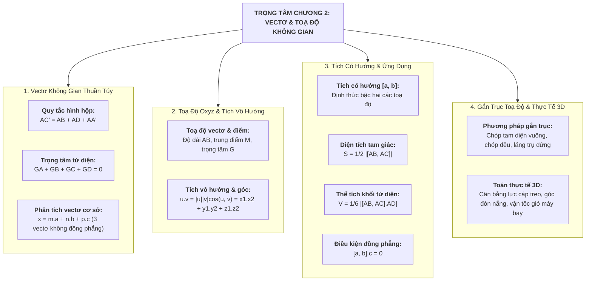

# CHƯƠNG 2: VECTƠ VÀ HỆ TOẠ ĐỘ TRONG KHÔNG GIAN (CHUYÊN SÂU 9+)
> **TÀI LIỆU ÔN THI ĐỈNH CAO: TỐT NGHIỆP THPT, HSA, V-SAT, TSA**
> *Mục tiêu: Đạt điểm 9.0 – 10.0 | Phủ kín 100% Toán Không gian thuần túy, Phương pháp gắn trục & Mô hình Thực tế 3D*
> *Cấu trúc đề thi mới Bộ GD&ĐT: Trắc nghiệm 4 lựa chọn, Đúng/Sai, Trả lời ngắn*

---

# PHẦN 1: BẢN ĐỒ TƯ DUY & HỆ THỐNG CÔNG THỨC NỀN TẢNG

---

## I. VECTƠ TRONG KHÔNG GIAN & CÁC QUY TẮC CƠ BẢN

### 1. Khái niệm & Quy tắc cộng trừ vectơ
* Vectơ trong không gian là một đoạn thẳng có hướng. Hai vectơ bằng nhau nếu chúng cùng hướng và cùng độ dài.
* **Quy tắc 3 điểm (Tam giác):**
  $$\vec{AB} + \vec{BC} = \vec{AC}, \qquad \vec{AB} - \vec{AC} = \vec{CB}$$
* **Quy tắc hình bình hành:** Nếu $ABCD$ là hình bình hành:
  $$\vec{AB} + \vec{AD} = \vec{AC}$$
* **Quy tắc hình hộp (Đặc trưng cơ bản trong không gian):**
  Cho hình hộp $ABCD.A'B'C'D'$ có 3 cạnh xuất phát từ đỉnh $A$:
  $$\vec{AB} + \vec{AD} + \vec{AA'} = \vec{AC'}$$
  *(Vectơ đường chéo bằng tổng 3 vectơ cạnh xuất phát từ cùng một đỉnh).*

### 2. Hệ thức trung điểm và trọng tâm
* **Trung điểm $M$ của đoạn thẳng $AB$:**
  $$\vec{MA} + \vec{MB} = \vec{0} \iff \vec{OA} + \vec{OB} = 2\vec{OM} \quad (\forall O)$$
* **Trọng tâm $G$ của tam giác $ABC$:**
  $$\vec{GA} + \vec{GB} + \vec{GC} = \vec{0} \iff \vec{OA} + \vec{OB} + \vec{OC} = 3\vec{OG} \quad (\forall O)$$
* **Trọng tâm $G$ của khối tứ diện $ABCD$:**
  $$\vec{GA} + \vec{GB} + \vec{GC} + \vec{GD} = \vec{0} \iff \vec{OA} + \vec{OB} + \vec{OC} + \vec{OD} = 4\vec{OG} \quad (\forall O)$$

### 3. Giá của Vectơ & Vectơ Song Song Với Mặt Phẳng
* **Giá của vectơ:** Đường thẳng đi qua điểm đầu và điểm cuối của vectơ $\vec{u}$ (với $\vec{u} \ne \vec{0}$) được gọi là **giá** của vectơ $\vec{u}$.
* **Vectơ song song với mặt phẳng:** Vectơ $\vec{u} \ne \vec{0}$ được gọi là song song với mặt phẳng $(P)$ nếu giá của $\vec{u}$ **song song hoặc nằm trong** $(P)$.
* **Cặp vectơ chỉ phương của mặt phẳng:** Hai vectơ $\vec{a}, \vec{b}$ không cùng phương được gọi là cặp vectơ chỉ phương của mặt phẳng $(P)$ nếu giá của chúng song song hoặc nằm trong $(P)$. Khi đó, mọi vectơ $\vec{c}$ có giá song song hoặc nằm trong $(P)$ đều biểu diễn duy nhất dưới dạng:
  $$\vec{c} = m\vec{a} + n\vec{b} \quad (m, n \in \mathbb{R})$$

### 4. Sự đồng phẳng của ba vectơ & Định lý phân tích cơ sở
* **Định nghĩa đồng phẳng:** Ba vectơ trong không gian được gọi là **đồng phẳng** nếu giá của chúng cùng song song hoặc nằm trong một mặt phẳng nào đó.
* **Điều kiện cần và đủ để ba vectơ đồng phẳng:**
  * Giả sử $\vec{a}, \vec{b}$ là hai vectơ không cùng phương. Ba vectơ $\vec{a}, \vec{b}, \vec{c}$ đồng phẳng $\iff$ tồn tại duy nhất cặp số thực $(m, n)$ sao cho:
    $$\vec{c} = m\vec{a} + n\vec{b}$$
  * Trong không gian toạ độ $Oxyz$:
    $$\vec{a}, \vec{b}, \vec{c} \text{ đồng phẳng} \iff [\vec{a}, \vec{b}] \cdot \vec{c} = 0$$
* **Định lý phân tích một vectơ theo 3 vectơ không đồng phẳng:**
  * Nếu $\vec{a}, \vec{b}, \vec{c}$ là ba vectơ **không đồng phẳng** (tức là $[\vec{a}, \vec{b}] \cdot \vec{c} \ne 0$), thì với mọi vectơ $\vec{x}$ bất kỳ trong không gian, luôn tồn tại **duy nhất** bộ ba số thực $(m, n, p)$ sao cho:
    $$\vec{x} = m\vec{a} + n\vec{b} + p\vec{c}$$

### 5. Phân tích cơ sở mở rộng
* **Định nghĩa đồng phẳng:** Ba vectơ $\vec{a}, \vec{b}, \vec{c}$ được gọi là đồng phẳng nếu giá của chúng cùng song song với một mặt phẳng.
* **Điều kiện đồng phẳng:** Nếu $\vec{a}$ và $\vec{b}$ không cùng phương thì:
  $$\vec{a}, \vec{b}, \vec{c} \text{ đồng phẳng} \iff \exists ! (m, n) \in \mathbb{R}: \vec{c} = m\vec{a} + n\vec{b}$$
* **Định lý phân tích theo bộ ba vectơ không đồng phẳng:** Nếu $\vec{a}, \vec{b}, \vec{c}$ là ba vectơ không đồng phẳng trong không gian thì với mọi vectơ $\vec{x}$ bất kỳ, luôn tồn tại **duy nhất** bộ ba số thực $(m, n, p)$ sao cho:
  $$\vec{x} = m\vec{a} + n\vec{b} + p\vec{c}$$

---

## II. TÍCH VÔ HƯỚNG CỦA HAI VECTƠ TRONG KHÔNG GIAN

### 1. Góc giữa hai vectơ trong không gian
Cho hai vectơ $\vec{u}$ và $\vec{v}$ khác $\vec{0}$. Từ điểm $O$ tùy ý dựng $\vec{OA} = \vec{u}, \vec{OB} = \vec{v}$. Khi đó:
$$\text{Góc giữa } \vec{u} \text{ và } \vec{v} \text{ là } \widehat{AOB} \quad (0^\circ \le (\vec{u}, \vec{v}) \le 180^\circ)$$

### 2. Tích vô hướng & Ứng dụng
* **Công thức định nghĩa:**
  $$\vec{u} \cdot \vec{v} = |\vec{u}| \cdot |\vec{v}| \cdot \cos(\vec{u}, \vec{v})$$
* **Góc giữa hai vectơ:**
  $$\cos(\vec{u}, \vec{v}) = \frac{\vec{u} \cdot \vec{v}}{|\vec{u}| \cdot |\vec{v}|}$$
* **Điều kiện vuông góc:**
  $$\vec{u} \perp \vec{v} \iff \vec{u} \cdot \vec{v} = 0$$
* **Ứng dụng vật lý:** Công cơ học $W$ sinh bởi lực $\vec{F}$ làm chất điểm dịch chuyển một quãng đường theo vectơ $\vec{s}$:
  $$W = \vec{F} \cdot \vec{s} = |\vec{F}| |\vec{s}| \cos(\vec{F}, \vec{s})$$

---

## III. HỆ TRỤC TOẠ ĐỘ OXYZ & CÁC BIỂU THỨC TOẠ ĐỘ

### 1. Toạ độ của Vectơ và Điểm
Trong không gian gắn hệ toạ độ $Oxyz$ với 3 vectơ đơn vị đôi một vuông góc $\vec{i}, \vec{j}, \vec{k}$ ($\vec{i}^2 = \vec{j}^2 = \vec{k}^2 = 1$ và $\vec{i}\cdot\vec{j} = \vec{j}\cdot\vec{k} = \vec{k}\cdot\vec{i} = 0$):
* **Toạ độ vectơ:** $\vec{u} = (x; y; z) \iff \vec{u} = x\vec{i} + y\vec{j} + z\vec{k}$.
* **Toạ độ điểm:** $M(x; y; z) \iff \vec{OM} = (x; y; z)$.

### 2. Các phép toán toạ độ cơ bản
Cho $\vec{a} = (x_1; y_1; z_1)$, $\vec{b} = (x_2; y_2; z_2)$ và số thực $k$:
* $\vec{a} \pm \vec{b} = (x_1 \pm x_2; y_1 \pm y_2; z_1 \pm z_2)$.
* $k\vec{a} = (kx_1; ky_1; kz_1)$.
* $\vec{a} = \vec{b} \iff x_1 = x_2, y_1 = y_2, z_1 = z_2$.
* $\vec{a} \parallel \vec{b}$ ($\vec{b} \ne \vec{0}$) $\iff \vec{a} = k\vec{b} \iff \frac{x_1}{x_2} = \frac{y_1}{y_2} = \frac{z_1}{z_2}$ (với các mẫu khác 0).
* **Độ dài vectơ:** $|\vec{a}| = \sqrt{x_1^2 + y_1^2 + z_1^2}$.
* **Tích vô hướng:** $\vec{a} \cdot \vec{b} = x_1 x_2 + y_1 y_2 + z_1 z_2$.
* **Cosin góc giữa hai vectơ:**
  $$\cos(\vec{a}, \vec{b}) = \frac{x_1 x_2 + y_1 y_2 + z_1 z_2}{\sqrt{x_1^2 + y_1^2 + z_1^2} \cdot \sqrt{x_2^2 + y_2^2 + z_2^2}}$$

### 3. Toạ độ điểm trong không gian
Cho $A(x_A; y_A; z_A), B(x_B; y_B; z_B), C(x_C; y_C; z_C), D(x_D; y_D; z_D)$:
* $\vec{AB} = (x_B - x_A; y_B - y_A; z_B - z_A)$.
* Độ dài $AB = |\vec{AB}| = \sqrt{(x_B - x_A)^2 + (y_B - y_A)^2 + (z_B - z_A)^2}$.
* Trung điểm $M$ của $AB$: $M\left(\frac{x_A+x_B}{2}; \frac{y_A+y_B}{2}; \frac{z_A+z_B}{2}\right)$.
* Trọng tâm $G$ của $\triangle ABC$: $G\left(\frac{x_A+x_B+x_C}{3}; \frac{y_A+y_B+y_C}{3}; \frac{z_A+z_B+z_C}{3}\right)$.
* Trọng tâm $G$ của tứ diện $ABCD$: $G\left(\frac{x_A+x_B+x_C+x_D}{4}; \frac{y_A+y_B+y_C+y_D}{4}; \frac{z_A+z_B+z_C+z_D}{4}\right)$.

---

## IV. TÍCH CÓ HƯỚNG CỦA HAI VECTƠ & ỨNG DỤNG HÌNH HỌC

### 1. Định thức tính tích có hướng
Cho $\vec{a} = (x_1; y_1; z_1)$ và $\vec{b} = (x_2; y_2; z_2)$. Tích có hướng $[\vec{a}, \vec{b}]$ (hay $\vec{a} \times \vec{b}$) là một vectơ có toạ độ:
$$[\vec{a}, \vec{b}] = \left( \begin{vmatrix} y_1 & z_1 \\ y_2 & z_2 \end{vmatrix}; \begin{vmatrix} z_1 & x_1 \\ z_2 & x_2 \end{vmatrix}; \begin{vmatrix} x_1 & y_1 \\ x_2 & y_2 \end{vmatrix} \right) = (y_1 z_2 - y_2 z_1; \; z_1 x_2 - z_2 x_1; \; x_1 y_2 - x_2 y_1)$$

### 2. Các tính chất quan trọng
1. $[\vec{a}, \vec{b}] \perp \vec{a}$ và $[\vec{a}, \vec{b}] \perp \vec{b}$.
2. $[\vec{b}, \vec{a}] = -[\vec{a}, \vec{b}]$.
3. $\vec{a}$ cùng phương với $\vec{b} \iff [\vec{a}, \vec{b}] = \vec{0}$.
4. **Điều kiện đồng phẳng của 3 vectơ:**
   $$\vec{a}, \vec{b}, \vec{c} \text{ đồng phẳng} \iff [\vec{a}, \vec{b}] \cdot \vec{c} = 0$$

### 3. Ứng dụng hình học của tích có hướng
* **Diện tích tam giác $ABC$:**
  $$S_{\triangle ABC} = \frac{1}{2} |[\vec{AB}, \vec{AC}]|$$
* **Diện tích hình bình hành $ABCD$:**
  $$S_{ABCD} = |[\vec{AB}, \vec{AD}]|$$
* **Thể tích khối tứ diện $ABCD$:**
  $$V_{ABCD} = \frac{1}{6} |[\vec{AB}, \vec{AC}] \cdot \vec{AD}|$$
* **Thể tích hình hộp $ABCD.A'B'C'D'$:**
  $$V = |[\vec{AB}, \vec{AD}] \cdot \vec{AA'}|$$

---

# PHẦN 2: PHÂN DẠNG BÀI TOÁN & PHƯƠNG PHÁP GIẢI CHI TIẾT

## DẠNG 1: PHÂN TÍCH VECTƠ THEO BỘ BA VECTƠ CƠ SỞ

#### Ví dụ mẫu 1:
Cho hình lăng trụ tam giác $ABC.A'B'C'$ có $\vec{AA'} = \vec{a}, \vec{AB} = \vec{b}, \vec{AC} = \vec{c}$. Gọi $I$ là trung điểm của $B'C$ và $G$ là trọng tâm của tam giác $A'B'C'$.
a) Phân tích vectơ $\vec{AI}$ theo $\vec{a}, \vec{b}, \vec{c}$.
b) Phân tích vectơ $\vec{AG}$ theo $\vec{a}, \vec{b}, \vec{c}$.

* **Lời giải chi tiết:**
  * **a) Phân tích $\vec{AI}$:**
    * Vì $I$ là trung điểm của $B'C$, theo quy tắc trung điểm với gốc $A$:
      $$\vec{AI} = \frac{1}{2} (\vec{AB'} + \vec{AC})$$
    * Lại có $ABB'A'$ là hình bình hành $\implies \vec{AB'} = \vec{AA'} + \vec{AB} = \vec{a} + \vec{b}$.
    * Do đó:
      $$\vec{AI} = \frac{1}{2} (\vec{a} + \vec{b} + \vec{c}) = \frac{1}{2}\vec{a} + \frac{1}{2}\vec{b} + \frac{1}{2}\vec{c}$$
  * **b) Phân tích $\vec{AG}$:**
    * Vì $G$ là trọng tâm tam giác $A'B'C'$, theo quy tắc trọng tâm với gốc $A$:
      $$\vec{AG} = \frac{1}{3} (\vec{AA'} + \vec{AB'} + \vec{AC'})$$
    * Ta có $\vec{AA'} = \vec{a}$, $\vec{AB'} = \vec{a} + \vec{b}$, và $\vec{AC'} = \vec{AA'} + \vec{AC} = \vec{a} + \vec{c}$.
    * Thay vào:
      $$\vec{AG} = \frac{1}{3} (\vec{a} + \vec{a} + \vec{b} + \vec{a} + \vec{c}) = \frac{1}{3} (3\vec{a} + \vec{b} + \vec{c}) = \vec{a} + \frac{1}{3}\vec{b} + \frac{1}{3}\vec{c}$$

---

## DẠNG 2: PHƯƠNG PHÁP GẮN HỆ TRỤC TOẠ ĐỘ OXYZ GIẢI HÌNH KHÔNG GIAN

### 1. Nguyên tắc chọn hệ trục toạ độ $Oxyz$:
* **Chọn gốc toạ độ $O$:** Tìm điểm có 3 đường thẳng đôi một vuông góc (góc tam diện vuông, ví dụ: góc phòng, chân đường cao hình chóp có đáy vuông/chữ nhật).
* **Gán các trục $Ox, Oy, Oz$:** Lần lượt dọc theo 3 đường vuông góc đó.
* **Xác định toạ độ tất cả các đỉnh** và sử dụng công thức toạ độ để tính khoảng cách, góc, thể tích.

#### Ví dụ mẫu 2:
Cho hình chóp $S.ABC$ có đáy $ABC$ là tam giác vuông tại $B$, $AB = a, BC = a\sqrt{3}$. Cạnh bên $SA$ vuông góc với mặt phẳng đáy $(ABC)$ và $SA = 2a$. Gọi $M$ là trung điểm của $SC$. Tính cosin của góc giữa hai đường thẳng $AM$ và $BC$.

* **Lời giải chi tiết:**
  * Chọn hệ trục $Oxyz$ với gốc $B(0;0;0)$, tia $BA \equiv Ox$, tia $BC \equiv Oy$, và tia cùng hướng với $\vec{AS}$ song song với trục $Oz$.
  * Toạ độ các điểm (chuẩn hóa $a = 1$):
    * $B(0; 0; 0)$.
    * $A(1; 0; 0)$ (do $BA = 1$).
    * $C(0; \sqrt{3}; 0)$ (do $BC = \sqrt{3}$).
    * $S(1; 0; 2)$ (do $SA = 2, SA \perp (ABC)$).
  * Trung điểm $M$ của $SC$:
    $$x_M = \frac{1 + 0}{2} = \frac{1}{2}, \quad y_M = \frac{0 + \sqrt{3}}{2} = \frac{\sqrt{3}}{2}, \quad z_M = \frac{2 + 0}{2} = 1 \implies M\left(\frac{1}{2}; \frac{\sqrt{3}}{2}; 1\right)$$
  * Vectơ chỉ phương của các đường thẳng:
    * $\vec{AM} = \left(\frac{1}{2} - 1; \frac{\sqrt{3}}{2} - 0; 1 - 0\right) = \left(-\frac{1}{2}; \frac{\sqrt{3}}{2}; 1\right)$.
    * $\vec{BC} = (0; \sqrt{3}; 0)$.
  * Tích vô hướng:
    $$\vec{AM} \cdot \vec{BC} = \left(-\frac{1}{2}\right)(0) + \left(\frac{\sqrt{3}}{2}\right)(\sqrt{3}) + 1(0) = \frac{3}{2}$$
  * Độ dài:
    * $|\vec{AM}| = \sqrt{\left(-\frac{1}{2}\right)^2 + \left(\frac{\sqrt{3}}{2}\right)^2 + 1^2} = \sqrt{\frac{1}{4} + \frac{3}{4} + 1} = \sqrt{2}$.
    * $|\vec{BC}| = \sqrt{0^2 + (\sqrt{3})^2 + 0^2} = \sqrt{3}$.
  * Cosin của góc giữa hai đường thẳng $AM$ và $BC$:
    $$\cos(AM, BC) = \frac{|\vec{AM} \cdot \vec{BC}|}{|\vec{AM}| \cdot |\vec{BC}|} = \frac{\frac{3}{2}}{\sqrt{2} \cdot \sqrt{3}} = \frac{3}{2\sqrt{6}} = \frac{\sqrt{6}}{4} \approx 0.6124$$

---

## DẠNG 3: MÔ HÌNH TOÁN THỰC TẾ 3D

### Bài toán 1: Cân bằng lực 3 dây cáp treo đèn chùm 3D
Một chiếc đèn chùm trang trí có trọng lượng $P = 150\text{ N}$ được treo vào điểm $S$ bởi 3 sợi dây cáp không dãn $SA, SB, SC$ gắn vào 3 điểm trên trần nhà nằm ngang tại $A(1; \sqrt{3}; 0), B(1; -\sqrt{3}; 0), C(-2; 0; 0)$ (đơn vị: mét). Điểm buộc $S$ có toạ độ $S(0; 0; -2)$. Tính lực căng $T$ của mỗi sợi dây khi hệ ở trạng thái cân bằng tĩnh.

* **Lời giải chi tiết:**
  * Toạ độ các vectơ hướng lực:
    * $\vec{SA} = (1; \sqrt{3}; 2) \implies |\vec{SA}| = \sqrt{1 + 3 + 4} = 2\sqrt{2}\text{ m}$.
    * $\vec{SB} = (1; -\sqrt{3}; 2) \implies |\vec{SB}| = 2\sqrt{2}\text{ m}$.
    * $\vec{SC} = (-2; 0; 2) \implies |\vec{SC}| = \sqrt{4 + 0 + 4} = 2\sqrt{2}\text{ m}$.
  * Do tính đối xứng, lực căng trên 3 dây bằng nhau: $T_A = T_B = T_C = T$.
  * Vectơ lực căng của từng dây:
    $$\vec{T}_A = \frac{T}{2\sqrt{2}}(1; \sqrt{3}; 2), \quad \vec{T}_B = \frac{T}{2\sqrt{2}}(1; -\sqrt{3}; 2), \quad \vec{T}_C = \frac{T}{2\sqrt{2}}(-2; 0; 2)$$
  * Trọng lực tác dụng lên $S$: $\vec{P} = (0; 0; -150)$.
  * Điều kiện cân bằng lực: $\vec{T}_A + \vec{T}_B + \vec{T}_C + \vec{P} = \vec{0}$.
  * Chiếu phương trình lên trục cao độ $Oz$:
    $$\frac{T}{2\sqrt{2}}(2) + \frac{T}{2\sqrt{2}}(2) + \frac{T}{2\sqrt{2}}(2) - 150 = 0 \iff 3 \cdot \frac{T}{\sqrt{2}} = 150 \implies T = 50\sqrt{2} \approx 70.71\text{ N}$$
* **Kết luận:** Lực căng của mỗi sợi cáp bằng $50\sqrt{2}\text{ N} \approx 70.71\text{ N}$.

---

# PHẦN 3: BỘ ĐỀ RÈN LUYỆN TOÀN DIỆN FORMAT 2025+

## PHẦN I: TRẮC NGHIỆM 4 LỰA CHỌN (8 Câu chuẩn phân hóa)

**Câu 1 (NB):** Cho hình hộp chữ nhật $ABCD.A'B'C'D'$. Khẳng định nào sau đây đúng?
* **A.** $\vec{AB} + \vec{AD} + \vec{AA'} = \vec{AC'}$
* **B.** $\vec{AB} + \vec{AD} + \vec{AA'} = \vec{CA'}$
* **C.** $\vec{AB} + \vec{BC} + \vec{CD} = \vec{AD}$
* **D.** $\vec{AB} + \vec{AD} = \vec{BD}$

* *Lời giải:* Theo quy tắc hình hộp, tổng 3 vectơ cạnh xuất phát từ đỉnh $A$ là $\vec{AB} + \vec{AD} + \vec{AA'} = \vec{AC'}$. $\implies$ **Chọn A**.

---

**Câu 2 (NB):** Cho tứ diện $ABCD$. Gọi $G$ là trọng tâm của tam giác $BCD$. Mệnh đề nào sau đây đúng?
* **A.** $\vec{AB} + \vec{AC} + \vec{AD} = 3\vec{AG}$
* **B.** $\vec{AB} + \vec{AC} + \vec{AD} = \vec{AG}$
* **C.** $\vec{AB} + \vec{AC} + \vec{AD} = 2\vec{AG}$
* **D.** $\vec{AB} + \vec{AC} + \vec{AD} = 4\vec{AG}$

* *Lời giải:* Do $G$ là trọng tâm $\triangle BCD \implies \vec{GB} + \vec{GC} + \vec{GD} = \vec{0}$. Với điểm $A$ bất kỳ: $\vec{AB} + \vec{AC} + \vec{AD} = 3\vec{AG}$. $\implies$ **Chọn A**.

---

**Câu 3 (TH):** Trong không gian $Oxyz$, cho $\vec{a} = (1; 2; -3)$ và $\vec{b} = (-2; 1; 1)$. Tích có hướng $[\vec{a}, \vec{b}]$ có toạ độ là:
* **A.** $(5; 5; 5)$
* **B.** $(5; -5; 5)$
* **C.** $(-5; 5; 5)$
* **D.** $(1; 7; 5)$

* *Lời giải:* $[\vec{a}, \vec{b}] = (2(1) - (-3)(1); (-3)(-2) - 1(1); 1(1) - 2(-2)) = (5; 5; 5)$. $\implies$ **Chọn A**.

---

**Câu 4 (TH):** Cho hai vectơ $\vec{u} = (1; -1; 2)$ và $\vec{v} = (0; 3; -1)$. Tích vô hướng $\vec{u} \cdot \vec{v}$ bằng:
* **A.** $-5$
* **B.** $5$
* **C.** $-1$
* **D.** $1$

* *Lời giải:* $\vec{u} \cdot \vec{v} = 1(0) + (-1)(3) + 2(-1) = 0 - 3 - 2 = -5$. $\implies$ **Chọn A**.

---

**Câu 5 (TH):** Cho tam giác $ABC$ có $A(1; 0; 1), B(0; 2; 3), C(2; 1; 0)$. Độ dài vectơ $\vec{AB}$ bằng:
* **A.** $3$
* **B.** $\sqrt{5}$
* **C.** $\sqrt{6}$
* **D.** $9$

* *Lời giải:* $\vec{AB} = (0 - 1; 2 - 0; 3 - 1) = (-1; 2; 2) \implies |\vec{AB}| = \sqrt{(-1)^2 + 2^2 + 2^2} = \sqrt{9} = 3$. $\implies$ **Chọn A**.

---

**Câu 6 (VD):** Cho hình lập phương $ABCD.A'B'C'D'$ cạnh $a$. Góc giữa hai vectơ $\vec{AB}$ và $\vec{A'C'}$ bằng:
* **A.** $45^\circ$
* **B.** $90^\circ$
* **C.** $60^\circ$
* **D.** $135^\circ$

* *Lời giải:* Vì $A'B'C'D'$ là hình vuông nên $\vec{A'C'} = \vec{AC}$. Góc giữa $\vec{AB}$ và $\vec{A'C'}$ chính là góc giữa $\vec{AB}$ và $\vec{AC}$, tức góc $\widehat{BAC} = 45^\circ$. $\implies$ **Chọn A**.

---

**Câu 7 (VD):** Trong không gian $Oxyz$, cho ba điểm $A(1; 1; 1), B(2; 3; 4), C(1; 2; 3)$. Diện tích tam giác $ABC$ bằng:
* **A.** $\frac{\sqrt{6}}{2}$
* **B.** $\sqrt{6}$
* **C.** $\frac{\sqrt{3}}{2}$
* **D.** $3$

* *Lời giải:* $\vec{AB} = (1; 2; 3), \vec{AC} = (0; 1; 2)$.
  * Tích có hướng: $[\vec{AB}, \vec{AC}] = (2(2) - 3(1); 3(0) - 1(2); 1(1) - 2(0)) = (1; -2; 1)$.
  * Diện tích: $S = \frac{1}{2} |[\vec{AB}, \vec{AC}]| = \frac{1}{2} \sqrt{1^2 + (-2)^2 + 1^2} = \frac{\sqrt{6}}{2}$. $\implies$ **Chọn A**.

---

**Câu 8 (VDC):** Cho ba lực $\vec{F}_1 = (10; 20; -5), \vec{F}_2 = (-15; 10; 15), \vec{F}_3 = (5; -30; -10)$ (đơn vị: N) cùng tác dụng vào một chất điểm đặt tại gốc toạ độ $O$. Hợp lực $\vec{F} = \vec{F}_1 + \vec{F}_2 + \vec{F}_3$ tác dụng lên chất điểm có độ lớn là:
* **A.** $0\text{ N}$
* **B.** $10\text{ N}$
* **C.** $5\text{ N}$
* **D.** $25\text{ N}$

* *Lời giải:* $\vec{F} = (10 - 15 + 5; 20 + 10 - 30; -5 + 15 - 10) = (0; 0; 0) = \vec{0} \implies |\vec{F}| = 0\text{ N}$ (Chất điểm ở trạng thái cân bằng lực). $\implies$ **Chọn A**.

---

## PHẦN II: TRẮC NGHIỆM ĐÚNG / SAI (3 Câu đa ý)

**Câu 1:** Trong không gian $Oxyz$, cho hình chóp $S.ABC$ có đáy $ABC$ là tam giác vuông tại $B$, $AB = 3, BC = 4$, $SA \perp (ABC)$ và $SA = 5$. Chọn hệ toạ độ sao cho gốc $B(0;0;0)$, tia $BA$ dọc theo trục $Ox$, tia $BC$ dọc theo trục $Oy$, và tia cùng hướng với $\vec{AS}$ song song với trục $Oz$.
* a) Toạ độ các điểm là $A(3; 0; 0), C(0; 4; 0), S(3; 0; 5)$.
* b) Vectơ $\vec{SC}$ có toạ độ là $(-3; 4; -5)$.
* c) Tích có hướng $[\vec{BA}, \vec{BC}] = (0; 0; 12)$.
* d) Thể tích khối chóp $S.ABC$ bằng $10$.

* **Đánh giá Đúng/Sai:**
  * a) **ĐÚNG:** $B(0;0;0), A(3;0;0), C(0;4;0), S(3;0;5)$.
  * b) **ĐÚNG:** $\vec{SC} = (0-3; 4-0; 0-5) = (-3; 4; -5)$.
  * c) **ĐÚNG:** $\vec{BA} = (3; 0; 0), \vec{BC} = (0; 4; 0) \implies [\vec{BA}, \vec{BC}] = (0; 0; 12)$.
  * d) **ĐÚNG:** $V = \frac{1}{3} S_{ABC} \cdot SA = \frac{1}{3} \left(\frac{1}{2} \cdot 3 \cdot 4\right) \cdot 5 = 10$.

---

**Câu 2:** Cho tứ diện đều $ABCD$ có cạnh bằng $a$. Gọi $M, N$ lần lượt là trung điểm của các cạnh $AB$ và $CD$.
* a) Vectơ $\vec{MN} = \frac{1}{2}(\vec{AD} + \vec{BC})$.
* b) Tích vô hướng $\vec{AB} \cdot \vec{CD} = 0$.
* c) Hai đường thẳng $AB$ và $CD$ vuông góc với nhau.
* d) Độ dài đoạn thẳng $MN$ bằng $\frac{a\sqrt{2}}{2}$.

* **Đánh giá Đúng/Sai:**
  * a) **ĐÚNG:** $\vec{MN} = \vec{MA} + \vec{AD} + \vec{DN}$ và $\vec{MN} = \vec{MB} + \vec{BC} + \vec{CN} \implies 2\vec{MN} = \vec{AD} + \vec{BC} \implies \vec{MN} = \frac{1}{2}(\vec{AD} + \vec{BC})$.
  * b) **ĐÚNG:** $\vec{AB} \cdot \vec{CD} = \vec{AB} \cdot (\vec{AD} - \vec{AC}) = \vec{AB}\cdot\vec{AD} - \vec{AB}\cdot\vec{AC} = a^2\cos 60^\circ - a^2\cos 60^\circ = 0$.
  * c) **ĐÚNG:** $\vec{AB} \cdot \vec{CD} = 0 \implies AB \perp CD$.
  * d) **ĐÚNG:** Tam giác $ACD$ đều cạnh $a \implies AN = \frac{a\sqrt{3}}{2}$. Tam giác $ABN$ cân tại $N$ có $MN \perp AB \implies MN = \sqrt{AN^2 - AM^2} = \sqrt{\frac{3a^2}{4} - \frac{a^2}{4}} = \frac{a\sqrt{2}}{2}$.

---

**Câu 3:** Trong không gian $Oxyz$, cho 4 điểm $A(1; 0; 0), B(0; 2; 0), C(0; 0; 3), D(2; 2; 2)$.
* a) Toạ độ trọng tâm $G$ của tứ diện $ABCD$ là $G\left(\frac{3}{4}; 1; \frac{5}{4}\right)$.
* b) Vectơ $[\vec{AB}, \vec{AC}]$ có toạ độ là $(6; 3; 2)$.
* c) Bốn điểm $A, B, C, D$ đồng phẳng.
* d) Thể tích tứ diện $ABCD$ bằng $2$.

* **Đánh giá Đúng/Sai:**
  * a) **ĐÚNG:** $G\left(\frac{1+0+0+2}{4}; \frac{0+2+0+2}{4}; \frac{0+0+3+2}{4}\right) = G\left(\frac{3}{4}; 1; \frac{5}{4}\right)$.
  * b) **ĐÚNG:** $\vec{AB} = (-1; 2; 0), \vec{AC} = (-1; 0; 3) \implies [\vec{AB}, \vec{AC}] = (6; 3; 2)$.
  * c) **SAI:** $\vec{AD} = (1; 2; 2) \implies [\vec{AB}, \vec{AC}] \cdot \vec{AD} = 6(1) + 3(2) + 2(2) = 16 \ne 0 \implies$ 4 điểm không đồng phẳng.
  * d) **SAI:** Thể tích $V = \frac{1}{6} |[\vec{AB}, \vec{AC}] \cdot \vec{AD}| = \frac{16}{6} = \frac{8}{3} \ne 2$.

---

## PHẦN III: TRẮC NGHIỆM TRẢ LỜI NGẮN (4 Câu thực tế & VDC)

**Câu 1 (Toán thực tế - Vận tốc máy bay trong gió):** Một máy bay cất cánh từ sân bay với vận tốc riêng $\vec{v}_1 = (400; 300; 50)$ (km/h). Cùng lúc đó một luồng gió mạnh thổi với vận tốc $\vec{v}_2 = (-40; 20; -10)$ km/h. Tính tốc độ thực tế của máy bay đối với mặt đất (kết quả làm tròn đến hàng đơn vị km/h).

* **Lời giải:**
  * Vận tốc thực tế đối với mặt đất: $\vec{v} = \vec{v}_1 + \vec{v}_2 = (400 - 40; 300 + 20; 50 - 10) = (360; 320; 40)\text{ km/h}$.
  * Tốc độ thực tế:
    $$|\vec{v}| = \sqrt{360^2 + 320^2 + 40^2} = \sqrt{129600 + 102400 + 1600} = \sqrt{233600} \approx 483.32\text{ km/h} \approx 483\text{ km/h}$$
* **Đáp số:** `483`

---

**Câu 2 (Toán thực tế - Treo đèn chùm cân bằng):** Một chiếc đèn chùm nặng $120\text{ N}$ được treo cân bằng bởi 3 sợi dây cáp cùng chiều dài gắn vào trần nhà tại các điểm $A(1; \sqrt{3}; 0), B(1; -\sqrt{3}; 0), C(-2; 0; 0)$ (đơn vị: mét). Điểm treo $S$ có toạ độ $S(0; 0; -2)$. Tính lực căng của mỗi sợi dây cáp (đơn vị: Newton, làm tròn đến chữ số thập phân thứ nhất).

* **Lời giải:**
  * Vectơ chỉ phương các dây cáp: $\vec{SA} = (1; \sqrt{3}; 2), \vec{SB} = (1; -\sqrt{3}; 2), \vec{SC} = (-2; 0; 2)$.
  * Độ dài $|\vec{SA}| = |\vec{SB}| = |\vec{SC}| = \sqrt{1 + 3 + 4} = 2\sqrt{2}\text{ m}$.
  * Do tính đối xứng, lực căng 3 dây bằng nhau $T_A = T_B = T_C = T$.
  * Trọng lực $\vec{P} = (0; 0; -120)$.
  * Điều kiện cân bằng tại $S$: $\vec{T}_A + \vec{T}_B + \vec{T}_C + \vec{P} = \vec{0}$.
  * Chiếu lên trục $Oz$: $3 \cdot \left(\frac{T}{2\sqrt{2}} \cdot 2\right) - 120 = 0 \iff \frac{3T}{\sqrt{2}} = 120 \implies T = 40\sqrt{2} \approx 56.568 \approx 56.6\text{ N}$.
* **Đáp số:** `56.6`

---

**Câu 3 (Toán thực tế - Tấm pin mặt trời):** Một tấm pin năng lượng mặt trời hình chữ nhật phẳng có 4 đỉnh $A(0;0;0), B(2;0;0), C(2;1.5;0.75), D(0;1.5;0.75)$ (đơn vị: mét) đặt nghiêng so với mặt đất nằm ngang $(Oxy)$. Tính góc nghiêng của tấm pin so với mặt đất (kết quả tính theo độ, làm tròn đến hàng đơn vị).

* **Lời giải:**
  * $\vec{AB} = (2; 0; 0), \vec{AD} = (0; 1.5; 0.75) = (0; \frac{3}{2}; \frac{3}{4})$.
  * Vectơ pháp tuyến tấm pin: $\vec{n} = [\vec{AB}, \vec{AD}] = (0; -1.5; 3) \parallel (0; -1; 2)$.
  * Vectơ pháp tuyến mặt đất: $\vec{k} = (0; 0; 1)$.
  * Cosin góc nghiêng $\alpha$:
    $$\cos \alpha = \frac{|\vec{n} \cdot \vec{k}|}{|\vec{n}| |\vec{k}|} = \frac{2}{\sqrt{0 + 1 + 4} \cdot 1} = \frac{2}{\sqrt{5}} \implies \alpha = \arccos\left(\frac{2}{\sqrt{5}}\right) \approx 26.565^\circ \approx 27^\circ$$
* **Đáp số:** `27`

---

**Câu 4 (VDC - Thể tích hình hộp):** Cho hình hộp $ABCD.A'B'C'D'$ có $A(1; 0; 1), B(2; 1; 2), D(1; -1; 1), A'(4; 5; -5)$. Tính thể tích khối hộp $ABCD.A'B'C'D'$.

* **Lời giải:**
  * $\vec{AB} = (1; 1; 1), \vec{AD} = (0; -1; 0), \vec{AA'} = (3; 5; -6)$.
  * Tích có hướng $[\vec{AB}, \vec{AD}] = (1(0) - 1(-1); 1(0) - 1(0); 1(-1) - 1(0)) = (1; 0; -1)$.
  * Thể tích khối hộp:
    $$V = |[\vec{AB}, \vec{AD}] \cdot \vec{AA'}| = |1(3) + 0(5) + (-1)(-6)| = |3 + 0 + 6| = 9$$
* **Đáp số:** `9`