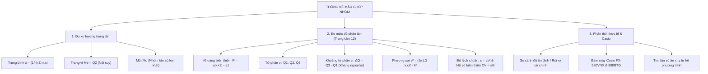

# CHƯƠNG 3: CÁC SỐ ĐẶC TRƯNG ĐO MỨC ĐỘ PHÂN TÁN CHO MẪU SỐ LIỆU GHÉP NHÓM (CHUYÊN SÂU 9+)
> **TÀI LIỆU ÔN THI ĐỈNH CAO: TỐT NGHIỆP THPT, HSA, V-SAT, TSA**
> *Mục tiêu: Đạt điểm 9.0 – 10.0 | Phủ kín 100% Thống kê suy luận, Phân tích rủi ro & Ứng dụng Thực tế*
> *Cấu trúc đề thi mới Bộ GD&ĐT: Trắc nghiệm 4 lựa chọn, Đúng/Sai, Trả lời ngắn*

---

# PHẦN 1: BẢN ĐỒ TƯ DUY & HỆ THỐNG CÔNG THỨC TOÀN DIỆN

---

## I. MẪU SỐ LIỆU GHÉP NHÓM & CÁC KHÁI NIỆM NỀN TẢNG

### 1. Bảng phân bố tần số ghép nhóm
Một mẫu số liệu ghép nhóm gồm $k$ nhóm có cấu trúc:
$$\begin{array}{|c|c|c|c|c|}
\hline
\textbf{Nhóm} & [a_1; a_2) & [a_2; a_3) & \dots & [a_k; a_{k+1}) \\
\hline
\textbf{Tần số } (n_i) & n_1 & n_2 & \dots & n_k \\
\hline
\textbf{Giá trị đại diện } (c_i) & c_1 = \frac{a_1+a_2}{2} & c_2 = \frac{a_2+a_3}{2} & \dots & c_k = \frac{a_k+a_{k+1}}{2} \\
\hline
\end{array}$$

* **Cỡ mẫu (tổng số quan sát):** $n = n_1 + n_2 + \dots + n_k = \sum_{i=1}^k n_i$.
* **Độ dài của nhóm $[a_i; a_{i+1})$:** $h_i = a_{i+1} - a_i$.

### 2. Các số đặc trưng đo xu hướng trung tâm (Ôn tập)
* **Số trung bình cộng ($\bar{x}$):**
  $$\bar{x} = \frac{n_1 c_1 + n_2 c_2 + \dots + n_k c_k}{n} = \frac{1}{n} \sum_{i=1}^k n_i c_i$$
* **Mốt ($M_o$):** Nhóm $[a_m; a_{m+1})$ có tần số lớn nhất $n_m = \max\{n_i\}$:
  $$M_o = a_m + \frac{n_m - n_{m-1}}{(n_m - n_{m-1}) + (n_m - n_{m+1})} \cdot (a_{m+1} - a_m)$$

---

## II. CÁC SỐ ĐẶC TRƯNG ĐO MỨC ĐỘ PHÂN TÁN (TRỌNG TÂM GDPT 2018)

### 1. Khoảng biến thiên (Range - $R$)
* **Công thức:**
  $$R = a_{k+1} - a_1$$
  *(Hiệu số giữa đầu mút phải của nhóm cuối cùng và đầu mút trái của nhóm đầu tiên).*
* **Ý nghĩa:** Cho biết phạm vi bao phủ cực đại của mẫu số liệu. Ưu điểm là tính toán cực nhanh, nhưng nhược điểm lớn là **rất nhạy cảm với các giá trị bất thường (ngoại lai)**.

---

### 2. Tứ phân vị ($Q_1, Q_2, Q_3$) và Khoảng tứ phân vị ($\Delta_Q$)

#### a) Công thức nội suy tuyến tính tìm Tứ phân vị $Q_p$ ($p \in \{1, 2, 3\}$):
1. **Tìm nhóm chứa $Q_p$:** Tính giá trị vị trí $\frac{p \cdot n}{4}$. Nhóm $[a_m; a_{m+1})$ là nhóm đầu tiên có tần số tích lũy $cf_m \ge \frac{p \cdot n}{4}$.
2. **Áp dụng công thức:**
   $$Q_p = a_m + \frac{\frac{p \cdot n}{4} - C}{n_m} \cdot (a_{m+1} - a_m)$$
   *Trong đó:*
   * $a_m$: Đầu mút trái của nhóm chứa $Q_p$.
   * $n_m$: Tần số của nhóm chứa $Q_p$.
   * $C = n_1 + n_2 + \dots + n_{m-1}$: Tổng tần số của tất cả các nhóm đứng trước nhóm chứa $Q_p$ ($C = 0$ nếu nhóm 1).
   * $a_{m+1} - a_m$: Độ dài của nhóm.

* **Cụ thể:**
  * **Tứ phân vị thứ nhất ($Q_1$ - Vị trí $\frac{n}{4}$):** Đo mốc $25\%$ số liệu nhỏ nhất.
    $$Q_1 = a_p + \frac{\frac{n}{4} - C_1}{n_p} \cdot (a_{p+1} - a_p)$$
  * **Tứ phân vị thứ hai (Trung vị $Q_2 = M_e$ - Vị trí $\frac{n}{2}$):** Đo mốc $50\%$ số liệu chính giữa.
    $$Q_2 = a_m + \frac{\frac{n}{2} - C_2}{n_m} \cdot (a_{m+1} - a_m)$$
  * **Tứ phân vị thứ ba ($Q_3$ - Vị trí $\frac{3n}{4}$):** Đo mốc $75\%$ số liệu.
    $$Q_3 = a_q + \frac{\frac{3n}{4} - C_3}{n_q} \cdot (a_{q+1} - a_q)$$

#### b) Khoảng tứ phân vị (Interquartile Range - $\Delta_Q$):
$$\Delta_Q = Q_3 - Q_1$$
* **Ý nghĩa sâu sắc:** Khoảng tứ phân vị đo độ biến thiên của **50% số liệu trung tâm** của mẫu. Đại lượng này **hoàn toàn không bị ảnh hưởng bởi các giá trị dị biệt hay ngoại lai (outliers)**, là đại lượng tin cậy nhất khi mẫu số liệu có độ lệch lớn.

---

### 3. Phương sai ($s^2$), Độ lệch chuẩn ($s$) & Hệ số biến thiên ($CV$)

#### a) Phương sai ($s^2$):
* **Công thức định nghĩa:**
  $$s^2 = \frac{1}{n} \sum_{i=1}^k n_i (c_i - \bar{x})^2$$
* **Công thức khai triển tính nhanh:**
  $$s^2 = \frac{1}{n} \left( \sum_{i=1}^k n_i c_i^2 \right) - \bar{x}^2$$

#### b) Độ lệch chuẩn ($s$):
$$s = \sqrt{s^2}$$
* **Ý nghĩa thực tế:**
  * Độ lệch chuẩn $s$ cùng đơn vị đo với số liệu gốc (dễ giải thích thực tế hơn phương sai $s^2$).
  * $s$ càng nhỏ $\implies$ Các số liệu càng tập trung sát với số trung bình $\bar{x} \implies$ **Độ đồng đều cao, sản phẩm ổn định, ít rủi ro**.
  * $s$ càng lớn $\implies$ Các số liệu càng phân tán xa số trung bình $\implies$ **Độ chênh lệch lớn, mức độ rủi ro cao**.

#### c) Hệ số biến thiên ($CV$ - Coefficient of Variation):
$$CV = \frac{s}{\bar{x}} \quad (\text{hoặc } CV = \frac{s}{\bar{x}} \times 100\%)$$
* **Ứng dụng:** Dùng để so sánh mức độ phân tán giữa hai mẫu số liệu có **đơn vị đo khác nhau** hoặc có **số trung bình khác nhau đáng kể**.

---

## III. HƯỚNG DẪN BẤM MÁY TÍNH CASIO FX-580VNX & FX-880BTG

### Quy trình trên Casio FX-580VNX:
1. **Bật cột tần số (Frequency):**
   * Bấm `SHIFT` $\to$ `MENU` $\to$ Cuộn xuống chọn `3: Thống kê (Statistics)` $\to$ Chọn `1: Bật (ON)`.
2. **Nhập bảng số liệu:**
   * Bấm `MENU` $\to$ `6: Thống kê` $\to$ Chọn `1: 1-Variable`.
   * Nhập các giá trị đại diện $c_i$ vào cột $X$.
   * Nhập các tần số $n_i$ tương ứng vào cột $FREQ$.
3. **Xem kết quả phân tích:**
   * Bấm `OPTN` $\to$ Chọn `3: 1-Variable Calc`.
   * Đọc kết quả: $\bar{x}$ (Số trung bình), $\sigma_x^2$ (Phương sai mẫu), $\sigma_x$ (Độ lệch chuẩn mẫu), $n$ (Cỡ mẫu).

---

# PHẦN 2: PHÂN DẠNG BÀI TOÁN & PHÂN TÍCH THỰC TIỄN 9+

## DẠNG 1: TÍNH TOÁN CÁC SỐ ĐẶC TRƯNG MẪU GHÉP NHÓM TỰ LUẬN

#### Ví dụ mẫu 1:
Khảo sát thời gian hoàn thành một bài kiểm tra trắc nghiệm (đơn vị: phút) của 50 học sinh lớp 12 được ghi lại trong bảng ghép nhóm sau:
$$\begin{array}{|c|c|c|c|c|c|}
\hline
\textbf{Thời gian (phút)} & [15; 20) & [20; 25) & [25; 30) & [30; 35) & [35; 40) \\
\hline
\textbf{Số học sinh } (n_i) & 5 & 12 & 18 & 10 & 5 \\
\hline
\end{array}$$

a) Tính số trung bình và mốt của mẫu số liệu ghép nhóm.
b) Tính khoảng biến thiên $R$ và khoảng tứ phân vị $\Delta_Q$.
c) Tính phương sai $s^2$ và độ lệch chuẩn $s$.

* **Lời giải chi tiết:**
  * Cỡ mẫu $n = 5 + 12 + 18 + 10 + 5 = 50$.
  * Bảng giá trị đại diện và tích tính toán:
    $$\begin{array}{|c|c|c|c|c|c|}
    \hline
    \text{Khoảng} & [15; 20) & [20; 25) & [25; 30) & [30; 35) & [35; 40) \\
    \hline
    c_i & 17.5 & 22.5 & 27.5 & 32.5 & 37.5 \\
    \hline
    n_i & 5 & 12 & 18 & 10 & 5 \\
    \hline
    n_i c_i & 87.5 & 270 & 495 & 325 & 187.5 \\
    \hline
    n_i c_i^2 & 1531.25 & 6075 & 13612.5 & 10562.5 & 7031.25 \\
    \hline
    \end{array}$$
  * **a) Số trung bình và Mốt:**
    * Số trung bình:
      $$\bar{x} = \frac{87.5 + 270 + 495 + 325 + 187.5}{50} = \frac{1365}{50} = 27.3\text{ phút}$$
    * Mốt: Nhóm có tần số lớn nhất là $[25; 30)$ có $n_3 = 18, n_2 = 12, n_4 = 10, h = 5$:
      $$M_o = 25 + \frac{18 - 12}{(18 - 12) + (18 - 10)} \cdot 5 = 25 + \frac{6}{6 + 8} \cdot 5 = 25 + \frac{30}{14} \approx 27.14\text{ phút}$$
  * **b) Khoảng biến thiên và Khoảng tứ phân vị:**
    * Khoảng biến thiên: $R = 40 - 15 = 25\text{ phút}$.
    * **Tìm $Q_1$:** $\frac{n}{4} = 12.5$. Tần số tích lũy: $cf_1 = 5 < 12.5 \le cf_2 = 17 \implies$ Nhóm chứa $Q_1$ là $[20; 25)$ ($a_2 = 20, n_2 = 12, C_1 = 5$):
      $$Q_1 = 20 + \frac{12.5 - 5}{12} \cdot 5 = 20 + \frac{7.5 \times 5}{12} = 20 + 3.125 = 23.125\text{ phút}$$
    * **Tìm $Q_3$:** $\frac{3n}{4} = 37.5$. Tần số tích lũy: $cf_2 = 17, cf_3 = 35 < 37.5 \le cf_4 = 45 \implies$ Nhóm chứa $Q_3$ là $[30; 35)$ ($a_4 = 30, n_4 = 10, C_3 = 35$):
      $$Q_3 = 30 + \frac{37.5 - 35}{10} \cdot 5 = 30 + \frac{2.5 \times 5}{10} = 30 + 1.25 = 31.25\text{ phút}$$
    * **Khoảng tứ phân vị:**
      $$\Delta_Q = Q_3 - Q_1 = 31.25 - 23.125 = 8.125\text{ phút}$$
  * **c) Phương sai và Độ lệch chuẩn:**
    * Tổng $\sum n_i c_i^2 = 1531.25 + 6075 + 13612.5 + 10562.5 + 7031.25 = 38812.5$.
    * Phương sai:
      $$s^2 = \frac{38812.5}{50} - (27.3)^2 = 776.25 - 745.29 = 30.96$$
    * Độ lệch chuẩn:
      $$s = \sqrt{30.96} \approx 5.56\text{ phút}$$

---

## DẠNG 2: BÀI TOÁN TÌM TẦN SỐ ẨN $x, y$ TRONG BẢNG GHÉP NHÓM

#### Ví dụ mẫu 2:
Bảng ghép nhóm sau ghi lại mức lương hàng tháng (triệu đồng) của 40 nhân viên trong một công ty:
$$\begin{array}{|c|c|c|c|c|c|}
\hline
\textbf{Mức lương} & [6; 8) & [8; 10) & [10; 12) & [12; 14) & [14; 16) \\
\hline
\textbf{Số nhân viên} & 4 & x & 16 & y & 2 \\
\hline
\end{array}$$
Biết rằng mức lương trung bình của nhân viên công ty là $\bar{x} = 10.7$ triệu đồng. Tìm hai giá trị tần số $x$ và $y$.

* **Lời giải:**
  * Giá trị đại diện các nhóm: $c_1 = 7, c_2 = 9, c_3 = 11, c_4 = 13, c_5 = 15$.
  * Phương trình tổng cỡ mẫu:
    $$4 + x + 16 + y + 2 = 40 \iff x + y = 18 \quad (1)$$
  * Phương trình số trung bình cộng:
    $$\bar{x} = \frac{4(7) + x(9) + 16(11) + y(13) + 2(15)}{40} = 10.7$$
    $$\iff 28 + 9x + 176 + 13y + 30 = 428 \iff 9x + 13y + 234 = 428 \iff 9x + 13y = 194 \quad (2)$$
  * Từ $(1) \implies x = 18 - y$, thay vào $(2)$:
    $$9(18 - y) + 13y = 194 \iff 162 - 9y + 13y = 194 \iff 4y = 32 \implies y = 8$$
    $\implies x = 18 - 8 = 10$.
* **Kết luận:** $x = 10$ và $y = 8$.

---

## DẠNG 3: BÀI TOÁN SO SÁNH ĐỘ PHÂN TÁN & ĐÁNH GIÁ RỦI RO THỰC TẾ

#### Ví dụ mẫu 3 (Phân tích rủi ro đầu tư tài chính):
Một chuyên viên tài chính phân tích tỷ suất lợi nhuận năm (đơn vị: $\%$) của hai quỹ đầu tư Quỹ Alpha và Quỹ Beta qua 40 kỳ đánh giá:
* **Quỹ Alpha:** Tỷ suất lợi nhuận trung bình $\bar{x}_A = 12.5\%$, độ lệch chuẩn $s_A = 2.1\%$.
* **Quỹ Beta:** Tỷ suất lợi nhuận trung bình $\bar{x}_B = 14.0\%$, độ lệch chuẩn $s_B = 6.8\%$.

a) Hãy tính hệ số biến thiên $CV$ của mỗi quỹ.
b) Dựa vào các chỉ số thống kê, đưa ra khuyến nghị cho:
   * Nhà đầu tư 1: Ưu tiên an toàn, cần dòng tiền ổn định, không chịu được rủi ro biến động mạnh.
   * Nhà đầu tư 2: Ưu tiên tối đa hóa lợi nhuận kỳ vọng và chấp nhận rủi ro cao.

* **Lời giải & Phân tích:**
  * **a) Hệ số biến thiên:**
    * Quỹ Alpha: $CV_A = \frac{s_A}{\bar{x}_A} = \frac{2.1}{12.5} = 0.168 = 16.8\%$.
    * Quỹ Beta: $CV_B = \frac{s_B}{\bar{x}_B} = \frac{6.8}{14.0} \approx 0.4857 = 48.57\%$.
  * **b) Khuyến nghị đầu tư:**
    * **Quỹ Alpha:** Có độ lệch chuẩn và hệ số biến thiên rất thấp ($CV = 16.8\%$), chứng tỏ tỷ suất sinh lời cực kỳ ổn định, ít biến động. Thích hợp nhất cho **Nhà đầu tư 1 (Thận trọng, an toàn)**.
    * **Quỹ Beta:** Có lợi nhuận trung bình cao hơn ($14.0\% > 12.5\%$), nhưng độ lệch chuẩn rất cao ($6.8\%$), rủi ro biến động giá gấp gần 3 lần Quỹ Alpha. Thích hợp cho **Nhà đầu tư 2 (Mạo hiểm, tìm kiếm lợi nhuận cao)**.

---

# PHẦN 3: BỘ ĐỀ RÈN LUYỆN TOÀN DIỆN FORMAT 2025+

## PHẦN I: TRẮC NGHIỆM 4 LỰA CHỌN (8 Câu chuẩn phân hóa)

**Câu 1 (NB):** Cho mẫu số liệu ghép nhóm về điểm kiểm tra của 40 học sinh:
$$\begin{array}{|c|c|c|c|c|c|}
\hline
\text{Khoảng điểm} & [4; 5) & [5; 6) & [6; 7) & [7; 8) & [8; 10] \\
\hline
\text{Số học sinh} & 3 & 7 & 15 & 10 & 5 \\
\hline
\end{array}$$
Khoảng biến thiên của mẫu số liệu ghép nhóm này là:
* **A.** $R = 6$
* **B.** $R = 5$
* **C.** $R = 4$
* **D.** $R = 10$

* *Lời giải:* Khoảng biến thiên $R = a_{k+1} - a_1 = 10 - 4 = 6$. $\implies$ **Chọn A**.

---

**Câu 2 (NB):** Giá trị đại diện của nhóm $[20; 30)$ trong mẫu số liệu ghép nhóm là:
* **A.** $25$
* **B.** $20$
* **C.** $30$
* **D.** $10$

* *Lời giải:* $c_i = \frac{20 + 30}{2} = 25$. $\implies$ **Chọn A**.

---

**Câu 3 (TH):** Tứ phân vị thứ nhất $Q_1$ của mẫu số liệu ghép nhóm phân chia mẫu số liệu thành hai phần, trong đó có bao nhiêu phần trăm số liệu nhỏ hơn hoặc bằng $Q_1$?
* **A.** $25\%$
* **B.** $50\%$
* **C.** $75\%$
* **D.** $100\%$

* *Lời giải:* $Q_1$ đo mốc $25\%$ số liệu nhỏ nhất của mẫu. $\implies$ **Chọn A**.

---

**Câu 4 (TH):** Đại lượng nào sau đây đo độ phân tán của $50\%$ số liệu chính giữa và KHÔNG bị ảnh hưởng bởi các giá trị bất thường (ngoại lai)?
* **A.** Khoảng tứ phân vị $\Delta_Q$
* **B.** Khoảng biến thiên $R$
* **C.** Phương sai $s^2$
* **D.** Độ lệch chuẩn $s$

* *Lời giải:* Khoảng tứ phân vị $\Delta_Q = Q_3 - Q_1$ đo $50\%$ số liệu trung tâm và có tính kháng ngoại lai vượt trội. $\implies$ **Chọn A**.

---

**Câu 5 (TH):** Một lớp học có điểm thi môn Toán với độ lệch chuẩn $s = 0.8$. Một lớp khác có độ lệch chuẩn $s = 1.6$. Kết luận nào sau đây đúng?
* **A.** Điểm thi của lớp thứ nhất đồng đều hơn lớp thứ hai.
* **B.** Điểm thi của lớp thứ hai đồng đều hơn lớp thứ nhất.
* **C.** Điểm trung bình của lớp thứ nhất cao hơn lớp thứ hai.
* **D.** Điểm trung bình của lớp thứ hai cao hơn lớp thứ nhất.

* *Lời giải:* Độ lệch chuẩn càng nhỏ chứng tỏ số liệu càng tập trung quanh số trung bình $\implies$ độ đồng đều càng cao. $\implies$ **Chọn A**.

---

**Câu 6 (VD):** Mẫu số liệu ghép nhóm có phương sai $s^2 = 6.25$. Độ lệch chuẩn của mẫu số liệu bằng:
* **A.** $2.5$
* **B.** $6.25$
* **C.** $39.0625$
* **D.** $1.25$

* *Lời giải:* Độ lệch chuẩn $s = \sqrt{s^2} = \sqrt{6.25} = 2.5$. $\implies$ **Chọn A**.

---

**Câu 7 (VD):** Bảng số liệu ghép nhóm thời gian đi bộ mỗi ngày của 50 người:
$$\begin{array}{|c|c|c|c|c|}
\hline
\text{Thời gian (phút)} & [10; 20) & [20; 30) & [30; 40) & [40; 50) \\
\hline
\text{Số người} & 10 & 20 & 15 & 5 \\
\hline
\end{array}$$
Nhóm chứa trung vị $M_e = Q_2$ của mẫu số liệu là:
* **A.** $[20; 30)$
* **B.** $[30; 40)$
* **C.** $[10; 20)$
* **D.** $[40; 50)$

* *Lời giải:* $\frac{n}{2} = \frac{50}{2} = 25$. Tần số tích lũy: $cf_1 = 10 < 25 \le cf_2 = 30 \implies$ Nhóm chứa trung vị là $[20; 30)$. $\implies$ **Chọn A**.

---

**Câu 8 (VDC):** Để so sánh độ biến động tương đối giữa hai danh mục đầu tư chứng khoán có mức lợi nhuận trung bình khác nhau, chỉ số thống kê thích hợp nhất là:
* **A.** Hệ số biến thiên $CV = \frac{s}{\bar{x}}$
* **B.** Khoảng biến thiên $R$
* **C.** Khoảng tứ phân vị $\Delta_Q$
* **D.** Số trung bình $\bar{x}$

* *Lời giải:* Hệ số biến thiên $CV = \frac{s}{\bar{x}}$ loại bỏ ảnh hưởng của độ lớn trung bình, cho phép so sánh độ phân tán tương đối chuẩn xác. $\implies$ **Chọn A**.

---

## PHẦN II: TRẮC NGHIỆM ĐÚNG / SAI (3 Câu đa ý)

**Câu 1:** Thống kê thời gian tự học ở nhà mỗi ngày (phút) của 60 học sinh lớp 12 thu được bảng sau:
$$\begin{array}{|c|c|c|c|c|c|}
\hline
\text{Thời gian (phút)} & [30; 60) & [60; 90) & [90; 120) & [120; 150) & [150; 180) \\
\hline
\text{Số học sinh} & 6 & 14 & 22 & 12 & 6 \\
\hline
\end{array}$$
* a) Cỡ mẫu của cuộc khảo sát là $n = 60$.
* b) Giá trị đại diện của nhóm $[90; 120)$ là $105$ phút.
* c) Nhóm chứa trung vị của mẫu số liệu là nhóm $[90; 120)$.
* d) Trung vị $M_e = Q_2$ của mẫu số liệu ghép nhóm xấp xỉ bằng $103.64$ phút.

* **Đánh giá Đúng/Sai:**
  * a) **ĐÚNG:** $n = 6 + 14 + 22 + 12 + 6 = 60$.
  * b) **ĐÚNG:** $c_3 = \frac{90 + 120}{2} = 105$.
  * c) **ĐÚNG:** $\frac{n}{2} = 30$. Tần số tích lũy: $cf_1 = 6, cf_2 = 20 < 30 \le cf_3 = 42 \implies$ Nhóm chứa trung vị là $[90; 120)$.
  * d) **ĐÚNG:** $Q_2 = 90 + \frac{30 - 20}{22} \cdot 30 = 90 + \frac{300}{22} \approx 103.64$ phút.

---

**Câu 2:** Điều tra chiều cao (cm) của 40 cây non trong vườn ươm:
$$\begin{array}{|c|c|c|c|c|}
\hline
\text{Chiều cao (cm)} & [10; 15) & [15; 20) & [20; 25) & [25; 30) \\
\hline
\text{Số cây} & 8 & 16 & 12 & 4 \\
\hline
\end{array}$$
* a) Chiều cao trung bình của các cây non trong vườn ươm là $19$ cm.
* b) Tứ phân vị thứ nhất $Q_1$ thuộc nhóm $[15; 20)$.
* c) Tứ phân vị thứ nhất $Q_1 = 15.625$ cm.
* d) Tứ phân vị thứ ba $Q_3 = 22.5$ cm.

* **Đánh giá Đúng/Sai:**
  * a) **ĐÚNG:** $\bar{x} = \frac{8(12.5) + 16(17.5) + 12(22.5) + 4(27.5)}{40} = \frac{100 + 280 + 270 + 110}{40} = \frac{760}{40} = 19$ cm.
  * b) **ĐÚNG:** $\frac{n}{4} = 10$. Tích lũy: $cf_1 = 8 < 10 \le cf_2 = 24 \implies$ nhóm $[15; 20)$.
  * c) **ĐÚNG:** $Q_1 = 15 + \frac{10 - 8}{16} \cdot 5 = 15 + \frac{10}{16} = 15.625$ cm.
  * d) **ĐÚNG:** $\frac{3n}{4} = 30$. Nhóm chứa $Q_3$ là $[20; 25)$ ($cf_2 = 24 < 30 \le cf_3 = 36$): $Q_3 = 20 + \frac{30 - 24}{12} \cdot 5 = 20 + 2.5 = 22.5$ cm.

---

**Câu 3:** Theo dõi năng suất trứng gà mỗi ngày của 2 trang trại A và B qua 50 ngày:
* Trang trại A: Năng suất trung bình $\bar{x}_A = 5000$ quả/ngày, phương sai $s_A^2 = 40000$.
* Trang trại B: Năng suất trung bình $\bar{x}_B = 5200$ quả/ngày, phương sai $s_B^2 = 160000$.
* a) Độ lệch chuẩn của trang trại A là $200$ quả/ngày.
* b) Độ lệch chuẩn của trang trại B là $400$ quả/ngày.
* c) Năng suất trứng hàng ngày của trang trại B ổn định hơn trang trại A.
* d) Hệ số biến thiên của trang trại A nhỏ hơn hệ số biến thiên của trang trại B.

* **Đánh giá Đúng/Sai:**
  * a) **ĐÚNG:** $s_A = \sqrt{40000} = 200$.
  * b) **ĐÚNG:** $s_B = \sqrt{160000} = 400$.
  * c) **SAI:** Độ lệch chuẩn của B ($400$) lớn gấp đôi A ($200$) $\implies$ Trang trại A có năng suất ổn định hơn trang trại B.
  * d) **ĐÚNG:** $CV_A = \frac{200}{5000} = 4\% < CV_B = \frac{400}{5200} \approx 7.69\%$.

---

## PHẦN III: TRẮC NGHIỆM TRẢ LỜI NGẮN (4 Câu thực tế & VDC)

**Câu 1 (Toán thực tế - Tiêu thụ điện):** Thống kê lượng điện sinh hoạt trong một tháng (đơn vị: kWh) của 100 hộ gia đình:
$$\begin{array}{|c|c|c|c|c|c|}
\hline
\text{Lượng điện (kWh)} & [100; 150) & [150; 200) & [200; 250) & [250; 300) & [300; 350) \\
\hline
\text{Số hộ} & 15 & 30 & 35 & 15 & 5 \\
\hline
\end{array}$$
Tính khoảng tứ phân vị $\Delta_Q = Q_3 - Q_1$ của mẫu số liệu ghép nhóm trên (làm tròn đến chữ số thập phân thứ hai).

* **Lời giải:**
  * $n = 100$.
  * $Q_1 = 150 + \frac{25 - 15}{30} \cdot 50 = 150 + \frac{50}{3} \approx 166.67\text{ kWh}$.
  * $Q_3 = 200 + \frac{75 - 45}{35} \cdot 50 = 200 + \frac{300}{7} \approx 242.86\text{ kWh}$.
  * $\Delta_Q = Q_3 - Q_1 = 242.857 - 166.667 = 76.19\text{ kWh}$.
* **Đáp số:** `76.19`

---

**Câu 2 (Tìm tần số ẩn):** Khảo sát mức lương tháng (triệu đồng) của 40 nhân viên:
$$\begin{array}{|c|c|c|c|c|c|}
\hline
\text{Mức lương} & [6; 8) & [8; 10) & [10; 12) & [12; 14) & [14; 16) \\
\hline
\text{Số nhân viên} & 4 & x & 16 & y & 2 \\
\hline
\end{array}$$
Biết rằng mức lương trung bình là $\bar{x} = 10.7$ triệu đồng. Tính giá trị tần số $x$.

* **Lời giải:**
  * Tổng cỡ mẫu: $4 + x + 16 + y + 2 = 40 \iff x + y = 18 \iff y = 18 - x$.
  * Trung bình: $\frac{4(7) + 9x + 16(11) + 13(18 - x) + 2(15)}{40} = 10.7$.
  * $\iff 28 + 9x + 176 + 234 - 13x + 30 = 428 \iff 468 - 4x = 428 \iff 4x = 40 \implies x = 10$.
* **Đáp số:** `10`

---

**Câu 3 (Toán thực tế - Độ lệch chuẩn điểm thi):** Điểm kiểm tra chất lượng đầu năm của 50 học sinh được cho trong bảng sau:
$$\begin{array}{|c|c|c|c|c|c|}
\hline
\text{Điểm} & [0; 2) & [2; 4) & [4; 6) & [6; 8) & [8; 10] \\
\hline
\text{Số HS} & 2 & 8 & 20 & 15 & 5 \\
\hline
\end{array}$$
Tính độ lệch chuẩn $s$ của mẫu số liệu ghép nhóm trên (kết quả làm tròn đến chữ số thập phân thứ hai).

* **Lời giải:**
  * Giá trị đại diện: $c_1 = 1, c_2 = 3, c_3 = 5, c_4 = 7, c_5 = 9$.
  * $\bar{x} = \frac{2(1) + 8(3) + 20(5) + 15(7) + 5(9)}{50} = \frac{2 + 24 + 100 + 105 + 45}{50} = \frac{276}{50} = 5.52$.
  * Tổng $\sum n_i c_i^2 = 2(1) + 8(9) + 20(25) + 15(49) + 5(81) = 2 + 72 + 500 + 735 + 405 = 1714$.
  * Phương sai: $s^2 = \frac{1714}{50} - (5.52)^2 = 34.28 - 30.4704 = 3.8096$.
  * Độ lệch chuẩn: $s = \sqrt{3.8096} \approx 1.95$.
* **Đáp số:** `1.95`

---

**Câu 4 (Toán thực tế - So sánh độ rủi ro):** Tỷ suất sinh lời cổ phiếu A có số trung bình $\bar{x} = 15\%$ và phương sai $s^2 = 9$. Tính hệ số biến thiên $CV$ của cổ phiếu A (tính theo phần trăm, làm tròn đến hàng đơn vị).

* **Lời giải:**
  * Độ lệch chuẩn $s = \sqrt{9} = 3\%$.
  * Hệ số biến thiên $CV = \frac{s}{\bar{x}} = \frac{3}{15} = 0.20 = 20\%$.
* **Đáp số:** `20`