# CHƯƠNG 4: NGUYÊN HÀM VÀ TÍCH PHÂN (CHUYÊN SÂU 9+)
> **TÀI LIỆU ÔN THI ĐỈNH CAO: TỐT NGHIỆP THPT, HSA, V-SAT, TSA**
> *Mục tiêu: Đạt điểm 9.0 – 10.0 | Phủ kín 100% Tích phân Hàm ẩn, Phương trình vi phân & Ứng dụng Thực tế Liên môn*
> *Cấu trúc đề thi mới Bộ GD&ĐT: Trắc nghiệm 4 lựa chọn, Đúng/Sai, Trả lời ngắn*

---

# PHẦN 1: BẢN ĐỒ TƯ DUY & BẢNG NGUYÊN HÀM MỞ RỘNG TOÀN DIỆN

```mermaid
graph TD
    A["NGUYÊN HÀM & TÍCH PHÂN"] --> B["1. Bảng nguyên hàm mở rộng"]
    A --> C["2. Phương pháp tính toán"]
    A --> D["3. Tích phân hàm ẩn 9+"]
    A --> E["4. Ứng dụng hình học & Thực tế"]
    
    B --> B1["Đa thức, Căn thức, Phân thức"]
    B --> B2["Mũ & Logarit"]
    B --> B3["Lượng giác toàn tập"]
    
    C --> C1["Đổi biến số Loại 1 (Vi phân nhanh)"]
    C --> C2["Đổi biến số Loại 2 (Lượng giác hóa)"]
    C --> C3["Từng phần Múa cột (Diagonal)"]
    C --> C4["Phân thức hữu tỉ (Che nghiệm Heaviside)"]
    
    D --> D1["Dạng 1: f'(x) + p(x).f(x) = q(x) (Thừa số tích phân)"]
    D --> D2["Dạng 2: f'(x).[f(x)]ⁿ = g(x)"]
    D --> D3["Dạng 3: x.f'(x) + k.f(x) = g(x)"]
    D --> D4["Đổi biến hàm ẩn f(a+b-x)"]
    
    E --> E1["Diện tích S: Elip, Parabol Archimedes"]
    E --> E2["Thể tích V: Thiết diện S(x), Tròn xoay Ox/Oy"]
    E --> E3["Liên môn: Vật lý v(t), s(t), W & Kinh tế CS, PS"]
```

---

## I. ĐỊNH NGHĨA & NGUYÊN LÝ NỀN TẢNG

### 1. Định nghĩa nguyên hàm
Cho hàm số $f(x)$ xác định trên khoảng $K \subset \mathbb{R}$.
* Hàm số $F(x)$ được gọi là một **nguyên hàm** của $f(x)$ trên $K$ nếu:
  $$F'(x) = f(x), \quad \forall x \in K$$
* Nếu $F(x)$ là một nguyên hàm của $f(x)$ thì họ tất cả các nguyên hàm của $f(x)$ là:
  $$\int f(x) \, dx = F(x) + C \quad (C \in \mathbb{R})$$

### 2. Các tính chất cơ bản
1. $\left( \int f(x) \, dx \right)' = f(x)$ và $d\left( \int f(x) \, dx \right) = f(x) \, dx$.
2. $\int f'(x) \, dx = f(x) + C$.
3. $\int k f(x) \, dx = k \int f(x) \, dx$ ($k \ne 0$).
4. $\int [f(x) \pm g(x)] \, dx = \int f(x) \, dx \pm \int g(x) \, dx$.

### 3. Định lý Newton – Leibniz (Tích phân xác định)
Nếu $f(x)$ liên tục trên $[a; b]$ và $F(x)$ là một nguyên hàm của $f(x)$ trên $[a; b]$:
$$\int_a^b f(x) \, dx = F(b) - F(a) = \left. F(x) \right|_a^b$$

* **Các tính chất đặc biệt của tích phân:**
  * $\int_a^a f(x) \, dx = 0$; \quad $\int_a^b f(x) \, dx = -\int_b^a f(x) \, dx$.
  * Tích phân chèn cận: $\int_a^b f(x) \, dx = \int_a^c f(x) \, dx + \int_c^b f(x) \, dx$ ($\forall a, b, c$).
  * Tính chất không phụ thuộc biến: $\int_a^b f(x) \, dx = \int_a^b f(t) \, dt = \int_a^b f(u) \, du$.
  * Nếu $f(x)$ là hàm số **chẵn** trên $[-a; a]$: $\int_{-a}^a f(x) \, dx = 2 \int_0^a f(x) \, dx$.
  * Nếu $f(x)$ là hàm số **lẻ** trên $[-a; a]$: $\int_{-a}^a f(x) \, dx = 0$.

---

## II. BẢNG NGUYÊN HÀM TOÀN DIỆN (TRA CỨU BẮT BUỘC THUỘC LÒNG)

$$\begin{array}{|l|l|}
\hline
\textbf{Nguyên hàm cơ bản} & \textbf{Nguyên hàm hàm hợp } u = ax + b \text{ } (a \ne 0) \\
\hline
\int 0 \, dx = C & \\
\int 1 \, dx = x + C & \int dx = x + C \\
\int x^\alpha \, dx = \frac{x^{\alpha+1}}{\alpha+1} + C \text{ } (\alpha \ne -1) & \int (ax+b)^\alpha \, dx = \frac{1}{a} \frac{(ax+b)^{\alpha+1}}{\alpha+1} + C \\
\int \frac{1}{x} \, dx = \ln|x| + C & \int \frac{1}{ax+b} \, dx = \frac{1}{a} \ln|ax+b| + C \\
\int \frac{1}{x^2} \, dx = -\frac{1}{x} + C & \int \frac{1}{(ax+b)^2} \, dx = -\frac{1}{a} \frac{1}{ax+b} + C \\
\int \frac{1}{\sqrt{x}} \, dx = 2\sqrt{x} + C & \int \frac{1}{\sqrt{ax+b}} \, dx = \frac{2}{a} \sqrt{ax+b} + C \\
\int e^x \, dx = e^x + C & \int e^{ax+b} \, dx = \frac{1}{a} e^{ax+b} + C \\
\int a^x \, dx = \frac{a^x}{\ln a} + C & \int a^{mx+n} \, dx = \frac{1}{m \ln a} a^{mx+n} + C \\
\int \cos x \, dx = \sin x + C & \int \cos(ax+b) \, dx = \frac{1}{a} \sin(ax+b) + C \\
\int \sin x \, dx = -\cos x + C & \int \sin(ax+b) \, dx = -\frac{1}{a} \cos(ax+b) + C \\
\int \frac{1}{\cos^2 x} \, dx = \tan x + C & \int \frac{1}{\cos^2(ax+b)} \, dx = \frac{1}{a} \tan(ax+b) + C \\
\int \frac{1}{\sin^2 x} \, dx = -\cot x + C & \int \frac{1}{\sin^2(ax+b)} \, dx = -\frac{1}{a} \cot(ax+b) + C \\
\int \tan x \, dx = -\ln|\cos x| + C & \int \cot x \, dx = \ln|\sin x| + C \\
\int \frac{1}{x^2 - a^2} \, dx = \frac{1}{2a} \ln \left| \frac{x-a}{x+a} \right| + C & \int \frac{1}{a^2 - x^2} \, dx = \frac{1}{2a} \ln \left| \frac{a+x}{a-x} \right| + C \\
\hline
\end{array}$$

---

# PHẦN 2: CÁC KỸ THUẬT TÍNH TOÁN & PHÂN DẠNG BÀI TOÁN

## DẠNG 1: ĐỔI BIẾN SỐ VI PHÂN NHANH (LOẠI 1)

### Phương pháp đưa vào vi phân:
Viết biểu thức dưới dạng $\int f(u(x)) \cdot u'(x) \, dx = \int f(u) \, du = F(u) + C$.
* **Các cặp vi phân kinh điển:**
  * $x \, dx = \frac{1}{2} d(x^2) = \frac{1}{2a} d(ax^2 + b)$.
  * $x^2 \, dx = \frac{1}{3} d(x^3)$.
  * $\frac{1}{x} \, dx = d(\ln x)$.
  * $\sin x \, dx = -d(\cos x)$; \quad $\cos x \, dx = d(\sin x)$.
  * $\frac{1}{\cos^2 x} \, dx = d(\tan x)$; \quad $\frac{1}{\sin^2 x} \, dx = -d(\cot x)$.
  * $e^x \, dx = d(e^x)$; \quad $e^{-x} \, dx = -d(e^{-x})$.
  * $\frac{1}{\sqrt{x}} \, dx = 2 d(\sqrt{x})$.

---

## DẠNG 2: ĐỔI BIẾN SỐ LƯỢNG GIÁC HÓA (LOẠI 2)

* **Trường hợp 1 (Chứa căn $\sqrt{a^2 - x^2}$):**
  * Đặt $x = a \sin t$ với $t \in [-\frac{\pi}{2}; \frac{\pi}{2}] \implies dx = a \cos t \, dt$.
  * Khi đó: $\sqrt{a^2 - x^2} = \sqrt{a^2(1 - \sin^2 t)} = a|\cos t| = a \cos t$.
* **Trường hợp 2 (Chứa biểu thức $x^2 + a^2$ hoặc căn $\sqrt{x^2 + a^2}$):**
  * Đặt $x = a \tan t$ với $t \in (-\frac{\pi}{2}; \frac{\pi}{2}) \implies dx = \frac{a}{\cos^2 t} \, dt = a(1 + \tan^2 t) \, dt$.
  * Khi đó: $x^2 + a^2 = a^2(1 + \tan^2 t) = \frac{a^2}{\cos^2 t}$.

---

## DẠNG 3: KỸ THUẬT TÍCH PHÂN TỪNG PHẦN MÚA CỘT (DIAGONAL INTEGRATION)

### 1. Nguyên tắc múa cột:
Áp dụng cho tích phân dạng $\int P(x) \cdot Q(x) \, dx$, trong đó $P(x)$ là đa thức:
* **Thứ tự ưu tiên chọn $u$:** $\text{Nhất Log } (\ln x) \to \text{Nhì Đa } (P(x)) \to \text{Tam Lượng } (\sin, \cos) \to \text{Tứ Mũ } (e^x)$.
* **Cột 1 (Dấu):** Luôn bắt đầu bằng dấu $+$ rồi đan xen $+ , - , + , - , \dots$
* **Cột 2 (Đạo hàm $u$):** Đạo hàm liên tiếp hàm $u$ cho đến khi bằng $0$ (hoặc lặp lại hàm ban đầu).
* **Cột 3 (Nguyên hàm $dv$):** Lấy nguyên hàm liên tiếp tương ứng của $dv$.
* **Quy tắc tính:** Nhân chéo theo đường mũi tên, cộng dồn kết quả.

$$\begin{array}{c|c|c|l}
\textbf{Dấu} & \textbf{Đạo hàm } u & \textbf{Nguyên hàm } dv & \textbf{Quy tắc kết quả} \\
\hline
+ & P(x) & Q(x) & \\
- & P'(x) \searrow & v_1(x) & + P(x) \cdot v_1(x) \\
+ & P''(x) \searrow & v_2(x) & - P'(x) \cdot v_2(x) \\
- & P'''(x) \searrow & v_3(x) & + P''(x) \cdot v_3(x) \\
\dots & 0 \searrow & \dots & \text{Dừng khi đạo hàm về 0}
\end{array}$$

#### Ví dụ mẫu:
Tính nguyên hàm $I = \int (x^2 - 2x + 3) e^{2x} \, dx$.
* **Lập bảng múa cột:**
  $$\begin{array}{c|c|c}
  \textbf{Dấu} & u & dv \\
  \hline
  + & x^2 - 2x + 3 & e^{2x} \\
  - & 2x - 2 \searrow & \frac{1}{2} e^{2x} \\
  + & 2 \searrow & \frac{1}{4} e^{2x} \\
  - & 0 \searrow & \frac{1}{8} e^{2x}
  \end{array}$$
* **Kết quả:**
  $$I = (x^2 - 2x + 3) \cdot \frac{1}{2} e^{2x} - (2x - 2) \cdot \frac{1}{4} e^{2x} + 2 \cdot \frac{1}{8} e^{2x} + C$$
  $$I = e^{2x} \left[ \frac{x^2 - 2x + 3}{2} - \frac{x - 1}{2} + \frac{1}{4} \right] + C = e^{2x} \left[ \frac{2x^2 - 4x + 6 - 2x + 2 + 1}{4} \right] + C = \frac{e^{2x}(2x^2 - 6x + 9)}{4} + C$$

---

## DẠNG 4: KỸ THUẬT CHE NGHIỆM TÍCH PHÂN PHÂN THỨC HỮU TỈ (HEAVISIDE METHOD)

Khi tính $\int \frac{P(x)}{(x - x_1)(x - x_2)} \, dx$ với bậc tử $<$ bậc mẫu:
$$\frac{P(x)}{(x - x_1)(x - x_2)} = \frac{A}{x - x_1} + \frac{B}{x - x_2}$$
* **Kỹ thuật che nghiệm nhanh:**
  * Để tìm $A$: Che nhân tử $(x - x_1)$ ở vế trái và thay $x = x_1 \implies A = \frac{P(x_1)}{x_1 - x_2}$.
  * Để tìm $B$: Che nhân tử $(x - x_2)$ ở vế trái và thay $x = x_2 \implies B = \frac{P(x_2)}{x_2 - x_1}$.

---

# PHẦN 3: CHUYÊN ĐỀ VDC 9+: TÍCH PHÂN HÀM ẨN PHƯƠNG TRÌNH VI PHÂN

## I. DẠNG 1: $f'(x) + p(x) \cdot f(x) = q(x)$ (KỸ THUẬT THỪA SỐ TÍCH PHÂN)
* **Phương pháp chuẩn:**
  * Nhân cả hai vế với hàm thừa số tích phân $\mu(x) = e^{\int p(x) \, dx}$:
    $$e^{\int p(x) dx} \cdot f'(x) + p(x) e^{\int p(x) dx} \cdot f(x) = q(x) \cdot e^{\int p(x) dx} \iff \left[ f(x) \cdot e^{\int p(x) dx} \right]' = q(x) \cdot e^{\int p(x) dx}$$
  * Lấy nguyên hàm hai vế:
    $$f(x) \cdot e^{\int p(x) dx} = \int q(x) \cdot e^{\int p(x) dx} \, dx + C$$

---

## II. DẠNG 2: $f'(x) \cdot [f(x)]^n = g(x)$ HOẶC $\frac{f'(x)}{[f(x)]^n} = g(x)$
* **Phương pháp:**
  * Khi $n \ne -1$: $\int f'(x) [f(x)]^n \, dx = \int [f(x)]^n \, d(f(x)) = \frac{[f(x)]^{n+1}}{n+1} = \int g(x) \, dx + C$.
  * Khi $n = -1$ ($\frac{f'(x)}{f(x)} = g(x)$): $\ln|f(x)| = \int g(x) \, dx + C \implies f(x) = k \cdot e^{\int g(x) dx}$.

---

## III. DẠNG 3: $x \cdot f'(x) + k \cdot f(x) = g(x)$
* **Phương pháp:**
  * Nhân cả hai vế với $x^{k-1}$:
    $$x^k \cdot f'(x) + k x^{k-1} f(x) = x^{k-1} g(x) \iff [x^k \cdot f(x)]' = x^{k-1} g(x)$$
  * Lấy nguyên hàm hai vế suy ra $x^k f(x)$.

#### Bài toán mẫu (VDC 9.8 điểm):
Cho hàm số $f(x)$ liên tục và nhận giá trị dương trên $(0; +\infty)$, thỏa mãn điều kiện $f(1) = 1$ và:
$$x \cdot f'(x) + 2 f(x) = x^2 \sqrt{f(x)}$$
Tính giá trị chính xác của $f(2)$.

* **Lời giải chi tiết:**
  * Do $x > 0$ và $f(x) > 0$, chia cả hai vế phương trình cho $x \sqrt{f(x)}$:
    $$\frac{f'(x)}{\sqrt{f(x)}} + \frac{2}{x} \sqrt{f(x)} = x$$
  * Ta nhận thấy: $\left( \sqrt{f(x)} \right)' = \frac{f'(x)}{2\sqrt{f(x)}} \implies \frac{f'(x)}{\sqrt{f(x)}} = 2 \left( \sqrt{f(x)} \right)'$.
  * Phương trình trở thành:
    $$2 \left( \sqrt{f(x)} \right)' + \frac{2}{x} \sqrt{f(x)} = x \iff \left( \sqrt{f(x)} \right)' + \frac{1}{x} \sqrt{f(x)} = \frac{x}{2}$$
  * Nhân hai vế với $x$ (vì $(x)' = 1$):
    $$x \cdot \left( \sqrt{f(x)} \right)' + 1 \cdot \sqrt{f(x)} = \frac{x^2}{2} \iff \left[ x \sqrt{f(x)} \right]' = \frac{x^2}{2}$$
  * Lấy nguyên hàm hai vế:
    $$x \sqrt{f(x)} = \int \frac{x^2}{2} \, dx = \frac{x^3}{6} + C$$
  * Sử dụng điều kiện ban đầu $f(1) = 1$:
    $$1 \cdot \sqrt{1} = \frac{1^3}{6} + C \implies C = 1 - \frac{1}{6} = \frac{5}{6}$$
  * Do đó:
    $$x \sqrt{f(x)} = \frac{x^3 + 5}{6} \implies \sqrt{f(x)} = \frac{x^3 + 5}{6x}$$
  * Tại điểm $x = 2$:
    $$\sqrt{f(2)} = \frac{2^3 + 5}{6(2)} = \frac{8 + 5}{12} = \frac{13}{12} \implies f(2) = \left( \frac{13}{12} \right)^2 = \frac{169}{144}$$
* **Đáp số:** $f(2) = \frac{169}{144} \approx 1.1736$.

---

# PHẦN 4: ỨNG DỤNG HÌNH HỌC & MÔ HÌNH THỰC TẾ LIÊN MÔN

## I. DIỆN TÍCH HÌNH PHẲNG
1. **Giới hạn bởi $y = f(x), y = g(x)$ và $x = a, x = b$:**
   $$S = \int_a^b |f(x) - g(x)| \, dx$$
2. **Diện tích hình Elip $\frac{x^2}{a^2} + \frac{y^2}{b^2} = 1$:**
   $$S_{\text{elip}} = \pi a b$$
3. **Định lý Archimedes cho Parabol:** Diện tích hình phẳng giới hạn bởi parabol và một đường thẳng cắt parabol tại 2 điểm bằng $\frac{2}{3}$ diện tích hình chữ nhật ngoại tiếp:
   $$S = \frac{2}{3} \cdot \text{Đáy} \cdot \text{Chiều cao}$$

---

## II. THỂ TÍCH KHỐI VẬT THỂ & KHỐI TRÒN XOAY
1. **Thể tích vật thể bất kỳ có diện tích thiết diện $S(x)$ vuông góc trục $Ox$ ($a \le x \le b$):**
   $$V = \int_a^b S(x) \, dx$$
2. **Thể tích khối tròn xoay quanh trục $Ox$ (giới hạn bởi $y = f(x), y = 0, x = a, x = b$):**
   $$V = \pi \int_a^b f^2(x) \, dx$$
3. **Thể tích khối tròn xoay quanh $Ox$ giới hạn bởi hai đường cong $y = f_1(x), y = f_2(x)$:**
   $$V = \pi \int_a^b |f_1^2(x) - f_2^2(x)| \, dx$$

---

### 4. Thể tích khối tròn xoay quanh trục tung $Oy$
Khi quay hình phẳng giới hạn bởi đường cong $x = g(y)$, trục tung $Oy$ ($x = 0$) và hai đường nằm ngang $y = c, y = d$ quanh trục $Oy$, thể tích khối tròn xoay tạo thành là:
$$V_y = \pi \int_c^d [g(y)]^2 \, dy$$

---

## III. MÔ HÌNH TOÁN THỰC TẾ LIÊN MÔN (VẬT LÝ & KINH TẾ)

### 1. Ứng dụng Vật lý:
* **Quãng đường chuyển động:** $v(t) = s'(t) \implies s = \int_{t_1}^{t_2} v(t) \, dt$.
* **Biến thiên vận tốc:** $a(t) = v'(t) \implies v(t_2) - v(t_1) = \int_{t_1}^{t_2} a(t) \, dt$.
* **Công sinh bởi lực biến thiên $F(x)$:** $W = \int_{x_1}^{x_2} F(x) \, dx$.
* **Điện lượng chạy qua tiết diện dây dẫn:** $q = \int_{t_1}^{t_2} i(t) \, dt$.

### 2. Ứng dụng Kinh tế học:
* **Hàm tổng chi phí:** $TC(Q) = \int MC(Q) \, dQ + FC$ ($MC$ là chi phí biên, $FC$ là định phí).
* **Thặng dư người tiêu dùng (Consumer Surplus - $CS$):** Đại diện cho lợi ích kinh tế người tiêu dùng nhận được:
  $$CS = \int_0^{Q_0} [P_d(Q) - P_0] \, dQ$$
* **Thặng dư nhà sản xuất (Producer Surplus - $PS$):**
  $$PS = \int_0^{Q_0} [P_0 - P_s(Q)] \, dQ$$

---

# PHẦN 5: BỘ ĐỀ RÈN LUYỆN TOÀN DIỆN FORMAT 2025+

## PHẦN I: TRẮC NGHIỆM 4 LỰA CHỌN (8 Câu chuẩn phân hóa)

**Câu 1 (NB):** Nguyên hàm của hàm số $f(x) = e^{2x}$ là:
* **A.** $\frac{1}{2} e^{2x} + C$
* **B.** $2e^{2x} + C$
* **C.** $e^{2x} + C$
* **D.** $\frac{1}{2} e^x + C$

* *Lời giải:* $\int e^{ax+b} dx = \frac{1}{a} e^{ax+b} + C \implies \int e^{2x} dx = \frac{1}{2} e^{2x} + C$. $\implies$ **Chọn A**.

---

**Câu 2 (NB):** Cho hàm số $f(x)$ liên tục trên đoạn $[a; b]$. Công thức nào sau đây đúng (Công thức Newton - Leibniz)?
* **A.** $\int_a^b f(x) dx = F(b) - F(a)$
* **B.** $\int_a^b f(x) dx = F(a) - F(b)$
* **C.** $\int_a^b f(x) dx = F(b) + F(a)$
* **D.** $\int_a^b f(x) dx = F'(b) - F'(a)$

* *Lời giải:* Theo định nghĩa tích phân xác định, $\int_a^b f(x) dx = F(b) - F(a)$. $\implies$ **Chọn A**.

---

**Câu 3 (TH):** Cho $\int_0^6 f(x) dx = 12$. Giá trị của tích phân $I = \int_0^2 f(3x) dx$ bằng:
* **A.** $4$
* **B.** $36$
* **C.** $6$
* **D.** $2$

* *Lời giải:* Đổi biến $t = 3x \implies dx = \frac{dt}{3}$. Đổi cận: $x=0 \to t=0, x=2 \to t=6$. $I = \frac{1}{3} \int_0^6 f(t) dt = \frac{12}{3} = 4$. $\implies$ **Chọn A**.

---

**Câu 4 (TH):** Thể tích khối tròn xoay tạo thành khi quay hình phẳng giới hạn bởi đồ thị hàm số $y = f(x)$ liên tục trên $[a; b]$, trục hoành và hai đường thẳng $x = a, x = b$ quanh trục $Ox$ là:
* **A.** $V = \pi \int_a^b [f(x)]^2 dx$
* **B.** $V = \int_a^b [f(x)]^2 dx$
* **C.** $V = \pi \int_a^b |f(x)| dx$
* **D.** $V = 2\pi \int_a^b f(x) dx$

* *Lời giải:* Công thức tròn xoay quanh trục $Ox$: $V = \pi \int_a^b y^2 dx$. $\implies$ **Chọn A**.

---

**Câu 5 (TH):** Tích phân $I = \int_1^e \frac{\ln x}{x} dx$ có giá trị bằng:
* **A.** $\frac{1}{2}$
* **B.** $1$
* **C.** $\frac{e^2 - 1}{2}$
* **D.** $2$

* *Lời giải:* Đặt $t = \ln x \implies dt = \frac{dx}{x}$. $I = \int_0^1 t dt = \left[\frac{t^2}{2}\right]_0^1 = \frac{1}{2}$. $\implies$ **Chọn A**.

---

**Câu 6 (VD):** Diện tích hình phẳng giới hạn bởi Parabol $(P): y = -x^2 + 4x$ và trục hoành $Ox$ bằng:
* **A.** $\frac{32}{3}$
* **B.** $\frac{16}{3}$
* **C.** $8$
* **D.** $16$

* *Lời giải:* Phương trình hoành độ giao điểm: $-x^2 + 4x = 0 \iff x = 0$ hoặc $x = 4$.
  * Diện tích: $S = \int_0^4 (-x^2 + 4x) dx = \left[-\frac{x^3}{3} + 2x^2\right]_0^4 = -\frac{64}{3} + 32 = \frac{32}{3}$ (Theo Archimedes: $S = \frac{2}{3} \cdot 4 \cdot 4 = \frac{32}{3}$). $\implies$ **Chọn A**.

---

**Câu 7 (VD):** Biết $\int_0^1 (2x + 1) e^x dx = a + b e$ với $a, b \in \mathbb{Z}$. Tổng $a + b$ bằng:
* **A.** $0$
* **B.** $2$
* **C.** $-1$
* **D.** $1$

* *Lời giải:* Múa cột:
  * Đạo hàm: $2x+1 \to 2 \to 0$.
  * Nguyên hàm: $e^x \to e^x \to e^x$.
  * Tích phân: $[(2x+1)e^x - 2e^x]_0^1 = [(2x-1)e^x]_0^1 = (1)e^1 - (-1)e^0 = e + 1$.
  * Do đó $a = 1, b = 1 \implies a + b = 2$. $\implies$ **Chọn B**.

---

**Câu 8 (VDC):** Cho hàm số $f(x)$ thỏa mãn $f(x) > 0, \forall x \in [0; 1]$ và $f'(x) + 2x f(x) = 0$ với $f(0) = 1$. Giá trị của $f(1)$ bằng:
* **A.** $e^{-1}$
* **B.** $e$
* **C.** $e^2$
* **D.** $e^{-2}$

* *Lời giải:* $\frac{f'(x)}{f(x)} = -2x \implies \ln f(x) = -x^2 + C \implies f(x) = e^{-x^2 + C}$.
  * $f(0) = 1 \implies e^C = 1 \implies C = 0 \implies f(x) = e^{-x^2}$.
  * Do đó $f(1) = e^{-1}$. $\implies$ **Chọn A**.

---

## PHẦN II: TRẮC NGHIỆM ĐÚNG / SAI (3 Câu đa ý)

**Câu 1:** Cho hàm số $f(x) = x \ln x$ trên khoảng $(0; +\infty)$.
* a) Đạo hàm của hàm số là $f'(x) = \ln x + 1$.
* b) Một nguyên hàm của hàm số $f(x)$ là $F(x) = \frac{x^2}{2} \ln x - \frac{x^2}{4}$.
* c) Tích phân $\int_1^e x \ln x dx = \frac{e^2 + 1}{4}$.
* d) Diện tích hình phẳng giới hạn bởi đồ thị $y = x \ln x$, trục hoành và hai đường thẳng $x = 1, x = e$ bằng $\frac{e^2 - 1}{4}$.

* **Đánh giá Đúng/Sai:**
  * a) **ĐÚNG:** $(x \ln x)' = \ln x + x \cdot \frac{1}{x} = \ln x + 1$.
  * b) **ĐÚNG:** Từng phần: $u = \ln x, dv = x dx \implies \int x \ln x dx = \frac{x^2}{2} \ln x - \int \frac{x}{2} dx = \frac{x^2}{2} \ln x - \frac{x^2}{4} + C$.
  * c) **ĐÚNG:** $\left[\frac{x^2}{2} \ln x - \frac{x^2}{4}\right]_1^e = \left(\frac{e^2}{2} - \frac{e^2}{4}\right) - \left(0 - \frac{1}{4}\right) = \frac{e^2}{4} + \frac{1}{4} = \frac{e^2 + 1}{4}$.
  * d) **SAI:** Do $x \ln x \ge 0$ trên $[1; e]$, diện tích đúng bằng tích phân ở câu c là $\frac{e^2 + 1}{4} \ne \frac{e^2 - 1}{4}$.

---

**Câu 2:** Một vật chuyển động thẳng có vận tốc thay đổi theo thời gian với quy luật $v(t) = 3t^2 - 6t + 5\text{ (m/s)}$ ($t$ tính bằng giây).
* a) Tại thời điểm $t = 2\text{ s}$, vận tốc của vật là $5\text{ m/s}$.
* b) Gia tốc tức thời của vật tại thời điểm $t = 3\text{ s}$ là $12\text{ m/s}^2$.
* c) Quãng đường vật đi được trong khoảng thời gian từ $t = 0$ đến $t = 3\text{ s}$ là $15\text{ m}$.
* d) Vận tốc của vật đạt giá trị nhỏ nhất tại thời điểm $t = 1\text{ s}$.

* **Đánh giá Đúng/Sai:**
  * a) **ĐÚNG:** $v(2) = 3(4) - 6(2) + 5 = 12 - 12 + 5 = 5\text{ m/s}$.
  * b) **ĐÚNG:** $a(t) = v'(t) = 6t - 6 \implies a(3) = 6(3) - 6 = 12\text{ m/s}^2$.
  * c) **ĐÚNG:** $s = \int_0^3 (3t^2 - 6t + 5) dt = [t^3 - 3t^2 + 5t]_0^3 = (27 - 27 + 15) - 0 = 15\text{ m}$.
  * d) **ĐÚNG:** $v(t) = 3(t - 1)^2 + 2 \ge 2 \implies v_{min} = 2\text{ m/s}$ tại $t = 1\text{ s}$.

---

**Câu 3:** Cho hình phẳng $(H)$ giới hạn bởi Parabol $y = x^2$ và đường thẳng $y = 2x$.
* a) Hoành độ giao điểm của Parabol và đường thẳng là $x = 0$ và $x = 2$.
* b) Diện tích của hình phẳng $(H)$ bằng $\frac{4}{3}$.
* c) Thể tích khối tròn xoay khi quay hình phẳng $(H)$ quanh trục hoành $Ox$ là $V = \frac{64\pi}{15}$.
* d) Thể tích $V = \pi \int_0^2 (2x - x^2)^2 dx$.

* **Đánh giá Đúng/Sai:**
  * a) **ĐÚNG:** $x^2 = 2x \iff x = 0$ hoặc $x = 2$.
  * b) **ĐÚNG:** $S = \int_0^2 (2x - x^2) dx = [x^2 - \frac{x^3}{3}]_0^2 = 4 - \frac{8}{3} = \frac{4}{3}$.
  * c) **ĐÚNG:** $V = \pi \int_0^2 ((2x)^2 - (x^2)^2) dx = \pi \int_0^2 (4x^2 - x^4) dx = \pi [\frac{4x^3}{3} - \frac{x^5}{5}]_0^2 = \pi (\frac{32}{3} - \frac{32}{5}) = \frac{64\pi}{15}$.
  * d) **SAI:** Công thức đúng là $V = \pi \int_0^2 [(2x)^2 - (x^2)^2] dx$, không phải bình phương hiệu $(2x - x^2)^2$.

---

## PHẦN III: TRẮC NGHIỆM TRẢ LỜI NGẮN (4 Câu thực tế & VDC)

**Câu 1 (Toán thực tế - Hãm phanh ô tô):** Một chiếc ô tô đang chạy với vận tốc $20\text{ m/s}$ thì người lái xe đạp phanh. Kể từ thời điểm đó, ô tô chuyển động chậm dần đều với vận tốc $v(t) = -4t + 20\text{ (m/s)}$ ($t$ tính bằng giây). Tính quãng đường xe ô tô còn di chuyển được từ lúc đạp phanh đến khi dừng hẳn (đơn vị: mét).

* **Lời giải:**
  * Xe dừng hẳn khi $v(t) = 0 \iff -4t + 20 = 0 \iff t = 5\text{ s}$.
  * Quãng đường đi được:
    $$s = \int_0^5 (-4t + 20) dt = [-2t^2 + 20t]_0^5 = -2(25) + 20(5) = -50 + 100 = 50\text{ m}$$
* **Đáp số:** `50`

---

**Câu 2 (Toán thực tế - Thặng dư tiêu dùng trong kinh tế):** Trong kinh tế học, hàm cầu đối với một loại sản phẩm là $p = D(x) = 100 - 2x$ (nghìn đồng/sản phẩm), trong đó $x$ là số lượng sản phẩm tiêu thụ. Biết mức giá cân bằng trên thị trường là $p_0 = 60\text{ nghìn đồng}$. Tính thặng dư của người tiêu dùng $CS = \int_0^{x_0} [D(x) - p_0] dx$ (đơn vị: nghìn đồng).

* **Lời giải:**
  * Tại mức giá cân bằng $p_0 = 60 \implies 100 - 2x_0 = 60 \iff 2x_0 = 40 \implies x_0 = 20$.
  * Thặng dư người tiêu dùng:
    $$CS = \int_0^{20} [(100 - 2x) - 60] dx = \int_0^{20} (40 - 2x) dx = [40x - x^2]_0^{20} = 40(20) - 20^2 = 800 - 400 = 400\text{ nghìn đồng}$$
* **Đáp số:** `400`

---

**Câu 3 (Toán thực tế - Bồn chứa nước hình Elip xoay):** Mặt cắt thẳng đứng của một bể chứa nước là hình Elip có phương trình $\frac{x^2}{25} + \frac{y^2}{9} = 1$ ($x, y$ tính bằng mét). Tính thể tích của bể chứa khi quay nửa elip trên quanh trục hoành $Ox$ (kết quả tính theo $\text{m}^3$, làm tròn đến hàng đơn vị, lấy $\pi \approx 3.1416$).

* **Lời giải:**
  * Phương trình $y^2 = 9\left(1 - \frac{x^2}{25}\right)$.
  * Thể tích khối tròn xoay (hình cầu dẹt Elipsoid):
    $$V = \pi \int_{-5}^5 9\left(1 - \frac{x^2}{25}\right) dx = 18\pi \int_0^5 \left(1 - \frac{x^2}{25}\right) dx = 18\pi \left[x - \frac{x^3}{75}\right]_0^5 = 18\pi \left(5 - \frac{125}{75}\right) = 18\pi \cdot \frac{10}{3} = 60\pi \approx 188.496 \approx 188\text{ m}^3$$
* **Đáp số:** `188`

---

**Câu 4 (VDC - Tích phân hàm ẩn):** Cho hàm số $f(x)$ liên tục trên $\mathbb{R}$ thỏa mãn $f(x) + f(-x) = \cos^2 x, \forall x \in \mathbb{R}$. Tính tích phân $I = \int_{-\frac{\pi}{2}}^{\frac{\pi}{2}} f(x) dx$ (làm tròn đến chữ số thập phân thứ hai).

* **Lời giải:**
  * Đặt $x = -t \implies dx = -dt$. Đổi cận $x = -\pi/2 \to t = \pi/2, x = \pi/2 \to t = -\pi/2$.
  * $I = \int_{\pi/2}^{-\pi/2} f(-t)(-dt) = \int_{-\pi/2}^{\pi/2} f(-x) dx$.
  * Cộng hai vế:
    $$2I = \int_{-\pi/2}^{\pi/2} [f(x) + f(-x)] dx = \int_{-\pi/2}^{\pi/2} \cos^2 x dx = \int_{-\pi/2}^{\pi/2} \frac{1 + \cos 2x}{2} dx = \left[\frac{x}{2} + \frac{\sin 2x}{4}\right]_{-\pi/2}^{\pi/2} = \frac{\pi}{4} - \left(-\frac{\pi}{4}\right) = \frac{\pi}{2}$$
  * Do đó $I = \frac{\pi}{4} \approx 0.785 \approx 0.79$.
* **Đáp số:** `0.79`