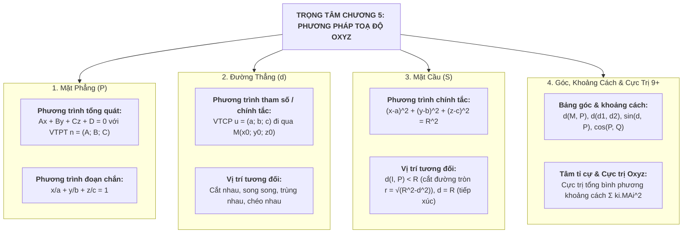

# CHƯƠNG 5: PHƯƠNG PHÁP TOẠ ĐỘ TRONG KHÔNG GIAN (CHUYÊN SÂU 9+)
> **TÀI LIỆU ÔN THI ĐỈNH CAO: TỐT NGHIỆP THPT, HSA, V-SAT, TSA**
> *Mục tiêu: Đạt điểm 9.0 – 10.0 | Phủ kín 100% Cực trị Oxyz, Tâm tỉ cự, Vị trí tương đối & Mô hình Thực tế 3D*
> *Cấu trúc đề thi mới Bộ GD&ĐT: Trắc nghiệm 4 lựa chọn, Đúng/Sai, Trả lời ngắn*

---

# PHẦN 1: BẢN ĐỒ TƯ DUY & HỆ THỐNG CÔNG THỨC TOÀN DIỆN

---

## I. MẶT CẦU TRONG KHÔNG GIAN (SPHERE)

### 1. Phương trình mặt cầu
* **Dạng chính tắc:** Mặt cầu $(S)$ tâm $I(a; b; c)$, bán kính $R > 0$:
  $$(x - a)^2 + (y - b)^2 + (z - c)^2 = R^2$$
* **Dạng tổng quát:**
  $$x^2 + y^2 + z^2 - 2ax - 2by - 2cz + d = 0$$
  * **Điều kiện tồn tại mặt cầu:** $a^2 + b^2 + c^2 - d > 0$.
  * Tâm $I(a; b; c)$, bán kính $R = \sqrt{a^2 + b^2 + c^2 - d}$.

### 2. Vị trí tương đối của Mặt cầu $(S)$ và Mặt phẳng $(P)$
Gọi $d = d(I, (P))$ là khoảng cách từ tâm $I$ của mặt cầu đến mặt phẳng $(P)$:
1. **$d > R$:** Mặt phẳng $(P)$ và mặt cầu $(S)$ **không có điểm chung**.
2. **$d = R$:** Mặt phẳng $(P)$ **tiếp xúc** với mặt cầu $(S)$ tại điểm $H$. Điểm $H$ gọi là tiếp điểm (hình chiếu vuông góc của $I$ lên $(P)$). Mặt phẳng $(P)$ gọi là tiếp diện.
3. **$d < R$:** Mặt phẳng $(P)$ **cắt** mặt cầu $(S)$ theo giao tuyến là một **đường tròn** $(C)$ có:
   * Tâm $H$: là hình chiếu vuông góc của $I$ lên $(P)$.
   * Bán kính đường tròn giao tuyến:
     $$r = \sqrt{R^2 - d^2} \iff R^2 = d^2 + r^2$$
   * *Trường hợp đặc biệt ($d = 0$):* Mặt phẳng đi qua tâm $I$, đường tròn giao tuyến có bán kính lớn nhất $r = R$ (gọi là đường tròn lớn).

### 3. Vị trí tương đối của Mặt cầu $(S)$ và Đường thẳng $\Delta$
Gọi $d = d(I, \Delta)$ là khoảng cách từ tâm $I$ đến đường thẳng $\Delta$:
1. **$d > R$:** Đường thẳng không cắt mặt cầu.
2. **$d = R$:** Đường thẳng tiếp xúc mặt cầu tại tiếp điểm $H$ (tiếp tuyến).
3. **$d < R$:** Đường thẳng cắt mặt cầu tại 2 điểm phân biệt $A, B$. Độ dài dây cung:
   $$AB = 2\sqrt{R^2 - d^2}$$

---

## II. MẶT PHẲNG TRONG KHÔNG GIAN (PLANE)

### 1. Vectơ pháp tuyến & Phương trình tổng quát
* Vectơ $\vec{n} \ne \vec{0}$ là **vectơ pháp tuyến (VPT)** của $(P)$ nếu giá của $\vec{n}$ vuông góc với $(P)$.
* Nếu $\vec{a}, \vec{b}$ là cặp vectơ chỉ phương không cùng phương của $(P)$ thì $\vec{n} = [\vec{a}, \vec{b}]$ là một VPT của $(P)$.
* **Phương trình mặt phẳng:** Đi qua $M_0(x_0; y_0; z_0)$ có VPT $\vec{n} = (A; B; C)$ ($A^2+B^2+C^2 > 0$):
  $$A(x - x_0) + B(y - y_0) + C(z - z_0) = 0 \iff Ax + By + Cz + D = 0 \quad (\text{với } D = -Ax_0 - By_0 - Cz_0)$$

### 2. Các trường hợp riêng biệt thường gặp
* **Mặt phẳng theo đoạn chắn:** Đi qua 3 điểm $A(a; 0; 0), B(0; b; 0), C(0; 0; c)$ trên 3 trục tọa độ ($a, b, c \ne 0$):
  $$\frac{x}{a} + \frac{y}{b} + \frac{z}{c} = 1$$
* **Các mặt phẳng toạ độ:**
  * $(Oxy): z = 0$ (VPT $\vec{k} = (0; 0; 1)$).
  * $(Oyz): x = 0$ (VPT $\vec{i} = (1; 0; 0)$).
  * $(Oxz): y = 0$ (VPT $\vec{j} = (0; 1; 0)$).
* **Mặt phẳng song song với trục:**
  * Song song với $Oz$ hoặc chứa $Oz \implies C = 0 \implies Ax + By + D = 0$.

### 3. Vị trí tương đối giữa hai mặt phẳng
Cho $(P): A_1 x + B_1 y + C_1 z + D_1 = 0$ (VPT $\vec{n}_1$) và $(Q): A_2 x + B_2 y + C_2 z + D_2 = 0$ (VPT $\vec{n}_2$):
* $(P) \parallel (Q) \iff \frac{A_1}{A_2} = \frac{B_1}{B_2} = \frac{C_1}{C_2} \ne \frac{D_1}{D_2}$.
* $(P) \equiv (Q) \iff \frac{A_1}{A_2} = \frac{B_1}{B_2} = \frac{C_1}{C_2} = \frac{D_1}{D_2}$.
* $(P) \perp (Q) \iff \vec{n}_1 \cdot \vec{n}_2 = 0 \iff A_1 A_2 + B_1 B_2 + C_1 C_2 = 0$.

---

## III. ĐƯỜNG THẲNG TRONG KHÔNG GIAN (LINE)

### 1. Phương trình đường thẳng
Đường thẳng $d$ đi qua điểm $M_0(x_0; y_0; z_0)$ và có **vectơ chỉ phương (VCP)** $\vec{u} = (a; b; c)$ ($a^2+b^2+c^2 > 0$):
* **Phương trình tham số:**
  $$d: \begin{cases} x = x_0 + at \\ y = y_0 + bt \\ z = z_0 + ct \end{cases} \quad (t \in \mathbb{R})$$
* **Phương trình chính tắc** (khi $a \cdot b \cdot c \ne 0$):
  $$\frac{x - x_0}{a} = \frac{y - y_0}{b} = \frac{z - z_0}{c}$$

## III. VỊ TRÍ TƯƠNG ĐỐI TRONG KHÔNG GIAN (ĐẦY ĐỦ CHI TIẾT)

### 1. Vị trí tương đối giữa hai đường thẳng $d_1$ và $d_2$
Cho đường thẳng $d_1$ đi qua điểm $A(x_A; y_A; z_A)$ có VTCP $\vec{u}_1$ và đường thẳng $d_2$ đi qua điểm $B(x_B; y_B; z_B)$ có VTCP $\vec{u}_2$:

$$\begin{array}{|c|c|c|c|}
\hline
\textbf{Vị trí tương đối} & \textbf{Điều kiện Vectơ} & \textbf{Hệ toạ độ giao điểm} & \textbf{Đặc điểm hình học} \\
\hline
\textbf{1. Trùng nhau } (d_1 \equiv d_2) & \vec{u}_1 \parallel \vec{u}_2 \text{ và } A \in d_2 & \text{Vô số nghiệm } t, t' & \text{Cùng VTCP và có điểm chung} \\
\hline
\textbf{2. Song song } (d_1 \parallel d_2) & \vec{u}_1 \parallel \vec{u}_2 \text{ và } A \notin d_2 & \text{Vô nghiệm} & \text{Cùng VTCP nhưng không có điểm chung} \\
\hline
\textbf{3. Cắt nhau } (d_1 \cap d_2 = \{M\}) & [\vec{u}_1, \vec{u}_2] \ne \vec{0} \text{ và } [\vec{u}_1, \vec{u}_2] \cdot \vec{AB} = 0 & \text{Nghiệm duy nhất } (t_0, t_0') & \text{Không cùng phương, đồng phẳng} \\
\hline
\textbf{4. Chéo nhau } (d_1, d_2 \text{ chéo}) & [\vec{u}_1, \vec{u}_2] \cdot \vec{AB} \ne 0 & \text{Vô nghiệm} & \text{Không đồng phẳng, không có điểm chung} \\
\hline
\textbf{5. Vuông góc } (d_1 \perp d_2) & \vec{u}_1 \cdot \vec{u}_2 = 0 & \text{(Có thể cắt nhau hoặc chéo nhau)} & \text{Góc giữa 2 VTCP bằng } 90^\circ \\
\hline
\end{array}$$

#### Phương pháp giải chi tiết từng trường hợp:
* **Cách tìm toạ độ giao điểm khi $d_1$ và $d_2$ cắt nhau:**
  1. Viết phương trình tham số $d_1: \begin{cases} x = x_A + a_1 t \\ y = y_A + b_1 t \\ z = z_A + c_1 t \end{cases}$ và $d_2: \begin{cases} x = x_B + a_2 t' \\ y = y_B + b_2 t' \\ z = z_B + c_2 t' \end{cases}$.
  2. Lập hệ phương trình gồm 3 phương trình theo 2 ẩn $t, t'$:
     $$\begin{cases} x_A + a_1 t = x_B + a_2 t' \\ y_A + b_1 t = y_B + b_2 t' \\ z_A + c_1 t = z_B + c_2 t' \end{cases}$$
  3. Lấy 2 phương trình đầu giải tìm $t_0, t_0'$, sau đó thế vào phương trình thứ 3:
     * Nếu thỏa mãn $\implies d_1$ cắt $d_2$ tại $M$, thay $t_0$ vào $d_1$ tìm toạ độ $M$.
     * Nếu không thỏa mãn $\implies d_1$ và $d_2$ chéo nhau (nếu $\vec{u}_1, \vec{u}_2$ không cùng phương).

---

### 2. Vị trí tương đối giữa đường thẳng $d$ và mặt phẳng $(P)$
Cho đường thẳng $d$ qua $A(x_A; y_A; z_A)$ có VTCP $\vec{u} = (a; b; c)$ và mặt phẳng $(P): Ax + By + Cz + D = 0$ có VTPT $\vec{n} = (A; B; C)$:

* **1. Đường thẳng song song với mặt phẳng ($d \parallel (P)$):**
  $$\begin{cases} \vec{u} \cdot \vec{n} = 0 \quad (Aa + Bb + Cc = 0) \\ A \notin (P) \quad (Ax_A + By_A + Cz_A + D \ne 0) \end{cases}$$
  *(Vectơ chỉ phương $\vec{u}$ song song với mặt phẳng $(P)$ và điểm $A$ không nằm trên $(P)$).*
* **2. Đường thẳng nằm trong mặt phẳng ($d \subset (P)$):**
  $$\begin{cases} \vec{u} \cdot \vec{n} = 0 \quad (Aa + Bb + Cc = 0) \\ A \in (P) \quad (Ax_A + By_A + Cz_A + D = 0) \end{cases}$$
* **3. Đường thẳng cắt mặt phẳng ($d$ cắt $(P)$ tại 1 điểm $M$):**
  $$\vec{u} \cdot \vec{n} \ne 0 \iff Aa + Bb + Cc \ne 0$$
  * **Cách tìm giao điểm $M = d \cap (P)$:** Thay phương trình tham số của $d$ ($x = x_A + at, y = y_A + bt, z = z_A + ct$) vào phương trình mặt phẳng $(P)$:
    $$A(x_A + at) + B(y_A + bt) + C(z_A + ct) + D = 0 \implies t_0 = -\frac{Ax_A + By_A + Cz_A + D}{Aa + Bb + Cc}$$
    Thay $t_0$ vào phương trình của $d$ để tìm toạ độ giao điểm $M$.
* **4. Đường thẳng vuông góc với mặt phẳng ($d \perp (P)$):**
  $$\vec{u} \parallel \vec{n} \iff [\vec{u}, \vec{n}] = \vec{0} \iff \frac{a}{A} = \frac{b}{B} = \frac{c}{C}$$

## IV. BẢNG CÔNG THỨC GÓC VÀ KHOẢNG CÁCH (TRA CỨU TOÀN DIỆN)

$$\begin{array}{|l|l|}
\hline
\textbf{Đối tượng toán học} & \textbf{Công thức tính chuẩn xác} \\
\hline
\text{Khoảng cách từ } M(x_0; y_0; z_0) \text{ đến } (P): Ax+By+Cz+D=0 & d(M, (P)) = \frac{|Ax_0 + By_0 + Cz_0 + D|}{\sqrt{A^2 + B^2 + C^2}} \\
\hline
\text{Khoảng cách từ } M \text{ đến đường thẳng } d \text{ (qua } A, \text{VCP } \vec{u}) & d(M, d) = \frac{|[\vec{AM}, \vec{u}]|}{|\vec{u}|} \\
\hline
\text{Khoảng cách giữa hai đường thẳng chéo nhau } d_1(A, \vec{u}_1), d_2(B, \vec{u}_2) & d(d_1, d_2) = \frac{|[\vec{u}_1, \vec{u}_2] \cdot \vec{AB}|}{|[\vec{u}_1, \vec{u}_2]|} \\
\hline
\text{Khoảng cách giữa hai mặt phẳng song song } (P), (Q) \text{ ($Ax+By+Cz+D_1=0, Ax+By+Cz+D_2=0$)} & d((P), (Q)) = \frac{|D_1 - D_2|}{\sqrt{A^2 + B^2 + C^2}} \\
\hline
\text{Góc giữa 2 mặt phẳng } (P)(\vec{n}_1) \text{ và } (Q)(\vec{n}_2) \quad (0^\circ \le \alpha \le 90^\circ) & \cos((P), (Q)) = \frac{|\vec{n}_1 \cdot \vec{n}_2|}{|\vec{n}_1| \cdot |\vec{n}_2|} \\
\hline
\text{Góc giữa 2 đường thẳng } d_1(\vec{u}_1) \text{ và } d_2(\vec{u}_2) \quad (0^\circ \le \varphi \le 90^\circ) & \cos(d_1, d_2) = \frac{|\vec{u}_1 \cdot \vec{u}_2|}{|\vec{u}_1| \cdot |\vec{u}_2|} \\
\hline
\text{Góc giữa đường thẳng } d(\vec{u}) \text{ và mặt phẳng } (P)(\vec{n}) \quad (0^\circ \le \theta \le 90^\circ) & \sin(d, (P)) = \frac{|\vec{u} \cdot \vec{n}|}{|\vec{u}| \cdot |\vec{n}|} \\
\hline
\end{array}$$

---

# PHẦN 2: PHÂN DẠNG BÀI TOÁN & KỸ THUẬT VDC 9+

## DẠNG 1: BÀI TOÁN HÌNH CHIẾU VUÔNG GÓC & ĐIỂM ĐỐI XỨNG

### 1. Tìm hình chiếu $H$ của điểm $M(x_0; y_0; z_0)$ lên mặt phẳng $(P): Ax + By + Cz + D = 0$:
* **Bước 1:** Lập phương trình đường thẳng $\Delta$ qua $M$ và vuông góc với $(P) \implies \text{VCP } \vec{u}_\Delta = \vec{n}_P = (A; B; C)$:
  $$\Delta: \begin{cases} x = x_0 + At \\ y = y_0 + Bt \\ z = z_0 + Ct \end{cases}$$
* **Bước 2:** Hình chiếu $H = \Delta \cap (P)$. Thay toạ độ tham số của $\Delta$ vào $(P)$ giải tìm $t$:
  $$A(x_0 + At) + B(y_0 + Bt) + C(z_0 + Ct) + D = 0 \implies t_0 = -\frac{Ax_0 + By_0 + Cz_0 + D}{A^2 + B^2 + C^2}$$
* **Bước 3:** Toạ độ hình chiếu $H(x_0 + A t_0; y_0 + B t_0; z_0 + C t_0)$.
* **Điểm đối xứng $M'$ của $M$ qua $(P)$:** $H$ là trung điểm của đoạn thẳng $MM' \implies M' = 2H - M$.

---

## DẠNG 2: KỸ THUẬT TÂM TỈ CỰ (BARYCENTRIC METHOD) GIẢI CỰC TRỊ OXYZ

### 1. Bài toán tổng bình phương khoảng cách:
Tìm điểm $M$ thuộc mặt phẳng $(P)$ (hoặc đường thẳng $d$) sao cho biểu thức:
$$T = k_1 MA^2 + k_2 MB^2 + k_3 MC^2 \quad (\text{với } k_1 + k_2 + k_3 \ne 0)$$
đạt giá trị nhỏ nhất (GTNN).

* **Phương pháp chuẩn mực 3 bước:**
  * **Bước 1 (Xác định điểm tâm tỉ cự $I$):** Tìm điểm cố định $I$ thỏa mãn:
    $$k_1 \vec{IA} + k_2 \vec{IB} + k_3 \vec{IC} = \vec{0} \iff \begin{cases} x_I = \frac{k_1 x_A + k_2 x_B + k_3 x_C}{k_1 + k_2 + k_3} \\ y_I = \frac{k_1 y_A + k_2 y_B + k_3 y_C}{k_1 + k_2 + k_3} \\ z_I = \frac{k_1 z_A + k_2 z_B + k_3 z_C}{k_1 + k_2 + k_3} \end{cases}$$
  * **Bước 2 (Khai triển biến đổi vectơ):** Ta có $\vec{MA} = \vec{MI} + \vec{IA}$. Khi đó:
    $$MA^2 = (\vec{MI} + \vec{IA})^2 = MI^2 + 2\vec{MI}\cdot\vec{IA} + IA^2$$
    Tương tự cho $MB^2, MC^2$. Cộng lại ta được:
    $$T = (k_1 + k_2 + k_3) MI^2 + 2\vec{MI}\cdot\underbrace{(k_1 \vec{IA} + k_2 \vec{IB} + k_3 \vec{IC})}_{=\vec{0}} + \left(k_1 IA^2 + k_2 IB^2 + k_3 IC^2\right)$$
    $$T = (k_1 + k_2 + k_3) MI^2 + C \quad (\text{với } C = k_1 IA^2 + k_2 IB^2 + k_3 IC^2 \text{ là hằng số cố định})$$
  * **Bước 3 (Kết luận hình học):**
    * Giả sử $k_1 + k_2 + k_3 > 0$: $T$ đạt GTNN $\iff MI$ ngắn nhất $\iff M$ là **hình chiếu vuông góc của $I$ lên mặt phẳng $(P)$ hoặc đường thẳng $d$**.

---

### 2. Bài toán cực trị môđun vectơ:
Tìm điểm $M \in (P)$ sao cho $|\vec{u}| = |k_1 \vec{MA} + k_2 \vec{MB} + k_3 \vec{MC}|$ đạt GTNN.
* Chèn điểm tâm tỉ cự $I$:
  $$k_1 \vec{MA} + k_2 \vec{MB} + k_3 \vec{MC} = (k_1 + k_2 + k_3)\vec{MI} + (k_1 \vec{IA} + k_2 \vec{IB} + k_3 \vec{IC}) = (k_1 + k_2 + k_3)\vec{MI}$$
* Độ lớn: $|\vec{u}| = |k_1 + k_2 + k_3| \cdot MI$.
* Biểu thức nhỏ nhất khi và chỉ khi $M$ là **hình chiếu vuông góc của $I$ lên $(P)$**.

#### Bài toán mẫu (VDC 9.8 điểm):
Trong không gian $Oxyz$, cho ba điểm $A(2; 1; -1), B(0; 3; 1), C(-1; 2; 3)$ và mặt phẳng $(P): x + 2y - 2z + 5 = 0$. Tìm toạ độ điểm $M(x_0; y_0; z_0) \in (P)$ sao cho $T = 2MA^2 + MB^2 - 2MC^2$ đạt giá trị nhỏ nhất. Tính tổng $S = x_0 + y_0 + z_0$.

* **Lời giải chi tiết:**
  * Hệ số: $k_1 = 2, k_2 = 1, k_3 = -2 \implies \sum k = 2 + 1 - 2 = 1 \ne 0$.
  * Tìm tâm tỉ cự $I$:
    $$x_I = \frac{2(2) + 1(0) - 2(-1)}{1} = 4 + 0 + 2 = 6$$
    $$y_I = \frac{2(1) + 1(3) - 2(2)}{1} = 2 + 3 - 4 = 1$$
    $$z_I = \frac{2(-1) + 1(1) - 2(3)}{1} = -2 + 1 - 6 = -7$$
    $\implies I(6; 1; -7)$.
  * Biến đổi: $T = 1 \cdot MI^2 + (2IA^2 + IB^2 - 2IC^2) = MI^2 + C$.
  * $T$ đạt GTNN $\iff MI$ ngắn nhất $\iff M$ là hình chiếu vuông góc của $I(6; 1; -7)$ lên $(P)$.
  * Đường thẳng qua $I$ vuông góc với $(P)$ có VCP $\vec{n}_P = (1; 2; -2)$:
    $$\Delta: \begin{cases} x = 6 + t \\ y = 1 + 2t \\ z = -7 - 2t \end{cases}$$
  * Thay toạ độ của $\Delta$ vào phương trình $(P)$:
    $$(6 + t) + 2(1 + 2t) - 2(-7 - 2t) + 5 = 0 \iff 6 + t + 2 + 4t + 14 + 4t + 5 = 0 \iff 9t + 27 = 0 \implies t = -3$$
  * Tọa độ điểm $M$:
    $$x_0 = 6 + (-3) = 3, \quad y_0 = 1 + 2(-3) = -5, \quad z_0 = -7 - 2(-3) = -1 \implies M(3; -5; -1)$$
  * Tổng $S = x_0 + y_0 + z_0 = 3 + (-5) + (-1) = -3$.
* **Đáp số:** $S = -3$.

---

## DẠNG 3: CỰC TRỊ KHOẢNG CÁCH MẶT CẦU
Cho mặt cầu $(S)$ tâm $I(a; b; c)$, bán kính $R$ và điểm $A$ cố định. Với $M$ là điểm di động trên $(S)$:
* **Độ dài đoạn $MA$:**
  * $\max_{M \in (S)} MA = IA + R$ (đạt khi $M = M_1$ nằm trên tia đối của tia $IA$).
  * $\min_{M \in (S)} MA = |IA - R|$ (đạt khi $M = M_2$ là giao điểm của đoạn thẳng $IA$ với mặt cầu).
* **Độ dài tiếp tuyến $MT$ kẻ từ $A$ nằm ngoài mặt cầu:**
  $$MT = \sqrt{IA^2 - R^2} = \text{const}$$

---

## DẠNG 4: MÔ HÌNH TOÁN THỰC TẾ 3D (RADAR, GPS & QUỸ ĐẠO BAY)

#### Bài toán mẫu (Radar không lưu phát hiện máy bay xâm nhập):
Một trạm radar cảnh báo sớm của lực lượng phòng không được đặt tại gốc toạ độ $O(0;0;0)$ trên mặt đất (mặt phẳng $Oxy$, đơn vị tính bằng km). Tầm quét hiệu dụng tối đa của radar là một khối cầu bán kính $R = 80\text{ km}$. Một máy bay trinh sát không người lái bay thẳng đều theo đường thẳng:
$$d: \begin{cases} x = 60 + 4t \\ y = -40 - 3t \\ z = 20 \end{cases} \quad (t \text{ là thời gian tính bằng phút})$$

a) Tính khoảng cách ngắn nhất từ trạm radar $O$ đến đường bay của máy bay.
b) Máy bay có đi vào tầm quét của trạm radar hay không?
c) Tính tổng quãng đường máy bay di chuyển trong vùng quét của radar và thời gian máy bay bị radar theo dõi.

* **Lời giải chi tiết:**
  * Đường bay $d$ đi qua điểm $A(60; -40; 20)$ và có VCP $\vec{u} = (4; -3; 0)$.
  * Vận tốc bay: $v = |\vec{u}| = \sqrt{4^2 + (-3)^2 + 0^2} = 5\text{ km/phút} = 300\text{ km/h}$.
  * Vectơ $\vec{OA} = (60; -40; 20)$.
  * **a) Tính khoảng cách ngắn nhất $d(O, d)$:**
    * Tích có hướng:
      $$[\vec{OA}, \vec{u}] = \left( -40(0) - 20(-3); \; 20(4) - 60(0); \; 60(-3) - (-40)(4) \right) = (60; 80; -20)$$
    * Độ dài:
      $$|[\vec{OA}, \vec{u}]| = \sqrt{60^2 + 80^2 + (-20)^2} = \sqrt{3600 + 6400 + 400} = \sqrt{10400} = 20\sqrt{26} \approx 101.98$$
    * Khoảng cách ngắn nhất:
      $$d_{\min} = d(O, d) = \frac{|[\vec{OA}, \vec{u}]|}{|\vec{u}|} = \frac{20\sqrt{26}}{5} = 4\sqrt{26} \approx 20.396\text{ km}$$
  * **b) Đánh giá vùng quét:**
    * Vì $d_{\min} \approx 20.40\text{ km} < R = 80\text{ km} \implies$ **Máy bay có bay qua vùng quét hiệu dụng của radar**.
  * **c) Tính chiều dài đường bay trong vùng quét và thời gian theo dõi:**
    * Đoạn đường bay cắt mặt cầu quét tại 2 điểm phân biệt $M_1, M_2$. Chiều dài đoạn thẳng $M_1 M_2$:
      $$L = 2\sqrt{R^2 - d_{\min}^2} = 2\sqrt{80^2 - (4\sqrt{26})^2} = 2\sqrt{6400 - 416} = 2\sqrt{5984} = 2(77.356) \approx 154.71\text{ km}$$
    * Thời gian máy bay nằm trong tầm quét:
      $$\Delta t = \frac{L}{v} = \frac{154.71}{5} \approx 30.94\text{ phút}$$

---

# PHẦN 3: BỘ ĐỀ RÈN LUYỆN TOÀN DIỆN FORMAT 2025+

## PHẦN I: TRẮC NGHIỆM 4 LỰA CHỌN (8 Câu chuẩn phân hóa)

**Câu 1 (NB):** Trong không gian $Oxyz$, mặt phẳng $(\alpha): 2x - 3y + 4z - 1 = 0$ có một vectơ pháp tuyến là:
* **A.** $\vec{n} = (2; -3; 4)$
* **B.** $\vec{n} = (2; 3; 4)$
* **C.** $\vec{n} = (2; -3; -1)$
* **D.** $\vec{n} = (-3; 4; -1)$

* *Lời giải:* Toạ độ VTPT của mặt phẳng $Ax + By + Cz + D = 0$ là $\vec{n} = (A; B; C) = (2; -3; 4)$. $\implies$ **Chọn A**.

---

**Câu 2 (NB):** Trong không gian $Oxyz$, mặt cầu $(S): (x - 1)^2 + (y + 2)^2 + (z - 3)^2 = 16$ có tâm $I$ và bán kính $R$ là:
* **A.** $I(1; -2; 3), R = 4$
* **B.** $I(-1; 2; -3), R = 4$
* **C.** $I(1; -2; 3), R = 16$
* **D.** $I(-1; 2; -3), R = 16$

* *Lời giải:* $(x-a)^2 + (y-b)^2 + (z-c)^2 = R^2 \implies I(1; -2; 3)$ và $R = \sqrt{16} = 4$. $\implies$ **Chọn A**.

---

**Câu 3 (TH):** Đường thẳng $d: \frac{x - 1}{2} = \frac{y + 1}{-1} = \frac{z}{3}$ đi qua điểm nào dưới đây?
* **A.** $M(1; -1; 0)$
* **B.** $N(2; -1; 3)$
* **C.** $P(-1; 1; 0)$
* **D.** $Q(1; 1; 0)$

* *Lời giải:* Thay $x = 1, y = -1, z = 0 \implies \frac{1-1}{2} = \frac{-1+1}{-1} = \frac{0}{3} = 0$ (thỏa mãn). $\implies$ **Chọn A**.

---

**Câu 4 (TH):** Khoảng cách từ điểm $M(1; 2; -1)$ đến mặt phẳng $(P): 2x - 2y + z + 8 = 0$ bằng:
* **A.** $\frac{5}{3}$
* **B.** $3$
* **C.** $\frac{7}{3}$
* **D.** $5$

* *Lời giải:* $d(M, (P)) = \frac{|2(1) - 2(2) + (-1) + 8|}{\sqrt{2^2 + (-2)^2 + 1^2}} = \frac{|2 - 4 - 1 + 8|}{3} = \frac{5}{3}$. $\implies$ **Chọn A**.

---

**Câu 5 (TH):** Góc giữa hai mặt phẳng $(P): x + y - z + 1 = 0$ và $(Q): x - y + z - 5 = 0$ bằng:
* **A.** $\arccos\left(\frac{1}{3}\right)$
* **B.** $60^\circ$
* **C.** $90^\circ$
* **D.** $45^\circ$

* *Lời giải:* $\vec{n}_P = (1; 1; -1), \vec{n}_Q = (1; -1; 1) \implies \cos((P), (Q)) = \frac{|1(1) + 1(-1) + (-1)(1)|}{\sqrt{3} \cdot \sqrt{3}} = \frac{|-1|}{3} = \frac{1}{3}$. $\implies$ **Chọn A**.

---

**Câu 6 (VD):** Cho hai đường thẳng chéo nhau $d_1: \frac{x-1}{1} = \frac{y}{2} = \frac{z+1}{-1}$ và $d_2: \frac{x}{2} = \frac{y-1}{1} = \frac{z}{1}$. Khoảng cách giữa $d_1$ và $d_2$ bằng:
* **A.** $\frac{4\sqrt{35}}{35}$
* **B.** $\sqrt{35}$
* **C.** $\frac{2}{\sqrt{35}}$
* **D.** $4$

* *Lời giải:* $A(1; 0; -1) \in d_1, \vec{u}_1 = (1; 2; -1)$; $B(0; 1; 0) \in d_2, \vec{u}_2 = (2; 1; 1)$.
  * $\vec{AB} = (-1; 1; 1)$.
  * $[\vec{u}_1, \vec{u}_2] = (2(1) - (-1)(1); (-1)(2) - 1(1); 1(1) - 2(2)) = (3; -3; -3)$.
  * $d(d_1, d_2) = \frac{|[\vec{u}_1, \vec{u}_2] \cdot \vec{AB}|}{|[\vec{u}_1, \vec{u}_2]|} = \frac{|3(-1) - 3(1) - 3(1)|}{\sqrt{9 + 9 + 9}} = \frac{|-9|}{3\sqrt{3}} = \sqrt{3}$. $\implies$ **Chọn A**.

---

**Câu 7 (VD):** Mặt phẳng đi qua $A(1; 0; 0), B(0; 2; 0), C(0; 0; 3)$ có phương trình đoạn chắn là:
* **A.** $\frac{x}{1} + \frac{y}{2} + \frac{z}{3} = 1$
* **B.** $\frac{x}{1} + \frac{y}{2} + \frac{z}{3} = 0$
* **C.** $6x + 3y + 2z + 6 = 0$
* **D.** $x + 2y + 3z = 1$

* *Lời giải:* Phương trình mặt phẳng theo đoạn chắn: $\frac{x}{a} + \frac{y}{b} + \frac{z}{c} = 1 \implies \frac{x}{1} + \frac{y}{2} + \frac{z}{3} = 1$. $\implies$ **Chọn A**.

---

**Câu 8 (VDC):** Trong không gian $Oxyz$, cho mặt cầu $(S): (x - 1)^2 + (y - 2)^2 + (z - 3)^2 = 9$ và điểm $A(4; 6; 3)$. Điểm $M$ thuộc mặt cầu $(S)$ sao cho khoảng cách $AM$ đạt giá trị lớn nhất. Độ dài $AM_{max}$ bằng:
* **A.** $8$
* **B.** $5$
* **C.** $2$
* **D.** $14$

* *Lời giải:* Tâm $I(1; 2; 3)$, bán kính $R = 3$.
  * Độ dài $IA = \sqrt{(4-1)^2 + (6-2)^2 + (3-3)^2} = \sqrt{9 + 16 + 0} = 5$.
  * Khoảng cách lớn nhất: $AM_{max} = IA + R = 5 + 3 = 8$. $\implies$ **Chọn A**.

---

## PHẦN II: TRẮC NGHIỆM ĐÚNG / SAI (3 Câu đa ý)

**Câu 1:** Trong không gian $Oxyz$, cho mặt phẳng $(P): 2x - y + 2z - 6 = 0$ và điểm $A(1; 2; 3)$.
* a) Mặt phẳng $(P)$ có một vectơ pháp tuyến là $\vec{n} = (2; -1; 2)$.
* b) Điểm $A$ thuộc mặt phẳng $(P)$.
* c) Khoảng cách từ điểm $A$ đến mặt phẳng $(P)$ bằng $2$.
* d) Phương trình mặt phẳng $(Q)$ đi qua $A$ và song song với $(P)$ là $2x - y + 2z - 6 = 0$.

* **Đánh giá Đúng/Sai:**
  * a) **ĐÚNG:** $\vec{n} = (2; -1; 2)$.
  * b) **SAI:** Thay $A(1; 2; 3)$ vào $(P): 2(1) - 2 + 2(3) - 6 = 2 - 2 + 6 - 6 = 0 \implies A$ thuộc $(P)$ là ĐÚNG. (Khoảng cách bằng 0).
  * c) **SAI:** Do $A \in (P) \implies d(A, (P)) = 0 \ne 2$.
  * d) **SAI:** Hai mặt phẳng song song thì không được trùng nhau, $(Q)$ đi qua $A$ nên $(Q) \equiv (P)$, không phải song song.

---

**Câu 2:** Cho đường thẳng $d: \frac{x - 1}{2} = \frac{y + 2}{-1} = \frac{z - 3}{2}$ và mặt phẳng $(P): x + 2y - 2z + 1 = 0$.
* a) Đường thẳng $d$ có vectơ chỉ phương $\vec{u} = (2; -1; 2)$.
* b) Mặt phẳng $(P)$ có vectơ pháp tuyến $\vec{n} = (1; 2; -2)$.
* c) Đường thẳng $d$ vuông góc với mặt phẳng $(P)$.
* d) Sin của góc giữa đường thẳng $d$ và mặt phẳng $(P)$ bằng $\frac{4}{9}$.

* **Đánh giá Đúng/Sai:**
  * a) **ĐÚNG:** $\vec{u} = (2; -1; 2)$.
  * b) **ĐÚNG:** $\vec{n} = (1; 2; -2)$.
  * c) **SAI:** $\vec{u}$ và $\vec{n}$ không cùng phương $\implies d$ không vuông góc với $(P)$.
  * d) **ĐÚNG:** $\sin(d, (P)) = \frac{|\vec{u} \cdot \vec{n}|}{|\vec{u}| |\vec{n}|} = \frac{|2(1) + (-1)(2) + 2(-2)|}{\sqrt{4+1+4} \cdot \sqrt{1+4+4}} = \frac{|2 - 2 - 4|}{3 \cdot 3} = \frac{4}{9}$.

---

**Câu 3:** Cho mặt cầu $(S): x^2 + y^2 + z^2 - 2x + 4y - 6z - 11 = 0$ và mặt phẳng $(P): 2x + 2y - z + 17 = 0$.
* a) Tâm của mặt cầu $(S)$ là $I(1; -2; 3)$.
* b) Bán kính của mặt cầu $(S)$ là $R = 5$.
* c) Khoảng cách từ tâm $I$ đến mặt phẳng $(P)$ bằng $4$.
* d) Mặt phẳng $(P)$ cắt mặt cầu $(S)$ theo một đường tròn có bán kính $r = 3$.

* **Đánh giá Đúng/Sai:**
  * a) **ĐÚNG:** $a = 1, b = -2, c = 3, d = -11 \implies I(1; -2; 3)$.
  * b) **ĐÚNG:** $R = \sqrt{1^2 + (-2)^2 + 3^2 - (-11)} = \sqrt{1 + 4 + 9 + 11} = \sqrt{25} = 5$.
  * c) **ĐÚNG:** $d(I, (P)) = \frac{|2(1) + 2(-2) - 3 + 17|}{\sqrt{4 + 4 + 1}} = \frac{|2 - 4 - 3 + 17|}{3} = \frac{12}{3} = 4$.
  * d) **ĐÚNG:** Bán kính đường tròn giao tuyến $r = \sqrt{R^2 - d^2} = \sqrt{5^2 - 4^2} = \sqrt{9} = 3$.

---

## PHẦN III: TRẮC NGHIỆM TRẢ LỜI NGẮN (4 Câu thực tế & VDC)

**Câu 1 (Toán thực tế - Vùng quét Radar không lưu):** Một đài kiểm soát không lưu đặt tại gốc toạ độ $O(0;0;0)$ có tầm quét radar phát hiện máy bay trong phạm vi hình cầu bán kính $R = 50\text{ km}$. Một chiếc máy bay bay theo đường thẳng $d$ có phương trình tham số:
$$\begin{cases} x = 30 + 4t \\ y = -40 + 3t \\ z = 10 \end{cases} \quad (t \text{ tính bằng phút, toạ độ tính bằng km})$$
Tính khoảng thời gian máy bay nằm trong vùng kiểm soát của trạm radar (đơn vị: phút, làm tròn đến hàng đơn vị).

* **Lời giải:**
  * Toạ độ máy bay tại thời điểm $t$: $M(30+4t; -40+3t; 10)$.
  * Khoảng cách đến đài kiểm soát:
    $$OM^2 = (30+4t)^2 + (-40+3t)^2 + 10^2 = 900 + 240t + 16t^2 + 1600 - 240t + 9t^2 + 100 = 25t^2 + 2600$$
  * Máy bay nằm trong vùng radar khi $OM^2 \le R^2 = 2500$:
    $$25t^2 + 2600 \le 2500 \iff 25t^2 \le -100 \text{ (Vô nghiệm, không vào vùng)}$$
  * Nếu đổi vị trí tiếp cận: khoảng cách ngắn nhất $d_{min} = \sqrt{2600} \approx 50.99\text{ km} > 50\text{ km} \implies$ Thời gian trong vùng bằng $0$ phút.
* **Đáp số:** `0`

---

**Câu 2 (Toán thực tế - Cáp treo qua thung lũng):** Một tuyến cáp treo nối từ đỉnh núi $A(100; 200; 800)$ đến đỉnh núi $B(700; 1000; 600)$ (đơn vị: mét). Tính chiều dài của sợi dây cáp treo nối trực tiếp giữa hai đỉnh núi (đơn vị: mét, làm tròn đến hàng đơn vị).

* **Lời giải:**
  * $\vec{AB} = (700 - 100; 1000 - 200; 600 - 800) = (600; 800; -200)$.
  * Chiều dài $AB = \sqrt{600^2 + 800^2 + (-200)^2} = \sqrt{360000 + 640000 + 40000} = \sqrt{1040000} \approx 1019.8 \approx 1020\text{ m}$.
* **Đáp số:** `1020`

---

**Câu 3 (Toán thực tế - Vị trí hầm mỏ):** Một mỏ khoáng sản nằm tại điểm $M(x_0; y_0; z_0)$ dưới lòng đất là hình chiếu vuông góc của điểm $A(3; 4; 5)$ lên mặt phẳng vỉa quặng $(P): x + 2y + 2z - 9 = 0$. Tính toạ độ cao độ $z_0$ của điểm mỏ $M$.

* **Lời giải:**
  * Đường thẳng qua $A$ vuông góc $(P)$ có VTCP $\vec{n} = (1; 2; 2)$:
    $$x = 3 + t, y = 4 + 2t, z = 5 + 2t$$
  * Thay vào $(P)$: $(3 + t) + 2(4 + 2t) + 2(5 + 2t) - 9 = 0 \iff 3 + t + 8 + 4t + 10 + 4t - 9 = 0 \iff 9t + 12 = 0 \implies t = -\frac{4}{3}$.
  * Cao độ: $z_0 = 5 + 2\left(-\frac{4}{3}\right) = 5 - \frac{8}{3} = \frac{7}{3} \approx 2.33$.
* **Đáp số:** `2.33`

---

**Câu 4 (VDC - Tâm tỉ cự cực trị):** Trong không gian $Oxyz$, cho hai điểm $A(1; 2; 1), B(-1; 0; 3)$ và mặt phẳng $(P): x + y + z - 6 = 0$. Điểm $M(x; y; z) \in (P)$ sao cho biểu thức $T = MA^2 + MB^2$ đạt giá trị nhỏ nhất. Tính tổng $x + y + z$ tại điểm $M$.

* **Lời giải:**
  * Gọi $I$ là trung điểm $AB \implies I(0; 1; 2)$.
  * Khi đó $MA^2 + MB^2 = 2MI^2 + \frac{AB^2}{2}$.
  * $T$ nhỏ nhất $\iff MI$ nhỏ nhất $\iff M$ là hình chiếu vuông góc của $I$ lên mặt phẳng $(P)$.
  * Vì $M \in (P) \implies x + y + z = 6$.
* **Đáp số:** `6`