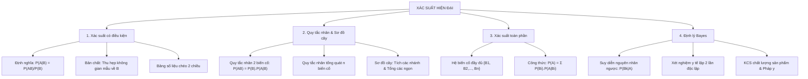
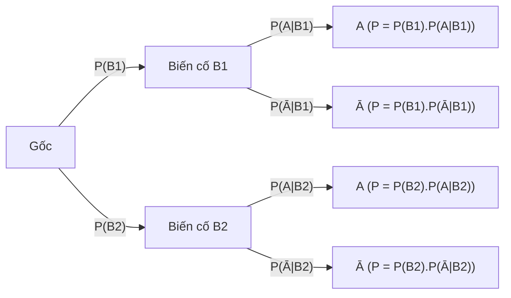

# CHƯƠNG 6: XÁC SUẤT CÓ ĐIỀU KIỆN VÀ CÔNG THỨC BAYES (CHUYÊN SÂU 9+)
> **TÀI LIỆU ÔN THI ĐỈNH CAO: TỐT NGHIỆP THPT, HSA, V-SAT, TSA**
> *Mục tiêu: Đạt điểm 9.0 – 10.0 | Phủ kín 100% Sơ đồ cây, Xác suất toàn phần, Định lý Bayes & Mô hình Thực tế 2025+*
> *Cấu trúc đề thi mới Bộ GD&ĐT: Trắc nghiệm 4 lựa chọn, Đúng/Sai, Trả lời ngắn*

---

# PHẦN 1: BẢN ĐỒ TƯ DUY & LÝ THUYẾT NỀN TẢNG CỐT LÕI

---

## I. XÁC SUẤT CÓ ĐIỀU KIỆN (CONDITIONAL PROBABILITY)

### 1. Bản chất trực quan & Định nghĩa
Giả sử ta thực hiện một phép thử có không gian mẫu $\Omega$. Xét hai biến cố $A$ và $B$ ($P(B) > 0$).
* **Bản chất trực quan:** Khi ta đã **biết trước biến cố $B$ chắc chắn đã xảy ra**, không gian mẫu của phép thử không còn là toàn bộ $\Omega$ nữa mà đã bị **thu hẹp lại chỉ còn tập hợp $B$**. Trong không gian mới $B$, phần thuận lợi cho biến cố $A$ chính là phần giao $A \cap B$.
* **Định nghĩa toán học:** Xác suất của biến cố $A$ với điều kiện biến cố $B$ đã xảy ra (kí hiệu là $P(A|B)$) là:
  $$P(A|B) = \frac{P(A \cap B)}{P(B)} = \frac{n(A \cap B)}{n(B)}$$

> **PHÂN BIỆT 3 ĐẠI LƯỢNG RẤT DỄ NHẦM LẪN:**
> 1. $P(A \cap B)$ (hay $P(AB)$): Xác suất để **cả hai** biến cố $A$ và $B$ **cùng xảy ra** (xét trên toàn bộ không gian mẫu $\Omega$).
> 2. $P(A|B)$: Xác suất $A$ xảy ra khi **đã biết $B$ đã xảy ra** (không gian mẫu thu hẹp về $B$).
> 3. $P(B|A)$: Xác suất $B$ xảy ra khi **đã biết $A$ đã xảy ra** (không gian mẫu thu hẹp về $A$).
> *Lưu ý:* Nói chung $P(A|B) \ne P(B|A)$ và $P(A|B) \ne P(A \cap B)$.

### 2. Các tính chất quan trọng của xác suất có điều kiện
Cho biến cố điều kiện $B$ với $P(B) > 0$:
1. $0 \le P(A|B) \le 1$.
2. $P(\Omega|B) = 1$ và $P(\emptyset|B) = 0$.
3. $P(B|B) = 1$.
4. **Quy tắc biến cố đối:** $P(\overline{A}|B) = 1 - P(A|B)$.
5. **Quy tắc cộng xác suất có điều kiện:**
   * Nếu $A_1 \cap A_2 = \emptyset$ thì: $P(A_1 \cup A_2 \mid B) = P(A_1|B) + P(A_2|B)$.
   * Tổng quát: $P(A_1 \cup A_2 \mid B) = P(A_1|B) + P(A_2|B) - P(A_1 \cap A_2 \mid B)$.

---

## II. QUY TẮC NHÂN XÁC SUẤT & TÍNH ĐỘC LẬP

### 1. Quy tắc nhân xác suất tổng quát
Từ định nghĩa xác suất có điều kiện, ta nhân chéo mẫu số:
* **Cho hai biến cố:**
  $$P(A \cap B) = P(B) \cdot P(A|B) = P(A) \cdot P(B|A)$$
* **Cho ba biến cố $A, B, C$:**
  $$P(A \cap B \cap C) = P(A) \cdot P(B|A) \cdot P(C|A \cap B)$$
* **Quy tắc nhân cho $n$ biến cố:**
  $$P(A_1 \cap A_2 \cap \dots \cap A_n) = P(A_1) \cdot P(A_2|A_1) \cdot P(A_3|A_1 \cap A_2) \dots P(A_n|A_1 \cap \dots \cap A_{n-1})$$

### 2. Tính độc lập của hai biến cố
* **Định nghĩa:** Hai biến cố $A$ và $B$ được gọi là **độc lập** nếu việc xảy ra hay không xảy ra của biến cố này không làm ảnh hưởng đến xác suất xảy ra của biến cố kia.
* **Điều kiện tương đương:**
  $$A, B \text{ độc lập} \iff P(A \cap B) = P(A) \cdot P(B) \iff P(A|B) = P(A) \iff P(B|A) = P(B)$$
* **Hệ quả:** Nếu $A$ và $B$ độc lập thì các cặp biến cố sau cũng độc lập: $(\overline{A}, B)$, $(A, \overline{B})$, và $(\overline{A}, \overline{B})$.

---

## III. SƠ ĐỒ CÂY (TREE DIAGRAM)

Sơ đồ hình cây là công cụ trực quan mạnh nhất để giải quyết các bài toán xác suất nhiều giai đoạn hoặc xác suất có điều kiện.

### Quy tắc làm việc trên Sơ đồ Cây:
1. **Quy tắc phân nhánh:** Tại mỗi nút rẽ nhánh, tổng các xác suất trên các nhánh xuất phát từ nút đó luôn bằng $1$.
2. **Quy tắc nhân (Dọc theo một đường đi):** Xác suất để một chuỗi biến cố xảy ra dọc theo một nhánh từ gốc đến ngọn bằng **tích các xác suất** ghi trên từng đoạn của nhánh đó.
   $$P(B_i \cap A) = P(B_i) \cdot P(A|B_i)$$
3. **Quy tắc cộng (Gom các ngọn lá):** Xác suất của một biến cố kết quả $A$ bằng **tổng xác suất** của tất cả các nhánh kết thúc bởi $A$.

---

## IV. ĐỊNH LÝ XÁC SUẤT TOÀN PHẦN (LAW OF TOTAL PROBABILITY)

### 1. Khái niệm Hệ Biến Cố Đầy Đủ
Họ các biến cố $\{B_1, B_2, \dots, B_n\}$ được gọi là một **hệ đầy đủ** (phân hoạch) của không gian mẫu $\Omega$ nếu thỏa mãn 3 điều kiện:
1. **Đôi một xung khắc:** $B_i \cap B_j = \emptyset, \forall i \ne j$.
2. **Vét cạn không gian mẫu:** $B_1 \cup B_2 \cup \dots \cup B_n = \Omega$.
3. **Có thể xảy ra:** $P(B_i) > 0, \forall i = 1, \dots, n$ và $\sum_{i=1}^n P(B_i) = 1$.

*Ví dụ về hệ đầy đủ:*
* $\{B, \overline{B}\}$ là hệ đầy đủ gồm 2 biến cố.
* Lấy ngẫu nhiên 1 sản phẩm từ 3 nhà máy $M_1, M_2, M_3$ thì $\{M_1, M_2, M_3\}$ là hệ đầy đủ.

### 2. Công thức xác suất toàn phần
Giả sử $\{B_1, B_2, \dots, B_n\}$ là một hệ biến cố đầy đủ. Khi đó với mọi biến cố $A \subset \Omega$, ta có:
$$P(A) = \sum_{i=1}^n P(B_i) \cdot P(A|B_i) = P(B_1)P(A|B_1) + P(B_2)P(A|B_2) + \dots + P(B_n)P(A|B_n)$$

* **Ý nghĩa:** Biến cố $A$ có thể xảy ra theo $n$ "kịch bản" (hoặc nguyên nhân) khác nhau $B_1, B_2, \dots, B_n$. Xác suất xảy ra $A$ bằng tổng xác suất có trọng số của $A$ trong từng kịch bản.

---

## V. ĐỊNH LÝ BAYES (BAYES' THEOREM - SUY LUẬN NGUYÊN NHÂN NGƯỢC)

### 1. Công thức Bayes
Giả sử $\{B_1, B_2, \dots, B_n\}$ là hệ biến cố đầy đủ và $A$ là một biến cố với $P(A) > 0$. Khi biến cố $A$ **đã xảy ra**, xác suất để $A$ bắt nguồn từ nguyên nhân $B_k$ (xác suất hậu nghiệm) được tính bởi:
$$P(B_k|A) = \frac{P(B_k \cap A)}{P(A)} = \frac{P(B_k) \cdot P(A|B_k)}{\sum_{i=1}^n P(B_i) \cdot P(A|B_i)}$$

### 2. Ý nghĩa triết học & ứng dụng của Định lý Bayes
* $P(B_k)$: **Xác suất tiền nghiệm (Prior probability)** – niềm tin hoặc xác suất ban đầu về nguyên nhân $B_k$ trước khi có bằng chứng mới $A$.
* $P(A|B_k)$: **Độ hợp lý (Likelihood)** – khả năng xuất hiện bằng chứng $A$ nếu nguyên nhân $B_k$ là đúng.
* $P(B_k|A)$: **Xác suất hậu nghiệm (Posterior probability)** – niềm tin được cập nhật về nguyên nhân $B_k$ sau khi đã quan sát thấy bằng chứng thực tế $A$.
* *Ứng dụng:* Trí tuệ nhân tạo (Bộ lọc thư rác Naive Bayes), Chẩn đoán y khoa, Khoa học dữ liệu, Tự động hóa nhận diện hình ảnh/giọng nói.

---

# PHẦN 2: CÁC DẠNG TOÁN ĐIỂN HÌNH & PHƯƠNG PHÁP GIẢI CHI TIẾT

## DẠNG 1: XÁC SUẤT CÓ ĐIỀU KIỆN TRÊN BẢNG SỐ LIỆU CHÉO 2 CHIỀU

### Phương pháp giải:
1. Đọc kỹ bảng phân bố 2 chiều, xác định kích thước mẫu $N$, các dòng và các cột.
2. Với bài toán "Tính xác suất để đối tượng thỏa mãn $A$ biết rằng đối tượng thuộc nhóm $B$":
   * **Cách 1 (Tỷ số số phần tử):** $P(A|B) = \frac{n(A \cap B)}{n(B)} = \frac{\text{Số phần tử ở ô giao giữa } A \text{ và } B}{\text{Tổng số phần tử của dòng (hoặc cột) } B}$.
   * **Cách 2 (Công thức xác suất):** $P(A|B) = \frac{P(A \cap B)}{P(B)}$.

#### Ví dụ mẫu 1:
Khảo sát 200 sinh viên tại một trường đại học về việc học thêm ngoại ngữ thứ hai (Tiếng Nhật hoặc Tiếng Hàn) thu được bảng số liệu sau:
$$\begin{array}{|c|c|c|c|}
\hline
\textbf{Giới tính} & \textbf{Tiếng Nhật } (N) & \textbf{Tiếng Hàn } (H) & \textbf{Tổng} \\
\hline
\textbf{Nam } (M) & 45 & 35 & 80 \\
\hline
\textbf{Nữ } (F) & 55 & 65 & 120 \\
\hline
\textbf{Tổng} & 100 & 100 & 200 \\
\hline
\end{array}$$

Chọn ngẫu nhiên 1 sinh viên trong nhóm khảo sát.
a) Tính xác suất chọn được sinh viên học Tiếng Nhật, biết sinh viên đó là Nữ.
b) Tính xác suất chọn được sinh viên là Nam, biết sinh viên đó học Tiếng Hàn.
c) Hai biến cố "Sinh viên là Nữ" và "Sinh viên học Tiếng Hàn" có độc lập với nhau hay không?

* **Lời giải chi tiết:**
  * Không gian mẫu $n(\Omega) = 200$.
  * **Câu a:** Biến cố điều kiện là "Sinh viên là Nữ" ($F$).
    * Số sinh viên nữ: $n(F) = 120$.
    * Số sinh viên nữ học Tiếng Nhật: $n(N \cap F) = 55$.
    * Xác suất có điều kiện:
      $$P(N|F) = \frac{n(N \cap F)}{n(F)} = \frac{55}{120} = \frac{11}{24} \approx 0.4583 \quad (45.83\%)$$
  * **Câu b:** Biến cố điều kiện là "Sinh viên học Tiếng Hàn" ($H$).
    * Số sinh viên học Tiếng Hàn: $n(H) = 100$.
    * Số sinh viên nam học Tiếng Hàn: $n(M \cap H) = 35$.
    * Xác suất có điều kiện:
      $$P(M|H) = \frac{n(M \cap H)}{n(H)} = \frac{35}{100} = 0.35 \quad (35\%)$$
  * **Câu c:** Xét tính độc lập của $F$ và $H$:
    * $P(F) = \frac{120}{200} = 0.60$.
    * $P(H) = \frac{100}{200} = 0.50$.
    * $P(F \cap H) = \frac{65}{200} = 0.325$.
    * Tích xác suất: $P(F) \cdot P(H) = 0.60 \times 0.50 = 0.30$.
    * Vì $P(F \cap H) = 0.325 \ne P(F) \cdot P(H) = 0.30 \implies$ Hai biến cố $F$ và $H$ **không độc lập** (phụ thuộc vào nhau).

---

## DẠNG 2: BÀI TOÁN XÁC SUẤT NHIỀU GIAI ĐOẠN (RÚT BÓNG / CHỌN HỘP)

### Phương pháp giải:
* Xác định rõ hệ biến cố ở giai đoạn 1 (Ví dụ: $B_1 =$ "Chọn hộp 1", $B_2 =$ "Chọn hộp 2").
* Tính xác suất chọn mỗi hộp: $P(B_1), P(B_2)$.
* Tính xác suất biến cố cần tìm ở giai đoạn 2 tương ứng với từng hộp: $P(A|B_1), P(A|B_2)$.
* Áp dụng công thức xác suất toàn phần: $P(A) = P(B_1)P(A|B_1) + P(B_2)P(A|B_2)$.

#### Ví dụ mẫu 2:
Có hai chiếc hộp đựng các quả cầu cùng kích thước:
* Hộp I: Chứa 4 quả cầu trắng và 6 quả cầu đen.
* Hộp II: Chứa 7 quả cầu trắng và 3 quả cầu đen.
Gieo một con xúc xắc cân đối: Nếu xuất hiện mặt 1 hoặc 2 chấm thì chọn Hộp I; nếu xuất hiện các mặt từ 3 đến 6 chấm thì chọn Hộp II. Từ hộp được chọn, lấy ngẫu nhiên ra 2 quả cầu.
a) Tính xác suất để lấy được 2 quả cầu cùng màu trắng.
b) Giả sử lấy được 2 quả cầu cùng màu trắng, tính xác suất để 2 quả cầu đó được lấy ra từ Hộp I.

* **Phân tích & Lời giải:**
  * Gọi $B_1$ là biến cố "Chọn Hộp I" (xúc xắc ra mặt 1 hoặc 2) $\implies P(B_1) = \frac{2}{6} = \frac{1}{3}$.
  * Gọi $B_2$ là biến cố "Chọn Hộp II" (xúc xắc ra mặt 3, 4, 5, 6) $\implies P(B_2) = \frac{4}{6} = \frac{2}{3}$.
  * $\{B_1, B_2\}$ tạo thành một hệ biến cố đầy đủ vì $P(B_1) + P(B_2) = 1$.
  * Gọi $A$ là biến cố "Lấy được 2 quả cầu cùng màu trắng".
  * **Tính xác suất có điều kiện:**
    * Nếu chọn Hộp I (có 4 trắng, 6 đen $\implies$ tổng 10 quả):
      $$P(A|B_1) = \frac{C_4^2}{C_{10}^2} = \frac{6}{45} = \frac{2}{15}$$
    * Nếu chọn Hộp II (có 7 trắng, 3 đen $\implies$ tổng 10 quả):
      $$P(A|B_2) = \frac{C_7^2}{C_{10}^2} = \frac{21}{45} = \frac{7}{15}$$
  * **a) Xác suất toàn phần để lấy được 2 quả trắng:**
    $$P(A) = P(B_1) \cdot P(A|B_1) + P(B_2) \cdot P(A|B_2) = \frac{1}{3} \cdot \frac{2}{15} + \frac{2}{3} \cdot \frac{7}{15} = \frac{2}{45} + \frac{14}{45} = \frac{16}{45} \approx 0.3556 \quad (35.56\%)$$
  * **b) Tính xác suất lấy từ Hộp I khi biết 2 quả đều màu trắng (Định lý Bayes):**
    $$P(B_1|A) = \frac{P(B_1 \cap A)}{P(A)} = \frac{P(B_1) \cdot P(A|B_1)}{P(A)} = \frac{\frac{1}{3} \cdot \frac{2}{15}}{\frac{16}{45}} = \frac{\frac{2}{45}}{\frac{16}{45}} = \frac{2}{16} = \frac{1}{8} = 0.125 \quad (12.5\%)$$

---

## DẠNG 3: MÔ HÌNH Y TẾ & SÀNG LỌC BỆNH (XÉT NGHIỆM ĐƠN & LẶP 2 LẦN)

Đây là dạng toán thời sự, xuất hiện thường xuyên trong đề thi tốt nghiệp THPT và ĐGNL.

### 1. Các thuật ngữ y học & Ký hiệu toán học:
* $P(B)$: Tỷ lệ người mắc bệnh trong cộng đồng (**Tỷ lệ hiện mắc - Prevalence**).
* $P(\overline{B}) = 1 - P(B)$: Tỷ lệ người không mắc bệnh.
* $P(+ \mid B)$: Xác suất người có bệnh xét nghiệm dương tính (**Độ nhạy - Sensitivity**).
* $P(- \mid \overline{B})$: Xác suất người khỏe mạnh xét nghiệm âm tính (**Độ đặc hiệu - Specificity**).
* $P(+ \mid \overline{B}) = 1 - \text{Specificity}$: Tỷ lệ **Dương tính giả (False Positive)**.
* $P(- \mid B) = 1 - \text{Sensitivity}$: Tỷ lệ **Âm tính giả (False Negative)**.

### 2. Mô hình xét nghiệm lặp 2 lần độc lập:
Nếu một người làm 2 xét nghiệm độc lập và cả 2 lần đều cho kết quả dương tính ($+_1 \cap +_2$):
$$P(B \mid +_1 \cap +_2) = \frac{P(B) \cdot P(+_1 \mid B) \cdot P(+_2 \mid B)}{P(B) \cdot P(+_1 \mid B) \cdot P(+_2 \mid B) + P(\overline{B}) \cdot P(+_1 \mid \overline{B}) \cdot P(+_2 \mid \overline{B})}$$

#### Ví dụ mẫu 3 (VDC 9.8 điểm):
Tỷ lệ người mắc một căn bệnh hiểm nghèo trong một cộng đồng dân cư là $0.2\%$ ($P(B) = 0.002$). Một phương pháp xét nghiệm chẩn đoán y tế có độ nhạy $99\%$ và độ đặc hiệu $96\%$.
a) Một người dân trong cộng đồng đi xét nghiệm ngẫu nhiên và nhận được kết quả dương tính. Tính xác suất người này thực sự mang mầm bệnh.
b) Bác sĩ yêu cầu người này làm lại xét nghiệm lần thứ hai bằng một phương pháp độc lập có cùng độ chính xác và kết quả vẫn là dương tính. Tính xác suất người này thực sự mang bệnh sau 2 lần dương tính liên tiếp.
c) Giải thích tại sao ở câu a dù độ nhạy xét nghiệm tới $99\%$ nhưng xác suất thực sự có bệnh lại thấp?

* **Lời giải chi tiết:**
  * Gọi $B$ là biến cố "Người được khám có bệnh" $\implies P(B) = 0.002 \implies P(\overline{B}) = 0.998$.
  * Độ nhạy: $P(+ \mid B) = 0.99$.
  * Độ đặc hiệu: $P(- \mid \overline{B}) = 0.96 \implies P(+ \mid \overline{B}) = 1 - 0.96 = 0.04$ (Dương tính giả).
  * **a) Xác suất thực sự có bệnh sau 1 lần xét nghiệm dương tính ($A_1$):**
    * Xác suất toàn phần để 1 người bất kỳ xét nghiệm dương tính:
      $$P(A_1) = P(B) P(+ \mid B) + P(\overline{B}) P(+ \mid \overline{B}) = 0.002 \times 0.99 + 0.998 \times 0.04 = 0.00198 + 0.03992 = 0.0419$$
    * Áp dụng công thức Bayes:
      $$P(B \mid A_1) = \frac{P(B) P(+ \mid B)}{P(A_1)} = \frac{0.00198}{0.0419} = \frac{198}{4190} \approx 0.04725 \quad (4.73\%)$$
  * **b) Xác suất thực sự có bệnh sau 2 lần xét nghiệm dương tính độc lập ($A_1 \cap A_2$):**
    * Xác suất 2 lần đều dương tính khi có bệnh: $P(A_1 \cap A_2 \mid B) = (0.99)^2 = 0.9801$.
    * Xác suất 2 lần đều dương tính khi không có bệnh: $P(A_1 \cap A_2 \mid \overline{B}) = (0.04)^2 = 0.0016$.
    * Xác suất toàn phần để cả 2 lần đều dương tính:
      $$P(A_1 \cap A_2) = 0.002 \times 0.9801 + 0.998 \times 0.0016 = 0.0019602 + 0.0015968 = 0.003557$$
    * Áp dụng công thức Bayes:
      $$P(B \mid A_1 \cap A_2) = \frac{0.0019602}{0.003557} \approx 0.5511 \quad (55.11\%)$$
  * **c) Bình luận & Giải thích ý nghĩa thực tế:**
    * Ở câu a, bệnh rất hiếm ($0.2\%$, tức trong 1000 người chỉ có 2 người bệnh và 998 người khỏe).
    * Với 998 người khỏe, tỷ lệ dương tính giả $4\%$ sẽ sinh ra khoảng $998 \times 0.04 \approx 40$ người bị báo động giả!
    * Trong khi 2 người bệnh chỉ sinh ra $2 \times 0.99 \approx 2$ người dương tính thật.
    * Do đó, trong tổng số $40 + 2 = 42$ người nhận kết quả dương tính, số người thực sự có bệnh chỉ chiếm $\frac{2}{42} \approx 4.73\%$. Đây chính là lý do trong y học **không bao giờ kết luận bệnh nan y chỉ dựa vào 1 lần test sàng lọc nhanh**.

---

## DẠNG 4: BÀI TOÁN KIỂM TRA CHẤT LƯỢNG KCS & ĐA PHÂN XƯỞNG

#### Ví dụ mẫu 4:
Một tập đoàn công nghệ có 3 nhà máy sản xuất chip bán dẫn:
* Nhà máy A cung cấp $50\%$ tổng số chip, tỷ lệ chip lỗi là $1\%$.
* Nhà máy B cung cấp $30\%$ tổng số chip, tỷ lệ chip lỗi là $2\%$.
* Nhà máy C cung cấp $20\%$ tổng số chip, tỷ lệ chip lỗi là $5\%$.
Tất cả chip được đưa vào kho tổng. Chọn ngẫu nhiên 1 con chip từ kho.
a) Tính xác suất để con chip được chọn là chip đạt chuẩn (không lỗi).
b) Kiểm tra thấy con chip được chọn bị lỗi. Tính xác suất con chip này do Nhà máy C sản xuất.

* **Lời giải chi tiết:**
  * Gọi $A, B, C$ lần lượt là biến cố con chip do Nhà máy A, B, C sản xuất.
  * Ta có: $P(A) = 0.5, P(B) = 0.3, P(C) = 0.2$. $\{A, B, C\}$ là hệ đầy đủ.
  * Gọi $E$ là biến cố "Con chip được chọn bị lỗi".
  * Ta có: $P(E|A) = 0.01, P(E|B) = 0.02, P(E|C) = 0.05$.
  * **a) Xác suất toàn phần con chip bị lỗi:**
    $$P(E) = P(A)P(E|A) + P(B)P(E|B) + P(C)P(E|C) = 0.5(0.01) + 0.3(0.02) + 0.2(0.05) = 0.005 + 0.006 + 0.010 = 0.021$$
    * Xác suất con chip đạt chuẩn (không lỗi):
      $$P(\overline{E}) = 1 - P(E) = 1 - 0.021 = 0.979 \quad (97.9\%)$$
  * **b) Xác suất con chip do Nhà máy C sản xuất khi biết nó bị lỗi:**
    $$P(C|E) = \frac{P(C) P(E|C)}{P(E)} = \frac{0.2 \times 0.05}{0.021} = \frac{0.010}{0.021} = \frac{10}{21} \approx 0.4762 \quad (47.62\%)$$

---

# PHẦN 3: BỘ ĐỀ RÈN LUYỆN TOÀN DIỆN THEO ĐỊNH DẠNG MỚI 2025+

## PHẦN I: TRẮC NGHIỆM 4 LỰA CHỌN (Nhiều câu then chốt)

**Câu 1 (NB):** Cho hai biến cố $A$ và $B$ với $P(B) = 0.4$ và $P(A \cap B) = 0.1$. Giá trị của $P(A|B)$ bằng:
A. $0.25$
B. $0.5$
C. $0.4$
D. $0.04$
* *Lời giải:* $P(A|B) = \frac{P(A \cap B)}{P(B)} = \frac{0.1}{0.4} = 0.25$. $\implies$ **Chọn A**.

**Câu 2 (TH):** Cho hai biến cố độc lập $A$ và $B$ có $P(A) = 0.7$ và $P(B) = 0.8$. Giá trị $P(A \mid \overline{B})$ bằng:
A. $0.7$
B. $0.8$
C. $0.56$
D. $0.14$
* *Lời giải:* Vì $A$ và $B$ độc lập nên $A$ và $\overline{B}$ cũng độc lập $\implies P(A \mid \overline{B}) = P(A) = 0.7$. $\implies$ **Chọn A**.

**Câu 3 (TH):** Một hộp chứa 5 viên bi đỏ và 3 viên bi xanh. Lấy ngẫu nhiên lần lượt 2 viên bi (không hoàn lại). Xác suất để viên bi thứ hai màu đỏ biết rằng viên bi thứ nhất màu đỏ là:
A. $\frac{4}{7}$
B. $\frac{5}{8}$
C. $\frac{4}{8}$
D. $\frac{5}{7}$
* *Lời giải:* Sau khi đã lấy ra 1 viên bi đỏ, trong hộp còn lại 4 viên bi đỏ và 3 viên bi xanh (tổng cộng 7 viên). Do đó xác suất lấy được viên đỏ ở lần hai là $\frac{4}{7}$. $\implies$ **Chọn A**.

**Câu 4 (VD):** Một xạ thủ bắn 2 phát súng độc lập vào bia. Xác suất bắn trúng ở phát thứ nhất là $0.8$, phát thứ hai là $0.7$. Tính xác suất để xạ thủ đó bắn trúng ở phát thứ nhất biết rằng có đúng một phát bắn trúng bia.
A. $\frac{6}{11}$
B. $\frac{12}{19}$
C. $\frac{12}{38}$
D. $\frac{4}{5}$
* *Lời giải:* 
  * Gọi $A_1, A_2$ là biến cố bắn trúng ở phát 1, phát 2 $\implies P(A_1)=0.8, P(A_2)=0.7$.
  * Gọi $C$ là biến cố "Có đúng 1 phát trúng bia":
    $$C = (A_1 \cap \overline{A_2}) \cup (\overline{A_1} \cap A_2)$$
    $$P(C) = 0.8(1 - 0.7) + (1 - 0.8)(0.7) = 0.8(0.3) + 0.2(0.7) = 0.24 + 0.14 = 0.38$$
  * Biến cố $A_1 \cap C = A_1 \cap \overline{A_2} \implies P(A_1 \cap C) = 0.8(0.3) = 0.24$.
  * Xác suất cần tìm: $P(A_1|C) = \frac{P(A_1 \cap C)}{P(C)} = \frac{0.24}{0.38} = \frac{12}{19}$. $\implies$ **Chọn B**.

---

## PHẦN II: TRẮC NGHIỆM ĐÚNG / SAI (Mỗi câu gồm 4 ý a, b, c, d)

**Câu 1:** Một trường học có $60\%$ học sinh là nữ và $40\%$ học sinh là nam. Tỷ lệ học sinh tham gia câu lạc bộ thể thao trong số học sinh nam là $50\%$, và trong số học sinh nữ là $25\%$. Chọn ngẫu nhiên một học sinh của trường.
* a) Xác suất chọn được học sinh nam và có tham gia câu lạc bộ thể thao là $0.20$.
* b) Xác suất chọn được một học sinh có tham gia câu lạc bộ thể thao bằng $0.35$.
* c) Biết rằng học sinh được chọn có tham gia câu lạc bộ thể thao, xác suất học sinh đó là nam bằng $\frac{4}{7}$.
* d) Hai biến cố "Học sinh được chọn là nam" và "Học sinh có tham gia câu lạc bộ thể thao" là hai biến cố độc lập.

* **Đánh giá Đúng/Sai:**
  * Gọi $M$ là biến cố học sinh nam $\implies P(M) = 0.40$; $F$ là nữ $\implies P(F) = 0.60$.
  * Gọi $T$ là biến cố học sinh tham gia CLB thể thao: $P(T|M) = 0.50$, $P(T|F) = 0.25$.
  * a) **ĐÚNG:** $P(M \cap T) = P(M) P(T|M) = 0.40 \times 0.50 = 0.20$.
  * b) **ĐÚNG:** $P(T) = P(M)P(T|M) + P(F)P(T|F) = 0.40(0.50) + 0.60(0.25) = 0.20 + 0.15 = 0.35$.
  * c) **ĐÚNG:** $P(M|T) = \frac{P(M \cap T)}{P(T)} = \frac{0.20}{0.35} = \frac{20}{35} = \frac{4}{7}$.
  * d) **SAI:** $P(M) \cdot P(T) = 0.40 \times 0.35 = 0.14 \ne P(M \cap T) = 0.20$. Do đó hai biến cố không độc lập.

**Câu 2:** Một hộp đựng 10 lá thăm gồm 3 lá trúng thưởng và 7 lá không trúng thưởng. Hai người A và B lần lượt rút mỗi người 1 lá thăm (không hoàn lại), A rút trước, B rút sau.
* a) Xác suất để người A rút được lá trúng thưởng là $\frac{3}{10}$.
* b) Xác suất để người B rút được lá trúng thưởng biết người A đã rút được lá trúng thưởng là $\frac{2}{9}$.
* c) Xác suất để người B rút được lá trúng thưởng bằng $\frac{3}{10}$.
* d) Người rút trước (người A) có cơ hội trúng thưởng cao hơn người rút sau (người B).

* **Đánh giá Đúng/Sai:**
  * Gọi $A_1$ là "A trúng", $B_1$ là "B trúng".
  * a) **ĐÚNG:** $P(A_1) = \frac{3}{10}$.
  * b) **ĐÚNG:** Nếu A đã rút 1 lá trúng, trong hộp còn 9 lá (2 lá trúng) $\implies P(B_1|A_1) = \frac{2}{9}$.
  * c) **ĐÚNG:** Áp dụng xác suất toàn phần cho B:
    $$P(B_1) = P(A_1)P(B_1|A_1) + P(\overline{A_1})P(B_1|\overline{A_1}) = \frac{3}{10} \cdot \frac{2}{9} + \frac{7}{10} \cdot \frac{3}{9} = \frac{6 + 21}{90} = \frac{27}{90} = \frac{3}{10}$$
  * d) **SAI:** $P(A_1) = P(B_1) = \frac{3}{10} \implies$ Cơ hội trúng thưởng của hai người là **hoàn toàn như nhau**, rút trước hay rút sau đều công bằng.

---

## PHẦN III: TRẮC NGHIỆM TRẢ LỜI NGẮN (Điền số thực tế & VDC)

**Câu 1 (Toán thực tế - Cảnh báo cháy nổ thông minh):** Một hệ thống cảm biến báo cháy tự động có xác suất phát chuông báo động khi có cháy xảy ra là $98\%$ ($0.98$), nhưng có xác suất báo động giả khi không có cháy là $1\%$ ($0.01$). Biết rằng tại một khu kho bãi, xác suất xảy ra cháy trong một ngày đêm là $0.005$. Tính xác suất để có cháy thực sự khi nghe thấy chuông báo động vang lên (kết quả làm tròn đến chữ số thập phân thứ hai).

* **Lời giải:**
  * Gọi $C$ là biến cố "Có cháy" $\implies P(C) = 0.005 \implies P(\overline{C}) = 0.995$.
  * Gọi $A$ là biến cố "Chuông báo động vang lên".
  * $P(A|C) = 0.98$ và $P(A|\overline{C}) = 0.01$.
  * Xác suất toàn phần chuông reo:
    $$P(A) = P(C)P(A|C) + P(\overline{C})P(A|\overline{C}) = 0.005(0.98) + 0.995(0.01) = 0.0049 + 0.00995 = 0.01485$$
  * Xác suất có cháy thực sự khi chuông reo:
    $$P(C|A) = \frac{P(C \cap A)}{P(A)} = \frac{0.0049}{0.01485} = \frac{490}{1485} \approx 0.32996 \approx 0.33$$
* **Đáp số:** `0.33`

**Câu 2 (Toán thực tế - Phân loại thư rác Spam Filter):** Một bộ lọc thư rác kiểm tra các email đến hòm thư. Thống kê cho thấy $30\%$ email gửi đến là thư rác (Spam). Trong thư rác, từ "Khuyến mãi" xuất hiện với xác suất $80\%$; trong khi ở thư bình thường, từ "Khuyến mãi" chỉ xuất hiện với xác suất $5\%$. Một email mới gửi đến có chứa từ "Khuyến mãi". Tính xác suất email này là thư rác (kết quả làm tròn đến chữ số thập phân thứ hai).

* **Lời giải:**
  * Gọi $S$ là biến cố "Email là thư rác" $\implies P(S) = 0.3 \implies P(\overline{S}) = 0.7$.
  * Gọi $K$ là biến cố "Email chứa từ Khuyến mãi" $\implies P(K|S) = 0.8, P(K|\overline{S}) = 0.05$.
  * Xác suất toàn phần:
    $$P(K) = P(S)P(K|S) + P(\overline{S})P(K|\overline{S}) = 0.3(0.8) + 0.7(0.05) = 0.24 + 0.035 = 0.275$$
  * Xác suất là thư rác:
    $$P(S|K) = \frac{P(S)P(K|S)}{P(K)} = \frac{0.24}{0.275} = \frac{240}{275} = \frac{48}{55} \approx 0.8727 \approx 0.87$$
* **Đáp số:** `0.87`
